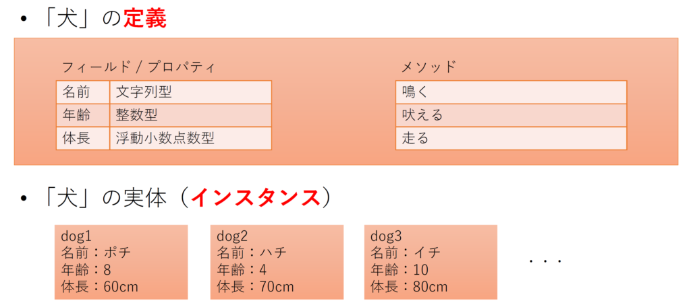

## JavaScript から始めるオブジェクト指向

注: 以下、オブジェクト指向プログラミングの考え方について解説しています。他の言語ですでに学習済みの場合は読み流していただいて結構です。

注: この記事では、最新の JavaScript に関する情報を扱っています。最新の Chrome と Firefox での動作を確認していますが、2019 年 10 月現在、Microsoft Edge 等のブラウザでは動作しません。

現代のプログラミング言語は、「**オブジェクト**指向」という考え方に基づいて設計されている場合が多いです。オブジェクト指向とは、「データと動作を一つのまとまりとして捉える考え方」です。

オブジェクト指向の言語において、データと動作のまとまりを、**クラス**といいます。



オブジェクト指向

実世界の例を用いて考えてみましょう。今回は「犬」を考えてみましょう。まず大前提にあるのが、「犬」なるものは実世界には存在しないということです。しかしながら、「犬」であれば必ず持っているものを考えることができます。これが、オブジェクト指向におけるクラスの**定義**です。

「犬」が共通して持っているものは何でしょうか。まず、「犬」が共通して持っている「データ」について考えます。「名前」「年齢」あるいは「体長」といったものが当てはまりますね。オブジェクト指向におけるクラスでは、このようなデータを**フィールド**という形で保持しています。

それでは、「動作」に関してはどうでしょうか。こちらには「鳴く」「吠える」あるいは「走る」といったものが考えられますね。オブジェクト指向においては、**メソッド**という概念で扱います。

フィールドやメソッドは、クラスの定義に含まれるべきものです。クラスの定義に対し、その定義をもとに作成された実体を**インスタンス**と呼びます。

上述のような概念をもとに、JavaScript のコードを書き起こすと、以下のようになります。

```
class Dog {
    age;
    name;
    bark() {
        if (this.age > 5) {
            document.write("バウバウ");
        } else {
            document.write("ワンワン");
        }
    }
}

const pochi = new Dog();
pochi.age = 8;
pochi.bark();
```

11 行目までがクラス定義の部分になります。2 ～ 3 行目がフィールドの定義、それ以降はメソッドの定義になっていますね。

13 行目では new 演算子を使うことで、Dog クラスのインスタンスを生成しています。インスタンスのフィールドやメソッドを利用するためには、ドット演算子を使ってください。

注目したいのは、10 行目の if 文の中の「this」という部分です。this キーワードは、メソッド定義内で使用され、実行された際のインスタンス自身を指します。したがって、pochi.bark();が実行された際、this には pochi が入っています。

今後、表記の簡略化のため、クラス「Hoge」のインスタンスメソッド「doSomething」を、「Hoge#doSomething」のように記述します。

## コンストラクタ

「constructor」の名前でメソッドを定義すると、**コンストラクタ**となります。コンストラクタは、new 演算子によってインスタンスが生成された際、各インスタンスに対し一度だけ実行されます。例を見てみましょう。

```
class Dog {
    age;
    name;
    constructor(age) {
        this.age = age;
    }
    bark() {
        if (this.age > 5) {
            document.write("バウバウ");
        } else {
            document.write("ワンワン");
        }
    }
}

const pochi = new Dog(8);
pochi.bark();
```

new 演算子によってインスタンスを生成する際に渡された引数は、コンストラクタの引数として実行されます。なお、5 行目左辺の this.age はフィールド、右辺の age はコンストラクタの引数なので全くの別物です。

## 継承

```
class Animal {
    name;
    age;
    constructor(name, age) {
        this.name = name;
        this.age = age;
    }
    showInfo() {
        document.write(`${this.name} (${this.age})`);
    }
}
class Human extends Animal {
    language;
    constructor(name, age, language) {
        super(name, age);
        this.language = language;
    }
    greet() {
        if (this.language == "English") {
            document.write(`Hello. I am ${this.name}.`);
        } else if (this.language == "Japanese") {
            document.write(`こんにちは。私は${this.name}です。`);
        }
    }
}

const student1 = new Human("Tanaka", 20, "Japanese");
student1.greet();
student1.showInfo();
```

Human クラスの定義の先頭行を見てください。extends キーワードに続いて別のクラスを指定すると、そのクラスを**継承**します。継承されたクラスの中では、自動的に継承元のフィールドやメソッドが使えるようになり、コンストラクタの中では、親クラスのコンストラクタを super キーワードによって呼び出すことができます。

## 課題

先ほどのサンプルコードに対し、以下の操作をしてください。

- Animal クラスに体重を表すフィールド weight を追加してください。
- Human フィールドに身長を表すフィールド height を追加してください。
- Human クラスに身長と体重から BMI を求めるメソッド「calculateBmi」メソッドを追加してください。
- student1 の BMI を calculateBmi メソッドを用いて計算し、出力してください。
