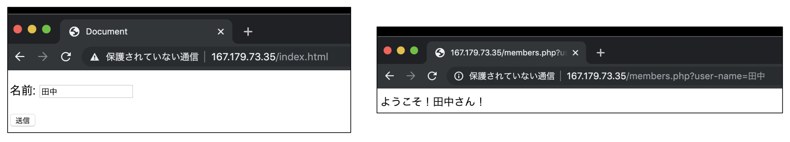

## クライアントがデータを送信する仕組み

前回の記事で、サーバー上でプログラムを動作させる仕組みを学習しました。しかしながら、前回学習した内容では、サーバーは決まった動作を繰り返すのみでした。ユーザーの入力内容に応じて処理を変更するにはどうしたら良いのでしょうか。

もっとも単純な方法は、URL に**クエリ文字列**と呼ばれる追加情報を付加することです。東京大学の学務システム UTAS を例にとってみましょう。ブラウザで UTAS にログインし、トップページを表示させると、その URL は

https://utas.adm.u-tokyo.ac.jp/campusweb/campusportal.do?page=main&tabId=home

になっています。「https://utas.adm.u-tokyo.ac.jp/campusweb/campusportal.do」まではよく見る形式ですが、「?page=main&tabId=home」は何者なのでしょうか。実は、これこそがクエリ文字列となっており、サーバー側に付加的な情報を伝える役割を担っています。形式は、見てわかる通り「パラメータ名=値」の組み合わせを「&」記号でつなぎ合わせた形になっており、先頭に「?」を付与することでクエリ文字列であることを明示しています。

プロパティ名や値に特殊な文字（主にアルファベット以外の文字を指します）が含まれる場合は注意が必要です。最も使用頻度の高いものとして、日本語の文字は URL として使える文字に含まれません。したがって、これらの文字を使用する場合、URL として使用可能な形式に変換してやる必要があります。

例えば、日本語の「あ」は UTF-8（現代の Web で使用される文字の符号化のための標準規格です）において「E38182（6 桁の 16 進数）」で表されます。この時、「あ」を URL で使用可能な形式に変換する（**URL エンコード**）場合、「%E3%81%82」となります。

## クエリ文字列を用いて PHP にユーザー入力を渡す

HTML において method 属性を get に指定した form タグを使用して input 要素を囲むと、input 要素に入力された値をクエリ文字列を使用してサーバー側に送信することができます。各 input 要素の name 属性に指定された値が、クエリ文字列におけるパラメータ名として使用されます。データの送信先の URL は form タグの action 属性によって指定できます。早速例を見てみましょう。

```
<form method="get" action="members.php">
    <p>名前: <input type="text" name="user-name"></p>
    <p><input type="submit" value="送信"></p>
</form>
```

```
ようこそ！<?php print($_GET['user-name']); ?>さん！
```



フォームの送信先の画面のアドレスバーに注目しましょう。index.html で入力された値が、URL のクエリパラメータとして引き渡されているのが分かります（なお、昨今のブラウザは URL エンコードされた文字列をデコードしてアドレスバーに表示する機能を持っているため、アドレスバーにエンコード済みの文字列が表示されていません）。

PHP では、クエリパラメータによって渡されたデータは、「$\_GET」変数に連想配列の形式で自動的に格納されます。この変数はプログラム中のどこからでもアクセスすることが可能となっています。

## HTTP POST メソッドを用いたデータの受け渡し

URL にクエリ文字列を付与することで、サーバー側にデータを送信することができることが分かりました。しかしながら、この方法では不十分な場合があります。もっともイメージしやすいのが、送信すべきデータが非常に大きい場合です。本来、規格上は URL の長さに上限は設けられていません。しかしながら、サーバーやブラウザによっては、使用できる URL の長さに上限を設けている場合があります。

[第３回のカリキュラム](https://utcode.net/2019/internal/utcode-lectures-03/)で、サーバーとクライアントが、HTTP プロトコルを用いてどのように通信をしているのかを軽く学習しました。この通信内容について、もう少し詳細に眺めてみましょう。

### リクエスト

以下は、HTTP リクエストの一例です。ブラウザから、「http://example.com/path/to/index.php」にアクセスすることを想定しています。ブラウザは、先にドメイン名からIPアドレスを取得した後、そのアドレスに向けて、以下のようなリクエストを発行します。

```
GET /path/to/index.php HTTP/1.1
Accept: image/gif, image/jpeg, */* Accept-Language: ja
User-Agent: Mozilla/4.0
Host: example.com
```

１行目の「GET」の部分を**リクエストメソッド**といいます。通常、ブラウザから適当なページを開くと、このリクエストメソッドを用いて通信が行われます。

スペースに続く文字列「/path/to/index.php」が**パス**です。URL のドメインより後ろの文字列がそのまま渡されます（クエリ文字列も含みます）。

さらに続く「HTTP/1.1」は HTTP プロトコルのバージョンを示しています。こちらに関してはあまり意識する必要はありません。

２行目以降は、**リクエストヘッダ**と呼ばれる領域になっており、「ヘッダ名: 値」の形式で、１行につき１ヘッダのペースで記述されます。主に使用されるリクエストヘッダに、Host リクエストヘッダがあります（上の例では４行目ですね）。

Host リクエストヘッダには、アクセスしようとするサーバーのホスト（＝ドメイン名）を指定します。昨今では、物理的なサーバーの台数を減らして多くの Web サービスを稼働させるため、複数のドメインが同じ IP アドレスに名前解決される場合が多くあります。その際、サーバー側ではどのドメインへのリクエストか判断できないため、この Host ヘッダを確認することにより、適切な応答をすることができるようになります。

### レスポンス

サーバーは、クライアントからのリクエストを受け、適切なレスポンスを返す必要があります。以下は、レスポンスの一例です。前項のリクエストに対する応答を想定しています。

```
HTTP/1.1 200 OK
Content-Length: 7360
Content-Type: text/html; charset=UTF-8
Date: Tue, 22 Oct 2019 14:28:50 GMT
Server: nginx/1.17.4
Vary: Accept-Encoding

<html><body>Hello World!</body></html>
```

まず確認すべきなのが、一行目の「200」という整数になります。この数値は、**ステータスコード**と呼ばれ、HTTP リクエストの成否を端的に示すための値です。ステータスコード 200 は、リクエストが成功したことを示します。200 番台以外のステータスコードは、リクエストが失敗したことを示します。

２行目以降は、**レスポンスヘッダ**と呼ばれる領域になっています。リクエストヘッダと対になる概念で、様々な情報が「ヘッダー名: 値」の形式で１行毎に記述されます。

レスポンスヘッダから空行を一行あけて続く部分が、**レスポンスボディ**です。リクエストされたリソースの内容が入ります。レスポンスヘッダの Content-Type ヘッダは、レスポンスボディの形式を表しています。ここで指定できる形式を、**MIME タイプ**と呼び、Web の世界では Windows でいう拡張子と同じような役割を果たしています。一般的に使われるものとして、以下のようなものがあります。

- HTML ... text/html
- CSS ... text/css
- JavaScript ... text/javascript、application/javascript 等

他にも、画像として「image/jpeg」「image/png」、動画として「video/mp4」、さらに「application/pdf」など、様々な MIME タイプが定義されています。

### POST リクエスト

一般的に使用される GET メソッドの代わりに、POST メソッドを使用することで、大規模なデータをサーバーに送信することができます。**GET メソッドと POST メソッドの最大の違いは、リクエストボディが存在するかどうか**になります。リクエストボディが存在するということで、POST メソッドを用いたリクエストの場合は、リクエストボディの種類を Content-Type リクエストヘッダで指定します。サーバーは、リクエストボディの内容に応じて、適切に処理を行うことができます。


GET メソッドと POST メソッド

以下は、冒頭のサンプルプログラムを、POST メソッドを用いて書き直した例です。

```
<form method="post" action="members.php">
    <p>名前: <input type="text" name="user-name"></p>
    <p><input type="submit" value="送信"></p>
</form>
```

```
ようこそ！<?php print($_POST['user-name']); ?>さん！
```


ご覧の通り、HTML 側の form タグの method 属性が get から post に変わり、PHP 側の$\_GETが$\_POST に変わった以外に目立った変化はありません。

なお、**form タグを用いて POST リクエストを送信する場合、通常 Content-Type リクエストヘッダは application/x-www-form-urlencoded になります**。このとき、リクエストボディは**URL のクエリ文字列と同じ形式で**エンコードされます。以上の例では、HTTP リクエストは以下のようになっていることでしょう。

```
POST /members.php HTTP/1.1
Host: 167.179.73.35
Content-Length: 28
Content-Type: application/x-www-form-urlencoded
Accept: text/html,application/xhtml+xml,application/xml;q=0.9,image/webp,image/apng,*/*;q=0.8,application/signed-exchange;v=b3

user-name=%E7%94%B0%E4%B8%AD
```

## 課題

商品検索システムを作ってみましょう。入力画面でプロダクト ID を入力すると、値段が表示されるようにしてください。データは

```
$data = [
    ['product_id' => 'A101', 'price' => 100],
    ['product_id' => 'A102', 'price' => 300],
    ['product_id' => 'B321', 'price' => 230],
    ['product_id' => 'B334', 'price' => 360]
];
```

を使ってください。

### ヒント

- $data は product_id キーと price キーを持つ連想配列の一次元配列になっています。foreach ループを回して、product_id が入力値と一致したらその時の price を出力しましょう。
