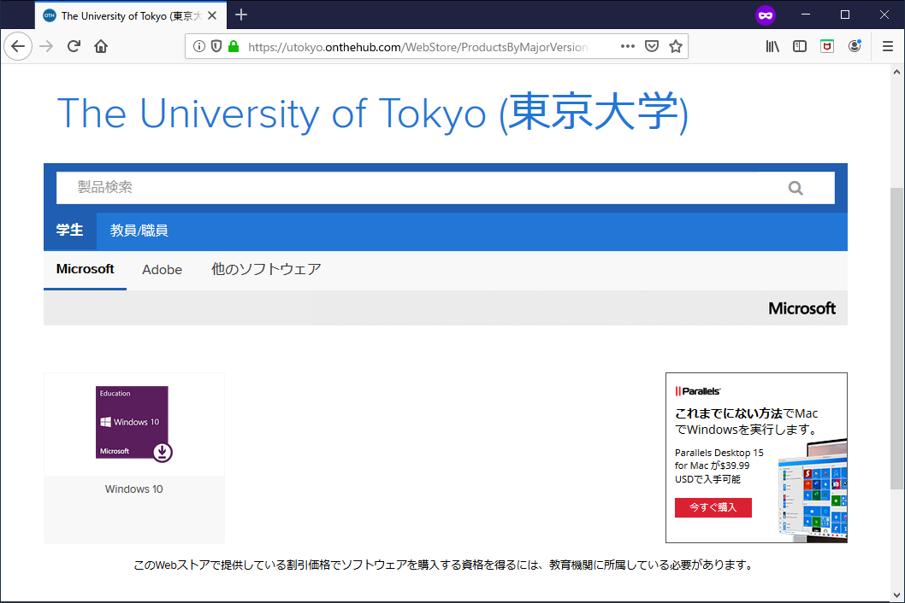
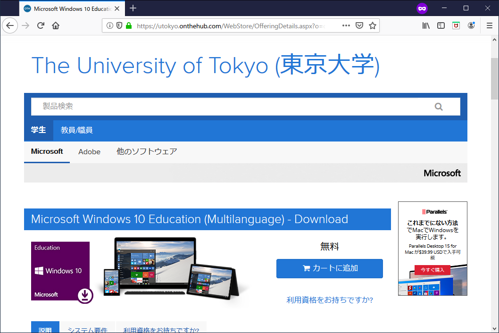
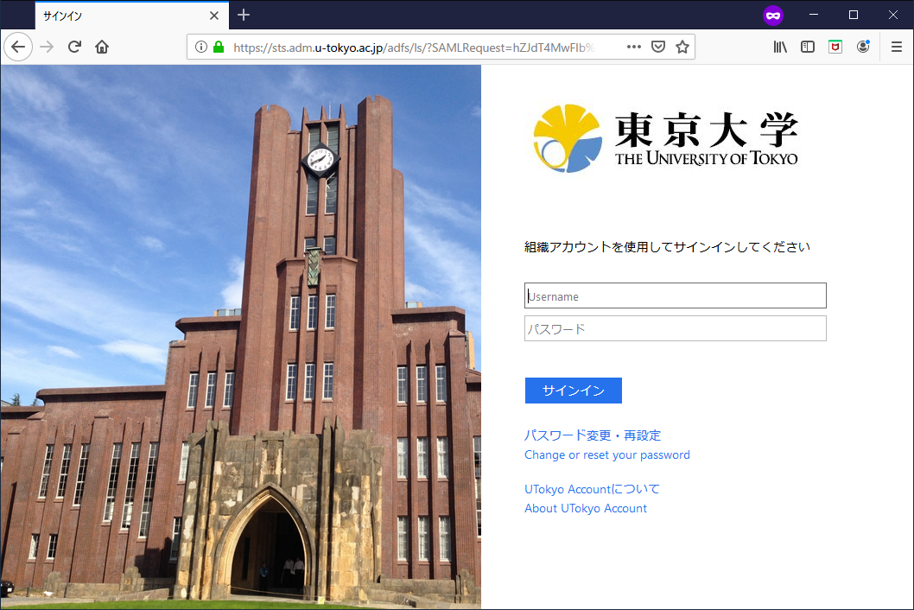

皆さんが購入された Windows マシンに搭載されている OS は、最近であれば Windows 10 Home であることが多いかと思いますが、この Home エディションでは、開発に必須の Hyper-V（仮想化支援機能）が有効化できなくなっています。幸いなことに、東京大学は学生に向け、Windows 10 の最上位エディションと同等の機能が利用できる Education ライセンスを無償で提供しています。この記事では、そちらの利用方法を解説します。

提供されるライセンスは kivuto 社の管理の下で提供されているようです。アップグレード専用のライセンスのため、仮想環境等にクリーンインストールすることはできません。

まずは[こちら](https://utokyo.onthehub.com/)にアクセスして、Windows 10 を選択しましょう。

「カートに追加」と書いてあるので有料のように見えますが、もちろん無料です。

東京大学の学生であることを証明するため、いつもの UTokyo Account でログインします。

こちらも怖いですが同じく「ご注文手続き」をクリックです。

連絡先を入力します。

おめでとうございます！Windows 10 Education のプロダクトキーが発行されました！

スタートメニューから「ライセンス認証」と検索し、「ライセンス認証の設定」をクリックします。

「プロダクト キーの変更」をクリックします。

先ほど発行されたプロダクトキーを入力しましょう。

作業を全て終了し、「開始」ボタンを押せば完了です。自動的に再起動し、30 分程度でアップグレードが完了するはずです。
