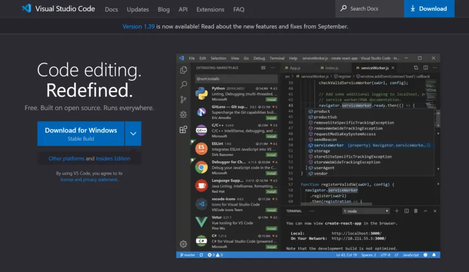
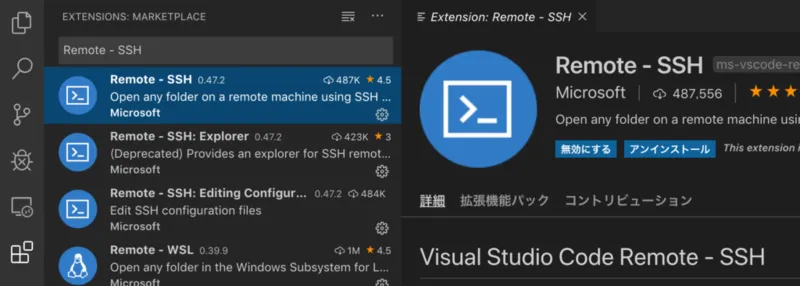
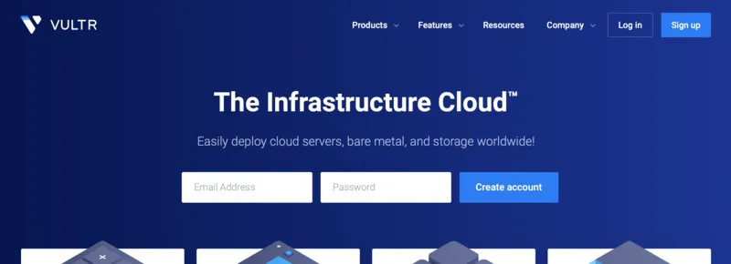
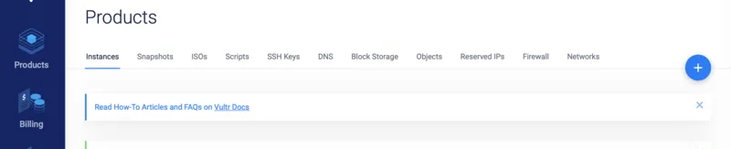
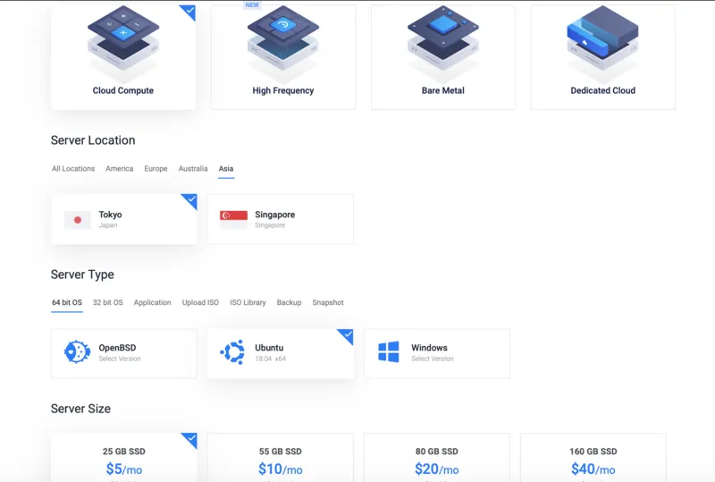
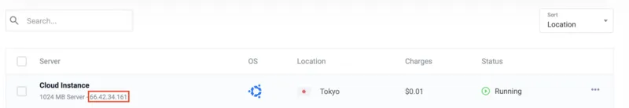
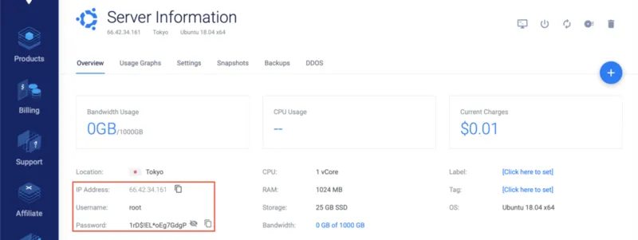
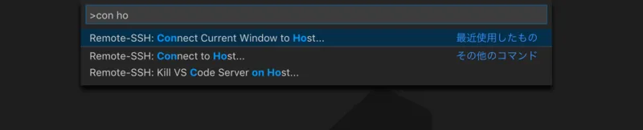
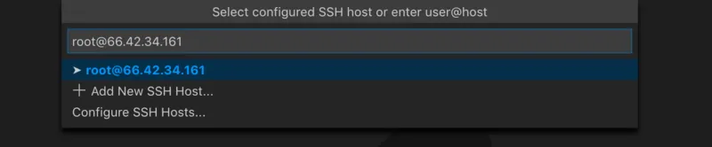

ようこそ！ut.code();へ。

## VSCode のインストール

[Visual Studio Code](https://code.visualstudio.com/)（以下 VSCode）は、Microsoft のエディタです。様々なプログラミング言語を軽快に扱えることで有名な、今最も人気のソフトウェアです。

インストールが終わったら、「Remote: SSH」プラグインを追加しておきましょう。

## PC とサーバー・VPS の利用

インターネット上でサービスを提供するためのコンピューターを**サーバー**といいます。また、それを利用するソフトウェアを、サーバーと対比させて**クライアント**と呼びます。皆さんが使用しているコンピューターに搭載されている OS は Windows や macOS でしょうが、サーバーの世界では**Linux**を搭載しているものを使用する場合が多いです。したがって、エンジニアとしての技術を高めるためには、Linux に親しんでおく必要があります。

タンスの奥に眠っているもう使われなくなった PC を引っ張り出し、Linux をインストールして実験するのが最も力の付く方法ですが、なかなかそこまでの余裕はないものです。インターネット上には、仮想的なサーバーを貸し出してくれる、**VPS**（Virtual Private Server）と呼ばれるサービスがあります。

サーバーの貸し出し、などというとお金がかかりそうなイメージですが、まあ御察しの通り実際かかってしまうのですが、最近では低価格化が一気に進み、月々 500〜600 円（実際には時間単位で課金なので使う分だけ使うようにすれば 1 円弱/h）程度でそこそこのスペックのサーバーが使えるようになりました。

今回は Vultr というアメリカのサービスを利用します。海外製のため低価格で使用できるにも関わらず、サーバーの物理的な場所として東京が指定できるので、日本からでも非常に快適に利用できます。

[こちら](https://www.vultr.com/?ref=8284679-4F)から登録すると、ut.code();の公式サイトを運営するためのアカウントからの紹介としてカウントされるため、（広告のようで心苦しいのですが）$10 の入金で一ヶ月間使える$50 分のクーポンがもらえます。

日本で使える VPS サービスとして、他にも ConoHa というサービスもあります。どちらを使っても大して変わりませんが萌えキャラが好きな方は ConoHa を使いましょう（詳しくはググりましょう）。

## Vultr で新しいサーバーを立ち上げる

以下の内容は Vultr に特有の内容ですが、基本的にどの VPS を利用しても同じです。

Vultr の管理画面はシンプルで大変使いやすいデザインになっています。新しいサーバーを立ち上げる場合は、「＋」ボタンを押してください。

今回は上の画像のように設定してみましょう。OS の種類は Ubuntu 18.04 としています。実は Linux には様々な種類があり、Ubuntu はその中でも世界中で最も有名なものです。トラブルになった時にも情報が得られやすいので、ut.code();では基本的に Ubuntu を利用していきます。

下の Server Type ではサーバーのスペックを指定しています。一番安いものでもよほど問題にならないのでそれでいきましょう。一時間あたり$0.007 です。安いですね。

設定が終わったら、「Deploy Now」を押してサーバーを立ち上げましょう。

## サーバーと IP アドレス

リストに戻ると、4 つの数字がドット記号で区切られている部分があります。これを**IP アドレス**と呼びます。IP アドレスとは、一般的なネットワークに接続されているコンピューターを区別するための番号です。ネットワークに接続する全ての端末に、重複しないように割り当てられます。今皆さんが目の前にしている PC やスマホにも、もちろん割り当てられていますよ！

サーバーの詳細情報を表示させると、ログイン用の ID やパスワードも表示できます。

## VSCode で作成したサーバにアクセスする

ここからはどの VPS でも同じ操作になります。

VSCode を起動して、\[Cmd / Ctrl\] + \[Shift\] + \[P\]を押してください。このショートカットキーは、現在利用可能なすべての機能を一覧表示（コマンドパレット）し、素早くアクセスするためのショートカットキーです。VSCode は、このショートカットキーさえ覚えてしまえばどこに何の機能があるのかを全く覚えなくても使用できます。面倒くさがり屋のためのショートカットキーですね笑

コマンドパレットから、「Remote-SSH: Connect Current Window to Host...」を実行します。実際には適当に入力して絞り込みをかけると素早くアクセスできます。

先ほど確認したユーザー名と IP アドレスを、「ユーザー名@IP アドレス」の形式で指定します。続いてパスワードの入力も求められるので、同じように入力しましょう。途中で「Continue / Cancel」の選択を求められた場合は「Continue」を押して続行してください。

何もメッセージが表示されなければ成功です！お疲れ様でした。

## 演習問題

- サーバーとクライアントの関係について説明してください。
- IP アドレスとは何でしょうか。
- 一般向けに使用される OS としては、PC であれば Windows や macOS、スマートフォンであれば iOS や Android が有名です。それでは、サーバーにおいて一般的に使用される OS に用いられるソフトウェアは何でしょうか。
