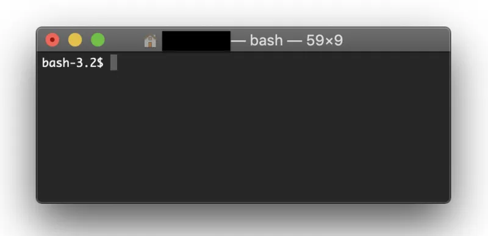
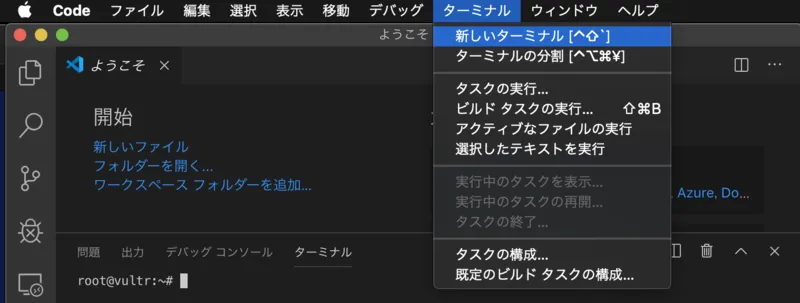
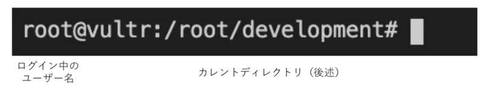
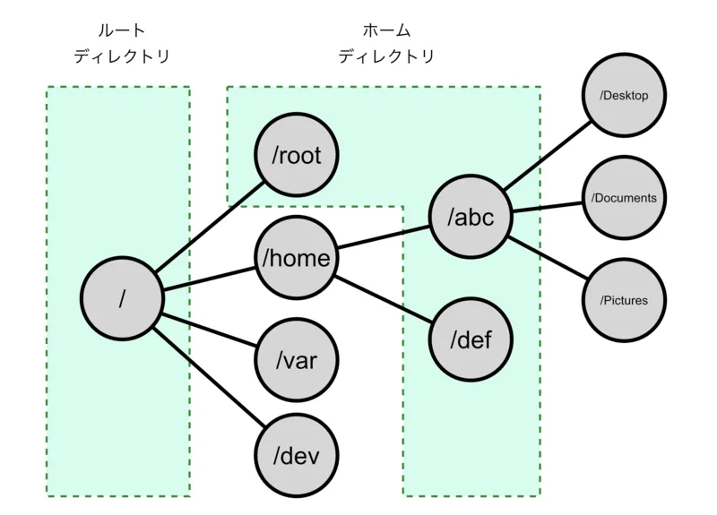
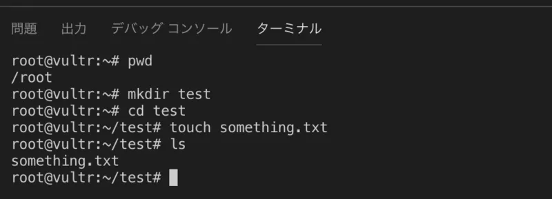
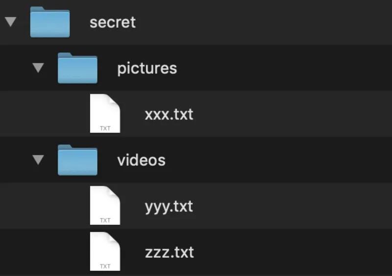

## 黒いアイツ

「**ターミナル**」と呼ばれるソフトウェアがあります。これは、PC をマウスやタッチパネルではなく、文字によって操作するためのソフトウェアです。

サーバーは、ネットサーフィンをしたり、表計算をしたり、ゲームをしたりするためのコンピューターではありません。したがって、サーバーに「画面」に相当するものはないのが普通です。使わなくなった PC をサーバーにする場合はあるんですけどね。したがって、サーバーを操作するためには、このように文字ベースのコマンドを使用する必要が出てきます。

「黒い画面」と呼ばれて恐れられるこのターミナルですが、慣れてしまえば全く怖くありません。今回は、VSCode に内蔵されているターミナルを使用して、サーバーをあれこれ操作していきましょう！

## VSCode 統合ターミナルの起動

統合ターミナルの起動

メニューからターミナルを起動します。当然のことながらコマンドパレットからも起動できるのでお好みでどうぞ。

## ファイルシステムとユーザー

パソコンでは、様々なデータを「ファイル」や「フォルダ」という単位で分けて管理しますよね。コマンドを使ってファイルシステムを操作するとき、普段皆さんが目にしている「フォルダ」に相当するものは「**ディレクトリ**」という名前で呼ばれます。

Linux において、ディレクトリは、「**ルートディレクトリ**」と呼ばれる特殊なディレクトリを頂点とする木構造で表現されます。この木構造の中の特定の要素を一意に表現するための表記を「**パス**」と言います。Linux においてパスの区切り文字は「/」で、それが単体で利用された際はルートディレクトリを表します。例えば、ルートディレクトリの中の「home」ディレクトリの中の「utcode」という名前のディレクトリは、「/home/utcode」という形で表現されます。

また、PC は複数のユーザーで使用されることを前提に設計されているため、各ユーザーが使用できる個人的な領域として「**ホームディレクトリ**」が作成されます。Ubuntu をはじめとした標準的な Linux では、ホームディレクトリは「/home/ユーザー名」にあります。

Linux には、最初から存在している「**root**」と呼ばれる特殊なユーザーがあります。root ユーザーは、コンピューター内の全てのファイルやディレクトリにアクセスできる権限を持っています。Ubuntu では、root ユーザーのホームディレクトリは/root にあります。

## 相対パスと絶対パス

現在開いているディレクトリを「**カレントディレクトリ**」と呼びます。すべてのファイルやディレクトリは、ルートディレクトリを基準とした「**絶対パス**」で表される他、カレントディレクトリからの「**相対パス**」で表すことができます。例えば、カレントディレクトリが「/home/utcode」のとき、「/home/utcode/pictures/xxx.webp」は「pictures/xxx.webp」と表されます。

パスを表現するとき、他にも様々な記号が利用できます。

| カレントディレクトリ | 目標のディレクトリ       | 相対パス                     |
| -------------------- | ------------------------ | ---------------------------- |
| /foo/bar             | /foo/bar/baz             | baz 又は ./baz               |
| /foo/bar             | /foo/bar/baz/foobar      | baz/foobar 又は ./baz/foobar |
| /foo/bar/baz         | /foo/bar                 | .. 又は ./..                 |
| /foo/bar/baz         | /foo                     | ../.. 又は ./../..           |
| どこでも             | /home/\[ユーザー名\]/foo | ~/foo                        |

カレントディレクトリは「.」、親ディレクトリは「..」、ホームディレクトリは「~」と表されることが分かります。

## コマンドの入力方法

コマンドはスペース区切りで入力し、最初がコマンド名、それ以降をそのコマンドの「**引数**」と呼びます。コマンド名や引数にスペース文字が含まれる場合は、値全体を「""（ダブルクォーテーション）」で囲むことでスペースが区切り文字として認識されることを防ぐことができます。以下にコマンドの一例を示します。使い方はググってください笑

<table>
  <tbody>
    <tr>
      <td>pwd</td>
      <td>カレントディレクトリを表示</td>
    </tr>
    <tr>
      <td>ls</td>
      <td>ディレクトリの中身を一覧表示</td>
    </tr>
    <tr>
      <td>cd</td>
      <td>カレントディレクトリを移動</td>
    </tr>
    <tr>
      <td>mkdir</td>
      <td>新しいディレクトリを作成</td>
    </tr>
    <tr>
      <td>touch</td>
      <td>新しいファイルを作成</td>
    </tr>
  </tbody>
</table>

## 演習問題

- 「ディレクトリ」「ルートディレクトリ」「パス」「ホームディレクトリ」「root ユーザー」「カレントディレクトリ」「絶対パス」「相対パス」について説明してください。
- 「/var/log/wifi.log」はどこにある、何という名前のファイルを表していますか。

## 課題

- コマンドのみを使用して、「/root」に以下に相当するディレクトリ構造を作成してください。

