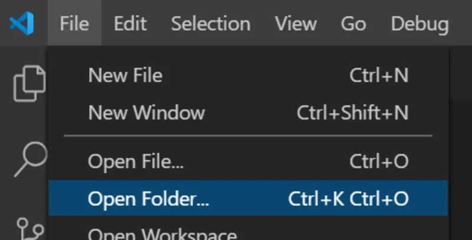
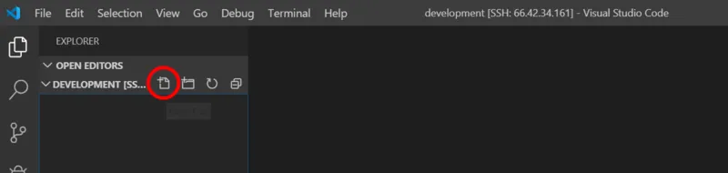
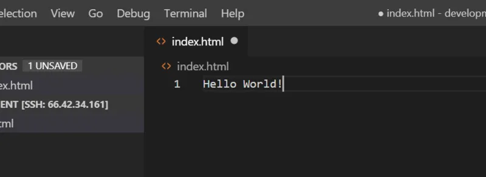
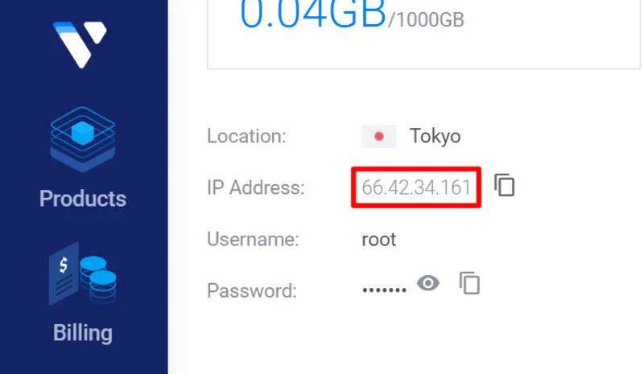
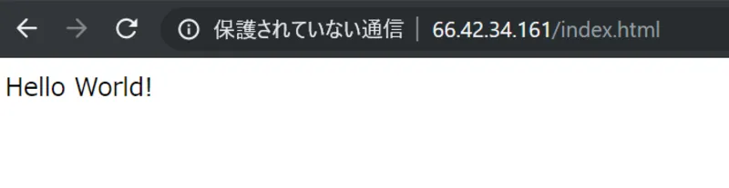
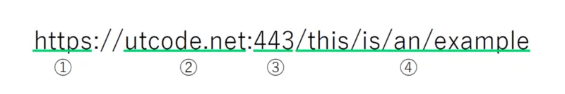
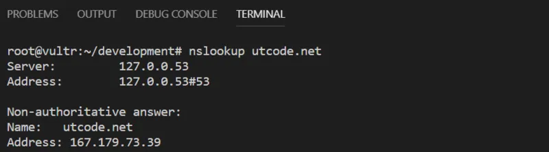
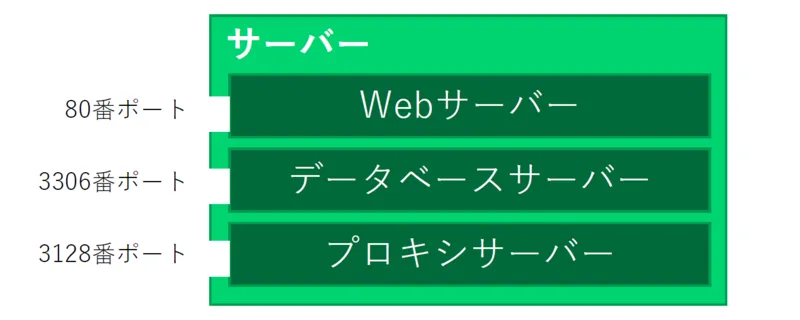
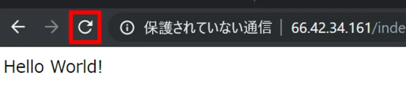
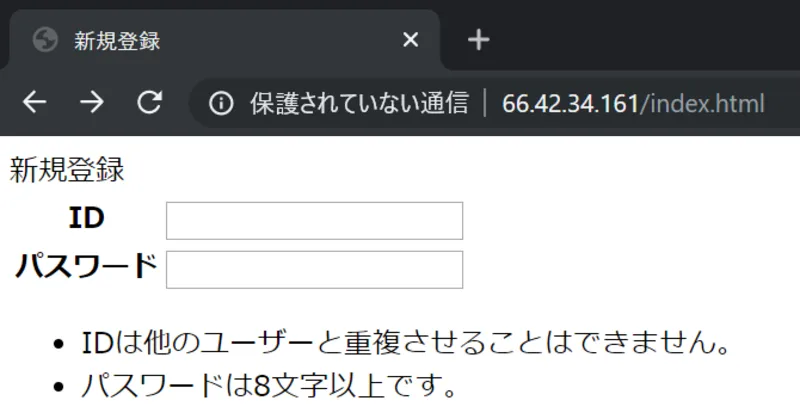

今回からお待ちかねプログラミングの時間です！まずはターミナルで

```
curl -fsSL https://raw.githubusercontent.com/chelproc/utcode-lectures-setup/master/lamp-on-docker/init.sh | sh
```

を実行しましょう！今回の開発に必要なソフトウェア等が自動的にインストールされます（コマンド一発で複雑な処理をまとめて行うことができるのが良いところですね）。結構時間がかかるので気長に待ちましょう。

## VSCode でディレクトリを開く

今までは VSCode のターミナルの部分だけを使ってきましたが、ここからはメインの機能を使っていきます。VSCode は、単純なエディタとして一つのファイルを開いて編集することもできますが、それ以上に、**あるディレクトリを作業ディレクトリとして決定し、その下のファイルを操作する**という使い方をするときに、その真価を発揮します。



VSCode でディレクトリを開く

\[File\] → \[Open Folder...\]から、

```
/root/development
```

を開いてください。このディレクトリは、冒頭のコマンドによって自動的に生成されたディレクトリです。

## 最初のファイルを作成する



ディレクトリを開いたら、最初のファイルを作成しましょう。ブラウザが読み取ることのできるファイルは**HTML 形式**です。「index.html」という名前でファイルを作成してみましょう。



編集が終わったらファイルを保存します。画面の「index.html」と書いてある部分の右側に白い丸が付いていますね。これはファイルが未保存である証です。保存を完了すれば消えてくれます。ファイルの保存にはショートカットキー\[Cmd / Ctrl\] + \[S\]が便利です。

## はじめての Web サイト

おめでとうございます！これであなたは最初の Web サイトを作成しました！それでは早速ブラウザからアクセスできるかどうか試してみましょう。



インターネットを通して Web サイトにアクセスするためには、サーバーの場所を知る必要がありますね！サーバーの住所に相当する番号が IP アドレスなのでした。IP アドレスを使用すれば、サーバーの場所を直接ブラウザに伝えることができます。

```
http://IPアドレス/index.html
```

にアクセスしてください。



思い通りに表示されましたか？

## 何が起きているのか考える

サービスを提供するコンピューターのことをサーバー、サービスにアクセスするコンピューターのことをクライアントと呼ぶのでした。同じように、**サービスにアクセスするためのソフトウェア、そのアクセスを監視して適切に応答するためのソフトウェアも、それぞれクライアント、サーバーと呼びます**。ウェブサイトを提供するためのサーバーは、**Web サーバー**です。

また、クライアントからサーバーへの要求を**リクエスト**、そのリクエストへのサーバーの応答を**レスポンス**と呼びます。

ウェブサーバーの挙動を理解するにあたり、まずはウェブサイトにアクセスするための URL がどのような構成になっているのかを考えてみましょう。



「https://utcode.net:443/this/is/an/example」を、「①https」、「②utcode.net」、「③443」、「④/this/is/an/example」という４つの部分に分けます。各部分が何を意味しているのかを見ていきましょう。

### ② ドメイン

いきなり ② からかよ、という感じですが、クライアントがサーバーにリクエストを送信する際、まず最初に使用されるのが**ドメイン**です。ドメインは、インターネット上でサーバーを区別するための識別名で、IP アドレスに変換されます（**名前解決**）。nslookup コマンドを使用することで、ドメインがどの IP アドレスに名前解決されるかを知ることができます。



### ③ ポート番号

一台の（物理）サーバーで稼働している（ソフトウェア）サーバーが一種類とは限りません。どのソフトウェアの通信なのかを区別するため、外部からの接続を待ち受けするソフトウェアは、0 ～ 2^16 - 1 (65535)の整数で表される**ポート番号**を指定する必要があります。



サーバーの種類によって使われるポート番号は大体決まっています。Web サーバーの場合は、80 番または 443 番が使用されるのが普通です。後述するプロトコルが**http の場合は 80 番、https の場合は 443 番**のとき、URL におけるポート番号は省略可能になります。一般的な URL にポート番号が存在していないのはこのためです。

### ① プロトコル / ④ パス

通信を行うための決まり事を**プロトコル**と呼びます。ウェブサイトを提供するためのプロトコルは**HTTP**または**HTTPS**です。プロトコルの内容についてはインターネットの標準化団体によって誰でも入手ができるようになっています。例えば、「http://example.com/this/is/an/example」にHTTPリクエストを送る際、内部的には以下のようなやり取りがサーバーとクライアントの間で交わされます。

クライアント → サーバー（HTTP リクエスト）

```
GET /this/is/an/example HTTP/1.1
Host: example.com
```

クライアント ← サーバー（HTTP レスポンス）

```
HTTP/1.1 200 OK
Content-Type: text/html

[ここにウェブサイトの内容が入る]
```

## Web サーバーの動作

Web サーバーとして代表的なソフトウェアは、「**Nginx**」や「**Apache**」です。どちらもインターネット上のコミュニティーによって開発されており、ソースコードは無償で一般公開されています（**オープンソース**）。

Web サーバーは、クライアントからのリクエストを受け、**URL の ④ パスに相当する部分を、あらかじめ設定されたドキュメントルートと言われるディレクトリからの相対パスとして解釈し、対象となるファイルの内容をクライアントに送信**します。

例えば、ドキュメントルートが「/var/www/html」である Web サーバーが、「http://example.com/path/to/file.html」へのリクエストを受けた場合、「/var/www/html/path/to/file.html」を読み込んで返します。

冒頭のコマンドは、ドキュメントルートを「/root/development」として Apache を起動するためのコマンドとなっていました。ですので、「http://IP アドレス/index.html」にアクセスした際、「/root/development/index.html」の内容が表示されたわけです。

## HTML の基本構造

先ほどの「index.html」をもう一度見直してみましょう。実は、HTML ファイルはただ文章を書けばよいというものではなく、いくつかの約束事があります。index.html を正しい HTML ファイルにするため、以下の通りに書き換えてください。

```
<!DOCTYPE html>
<html lang="ja">
<head>
  <meta charset="utf-8">
  <title>Document</title>
</head>
<body>
  Hello World!
</body>
</html>
```

サーバー上のファイルを変更した場合は、ブラウザ上で更新ボタンをクリックします。



更新ボタンをクリック

先ほどとは表示が変わっていないのにもかかわらず、コードの量が大きく増加してしまいました。どうしたものでしょうか。

HTML ファイルには、文書に意味を持たせるために**タグ**と呼ばれる構文を持つことができます。タグは、`<tag>` のような、「小なり」と「大なり」で囲まれた英数字のまとまりになります。`<tag>内容</tag>` のように、タグ名の先頭にスラッシュを付けるか否かにより、「**開始タグ**」と「**終了タグ**」を表現し、内部のテキスト等を挟み込むことができます。j 開始タグから終了タグまでのまとまり、もしくは終了タグを持たないタグの場合はそれ自身によって生み出される出力を、「**HTML 要素**」といいます。

HTML の開始タグの中に `<tag type="value">` のように「属性」を指定すると、より正確に HTML 要素をコントロールできます。例えば、html タグには lang 属性を指定することができ、その文書が何の言語で記されたものであるかを示すことができます。

全ての HTML ファイルは、一行目の

```
<!DOCTYPE html>
```

という「このファイルは HTML ファイルだ！」と宣言する定型文ののち、**html タグを頂点とした木構造**となっており、html タグの直属の子としては、head タグと body タグがそれぞれ１つずつのみ存在しています。このうち、head タグは文書のメタ情報（文書自身関する情報）を格納し、上記の例であれば title タグによって文書のタイトルを、meta タグの charset 属性において文字コードを指定しています。body タグの中には実際に画面に表示され得る情報を記述します。

## HTML 開発のお供に

html タグは数多く存在しています。初めのうちは使うたびにインターネットで調べればよいでしょう。何度も製品を作っているうちにいつの間にか身についているはずです。以下に調べものに役立つサイトを掲載しておきます。

- HTML クイックリファレンス ... [http://www.htmq.com/html5/](http://www.htmq.com/html5/)
  - 昔ながらのデザインですが必要な情報が過不足なく掲載されています。単純に眺めるのも楽しいですね。
- HTML - MDN ... [https://developer.mozilla.org/ja/docs/Web/HTML](https://developer.mozilla.org/ja/docs/Web/HTML)
  - 情報の信頼性に関しては、[HTML の仕様書](https://www.w3.org/TR/html52/)の次に高いといっても過言ではありません。比較的難解ですが、ある程度技術力を蓄えた後には、メインで役立ってくれることでしょう。

## 演習問題

- 「サーバー」「リクエスト」「レスポンス」「ドメイン」「ポート番号」「プロトコル」とは何でしょうか。
- Web サーバーの動作について、「ドキュメントルート」という単語を用いて説明してください。
- https://utcode.net/にアクセスする際のポート番号は何でしょうか。
- utcode.net のドキュメントルートが「/home/utcode/public」であるとします。Web サーバーは、「https://utcode.net/images/secret.webp」へのリクエストを受けた際、どのファイルを読み込もうとするでしょうか。絶対パスで答えてください。

## 課題

HTML を用いて、以下のフォームを作成してください。なお、入力欄は表を用いて整列されています。また、下部の注意書きは箇条書きを表現するための要素が使用されています。


