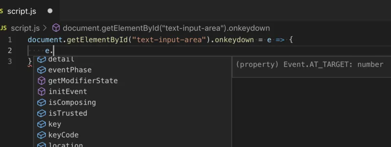
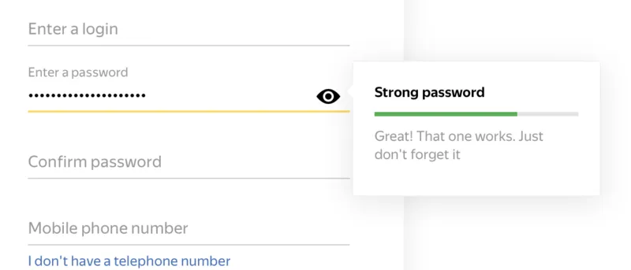

久しぶりに楽しい回です。次回からまた辛い部分になってくるので、気合を入れて頑張りましょう！

## DOM

今までは、document.write 関数を用いて、ブラウザ上に様々な情報を表示していました。これからは**document.write 関数は封印**してください（エッ！）。

折角 HTML や CSS を勉強したのに、JavaScript でそれらを扱えないのは大変不便ですね。HTML の構造を JavaScript で扱うための仕組みを、**DOM**（Document Object Model）と言います。抽象的なようですが、DOM とは言ってしまえば様々なクラスの集合体です。使用例から見てみましょう。

```
<div id="viewer"></div>
```

```
const element = document.getElementById("viewer");
element.textContent = "Hello JavaScript";
```

コピペする際、body タグの中で script タグが一番最後になるように注意しましょう。これは、JavaScript が読み込まれた際、他の HTML 要素が読み込まれていないという事態を防ぐためです。

サンプルコードを実行すると、画面に「Hello JavaScript」と表示されたはずです。もう少し詳しく見ていきましょう。

document.getElementById メソッドは、**HTML 要素の中から引数で与えられた ID を持つ要素を取得し、HTMLElement クラスのインスタンスを返します**（厳密にはクラスではないですがクラスだと思うと理解しやすいです）。HTMLElement クラス（の継承元のクラス）は、textContent プロパティ（≒ フィールド）を持ち、これが要素内部のテキストと対応しています。[Element クラスのリファレンス（MDN）](https://developer.mozilla.org/ja/docs/Web/API/Element)を見ると、他にもどのような操作ができるのかを知ることができます。

なお、今回は document.getElementById 関数の戻り値を一度変数に代入しましたが、変数を経由することなく直接プロパティを操作することもできます。

```
document.getElementById("viewer").textContent = "Hello JavaScript";
```

## イベント

HTML 要素がクリックされた際に実行される動作を指定してみましょう。onclick プロパティに関数（**イベントハンドラ**）を設定することで、要素がクリックされた際に処理を行うことができます。

```
<button id="wonderful-button">Click me!</button>
```

```
document.getElementById("wonderful-button").onclick = () => {
    alert("大好き！");
};
```

alert メソッドは、ブラウザにメッセージボックスを出させるためのメソッドです。

イベントハンドラに引数を指定することで、イベントに関する詳細情報を取得することができます。VSCode の補完機能を使うとどのような情報が取得できるのか調べられるので、積極的に利用していきましょう。



入力されたキーの情報をメッセージボックスに表示する例を、以下に示します。

```
<input type="text" id="text-input-area">
```

```
document.getElementById("text-input-area").onkeydown = e => {
    alert(e.key);
};
```

## CSS を JavaScript から操作する

CSS を JavaScript から操作できるようになると、表現の幅が劇的に広がります。以下の例は、JavaScript から CSS の font-size プロパティを操作する例です。

```
<div id="message">Hello World!</div>
```

```
const element = document.getElementById("message");
element.style.fontSize = "30px";
```

style の中の各プロパティを操作することで、要素の CSS を直接操作できます。この際、気をつけなければならないのは、CSS で「font-size」のように扱っていたプロパティが、JavaScript では「fontSize」のように名前が若干変わることです。

CSS のプロパティ名のように、単語の区切りをハイフンで表す記法を**ケバブケース**と呼びます。また、JavaScript のように、単語の区切りを大文字で表現する記法を**キャメルケース**と呼びます。使用する言語によって変数名の付け方には特徴があるので、しっかりと頭に入れておきましょう。

<table>
  <tbody>
    <tr>
      <td>
        アッパーキャメルケース
        <br />
        （パスカルケース）
      </td>
      <td>UpperCamelCase</td>
      <td>クラス名 (JS)</td>
    </tr>
    <tr>
      <td>
        ローワーキャメルケース
        <br />
        （単にキャメルケースとも）
      </td>
      <td>lowerCamelCase</td>
      <td>
        変数名 (JS)
        <br />
        フィールド名 (JS)
        <br />
        プロパティ名 (JS)
      </td>
    </tr>
    <tr>
      <td>ケバブケース</td>
      <td>kebab-case</td>
      <td>
        HTML
        <br />
        CSS
        <br />
        ファイル名
      </td>
    </tr>
    <tr>
      <td>スネークケース</td>
      <td>
        snake_case
        <br />
        SNAKE_CASE
      </td>
      <td>定数 (JS) (全て大文字)</td>
    </tr>
  </tbody>
</table>

## 課題

JavaScript を用いて、最近の Web アプリケーションでよく見る以下の機能を実装してください。

- パスワード入力欄の下部にバーを用意します（div タグに width プロパティと height プロパティを指定すれば良いでしょう）
- バーは、パスワードの長さに比例して伸縮します。
- パスワードが一定以上の長さなら緑色、ある程度の長さなら黄色、短いようであれば赤色にバーの色を変えましょう。

以下は上記のようなパスワードインジケーターが実際に使用されている例です。画像ほどこだわる必要はありませんので、最低限上に挙げられた３つが実現できているシステムを作成してください。



パスワードの強度を表示するインジケーター

### ヒント

- document.getElementById メソッドによって取得された input 要素を表すオブジェクトは、value プロパティを持ち、テキストボックスに入力されているテキストと対応します。
- CSS のプロパティに設定される値は、基本的に文字列です。これは、色を表す「#123456」や、長さを表す「100px」等、JavaScript オブジェクトに対応させることが難しいからです。
