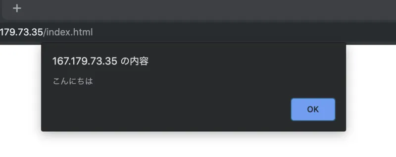

今回は重ための内容から入ります。眠くなる時間帯に読まないようにしましょう。

## Promise

### 同期処理と非同期処理

時間の掛かる処理というものがあります。例えば、インターネット通信や、ファイルの読み込みといった類の処理です。これらの処理を一般的な方法で実装しようとすると、その処理を行う間、ユーザーからの入力が受けられない状態になってしまいます。これが俗に言う、「フリーズした」状態です。幸いなことに、JavaScript では、時間の掛かる処理の待ち時間を、他の処理のために充てることができるようになっています。これを**非同期処理**といいます。JavaScript における非同期処理は、**コールバック**を用いて処理されます。

```
setTimeout(() => {
    document.write("Text 1");
}, 1000);
```

setTimeout 関数は、2 つの引数をとり、第 1 引数で指定された関数を、第 2 引数で指定された時間（ミリ秒）後に実行します。このように、システムによって処理の完了後に呼び出される関数を、**コールバック関数**と呼びます。

それでは、setTimeout 関数を用いて、1 秒毎に異なるメッセージを表示させることを考えてみましょう。すぐに思いつくのは、以下のようなコードです。

```
setTimeout(() => {
    document.write("Text 1");
    setTimeout(() => {
        document.write("Text 2");
        setTimeout(() => {
            document.write("Text 3");
            setTimeout(() => {
                document.write("Text 4");
            }, 1000);
        }, 1000);
    }, 1000);
}, 1000);
```

くどいですね。一昔前の JavaScript では、上記コードのように、コールバック関数が大量に使用された結果、インデントが非常に深くなるという事態に陥りがちでした（人々はこれをコールバック地獄と呼びました）。

この状況を解決するために生まれたのが、Promise API です。Promise を用いると、上記のコードは以下のように書き換えることができます。

```
function mySetTimeout(time) {
    return new Promise((resolve, reject) => {
        setTimeout(() => {
            resolve();
        }, time);
    });
}
mySetTimeout(1000).then(value => {
    document.write("Text 1");
    return mySetTimeout(1000);
}).then(value => {
    document.write("Text 2");
    return mySetTimeout(1000);
}).then(value => {
    document.write("Text 3");
    return mySetTimeout(1000);
}).then(value => {
    document.write("Text 4");
    return mySetTimeout(1000);
});
```

それでは、上記のコードを解説していきます。

### Promise とは何なのか？

#### Promise に対応する関数やメソッドの作成

setTimeout 関数は、昔ながらのコールバック関数を用いた形式となっています。そのため、Promise を用いて setTimeout を利用するためには、setTimeout を Promise に対応させるための関数（ラッパー関数）を作成する必要があります。

- Promise に対応する非同期処理関数は、Promise クラスのインスタンスを返します。
- Promise クラスのコンストラクタは、ただ 1 つの引数をとりま す。
- この引数は関数で、その関数は二つの引数(resolve と reject)をとることができます。
- 非同期処理はその関数の中で実行し、正常に終了した時点で resolve を、異常終了した場合は reject を呼びます。
- resolve はただ一つの引数を取り、非同期処理の結果を渡します。
- reject はただ一つの引数を取り、処理の失敗の理由を渡します。

#### Promise を用いた非同期処理に対応する関数の使い方

- Promise に対応する非同期処理関数により得られた Promise クラスのインスタンスは、then メソッドを持ちます。
- then メソッドはただ一つの引数を取り、この引数は関数です。
- この関数はただ一つの引数を取り、then メソッドが実行された時点で一度内部的に保存されます。
- 非同期処理が終了した時点で、この関数は実行され、引数には非同期処理の結果(前頁の resolve の引数に相当)が渡されます。
- この関数の中で Promise を返すと、その Promise が resolve された時点で、then メソッドの返り値として得られる Promise が resolve されます。

### Async / Await 文

Async / Await 構文を用いると、Promise を用いた非同期処理をさらに簡潔に記述することができます。

```
async function promiseTest() {
    await mySetTimeout(1000);
    document.write("Text 1");
    await mySetTimeout(1000);
    document.write("Text 2");
    await mySetTimeout(1000);
    document.write("Text 3");
    await mySetTimeout(1000);
    document.write("Text 4");
}
promiseTest();
```

上記コードの要点は、以下の通りです。

- async キーワードを指定した関数の中で await 文が実行されると、その関数は Promise が解決（＝ resolve または reject）されるまで実行が中断されます。
- Promise が resolve された場合にはその値が await 文の戻り値と なり、reject された場合は例外を発生します。
- await 文を使用する関数は、async キーワードを付与する必要が あります。
- async キーワードが付与された関数は、自動的に戻り値が Promise 型となります。

## Ajax

ユーザーが Web サイトを閲覧している際、新たな情報を得るためには、通常ページの遷移が発生します。**Ajax**（エイジャックスと読みます）と呼ばれる技を使用すると、ページ遷移を発生させることなく、JavaScript のみを用いて HTTP リクエストを発行したり、その結果を取得・加工・表示したりすることができます。Ajax を用いると、ページ全体を読み込み直すことなく、必要な部分だけを取得・反映させることができるため、レスポンス速度の改善が期待できます。

### Fetch API

Fetch API は、JavaScript を用いて HTTP リクエストを作成することのできる、現状最も簡単な方法です。Promise に対応しており、高い可読性が魅力です。Fetch API を用いて、サーバー上のテキストファイルを取得して表示させる例を、以下に示します。

```
(async () => {
    const result = await fetch("data.txt");
    const text = await result.text();
    alert(text);
})();
```

```
こんにちは
```

fetch 関数は Promise を返却するため、async キーワードを指定した関数でラップする必要があります。今回は無名関数を用いて関数の生成と実行を同時に行なっています。なお、alert 関数はメッセージボックスを表示するための関数です。



Ajax を用いて非同期的にリモートのデータを取得する

fetch メソッドの戻り値は、Response クラスの Promise になります。また、Response クラスの text メソッドにより、リクエストの結果を文字列の Promise で取得できます。

### Fetch API を用いて POST リクエストを送信する

fetch 関数に取得先の URL のみを指定した場合、発行されるリクエストは GET メソッドです。しかしながら、第２引数に適切な値を設定することにより、POST リクエストを発行することができます。

#### JSON

前回のカリキュラムでは、form タグを用いてサーバー側に POST リクエストを送信しました。このとき、どのような形式でデータが送信されるかを覚えていますか？そうです。URL エンコードされて送信されるのでした。しかしながら、URL エンコードは簡潔な反面、複雑なデータ構造を表現しようとすると、すぐに壁に突き当たります。例えば、JavaScript において以下のように表現されるデータ構造を考えてみましょう。

```
const data = [
    { id: 1, name: "田中", age: 19 },
    { id: 2, name: "鈴木", age: 21 },
    { id: 3, name: "佐藤", age: 23 }
];
```

田中さんのデータだけであれば、application/x-www-form-urlencoded（URL エンコード）形式でも「id=1&name=田中&age=19」などと表現できるのですが、件数が複数件になっていくと、この形式では厳しくなってきます。そこで登場するのが、**JSON**（JavaScript Object Notation）と呼ばれるデータの表現方法です。名前に「JavaScript」と付くことからも分かる通り、JSON はそれ単体で JavaScript として有効な文字列です。また、JavaScript には、JSON を簡単に扱えるようにするためのメソッド群が用意されています。

```
JSON.stringify(data)
```

JSON.stringify メソッドを用いると、オブジェクトを JSON 形式に変換できます。以上のコードにより得られる文字列は以下の通りです。

```json
[
  { "id": 1, "name": "田中", "age": 19 },
  { "id": 2, "name": "鈴木", "age": 21 },
  { "id": 3, "name": "佐藤", "age": 23 }
]
```

特徴としては、JavaScript では必須ではなかったオブジェクトのキー名につけるダブルクォーテーションが必須となった点です。その他は通常の JavaScript と全く変わりがありません。JSON.stringify メソッドは改行や余分な空白文字を入れませんが、当然のことながら存在していても間違った JSON ではありません。

なお、JSON.stringify メソッド等で生成した JSON は、JSON.parse メソッドで元の JavaScript オブジェクトに戻すことができます。

#### Content-Type リクエストヘッダを指定して POST リクエスト

JSON.stringify メソッドを用いて生成した JSON をリクエストボディとし、Fetch API を用いて POST リクエストを送信してみましょう。サンプルコードは以下の通りです。

```
const result = await fetch("/do-something.php", {
    method: "POST",
    headers: {
        "Content-Type": "application/json"
    },
    body: JSON.stringify(data)
});
const resultText = await result.text();
```

先ほどは fetch 関数の第一引数のみを使用しましたが、今回は第二引数も使用しています。fetch 関数の第二引数では、リクエストに関する様々な設定を行うことができます。method にはリクエストメソッドを、body にはリクエストボディを、headers にはリクエストヘッダを「ヘッダ名: 値」の形のオブジェクトで記述します。JSON の MIME タイプは「application/json」なので、Content-Type に忘れずに指定しましょう。

## PHP からリクエストボディに指定された JSON を利用する

先ほどのスクリプトにより送られてきた JSON

```json
[
  { "id": 1, "name": "田中", "age": 19 },
  { "id": 2, "name": "鈴木", "age": 21 },
  { "id": 3, "name": "佐藤", "age": 23 }
]
```

を PHP から受信することを考えてみましょう。今回は、受け取った全ての人の名前を出力するプログラムを書いてみます。

```
<?php
$json = file_get_contents('php://input');
$data = json_decode($json);
foreach ($data as $person) {
    print("{$person->name}\n");
}
```

前回のカリキュラムで form タグを用いて POST リクエストを送信した際、リクエストボディが application/x-www-form-urlencoded 形式でエンコードされていました。しかしながら、今回のリクエストボディは JSON（application/json 形式）です。したがって、今までのように$\_POST\['キー名'\]などのようには取得できません。一度リクエストボディを文字列として受け取った後、JSON として解釈する必要があります。

PHP でリクエストボディを文字列として取得するには、file_get_contents('php://input')とします。これにより受け取った JSON を、3 行目の json_decode 関数により PHP のオブジェクトに変換します。この時の$data を[var_dump 関数](https://www.php.net/manual/ja/function.var-dump.php)（変数の中身を詳細に出力するための関数です）を用いて出力した結果は以下の通りです。

```
array(3) {
   \[0\]=> object(stdClass)#1 (3) {
     \["id"\]=> int(1)
     \["name"\]=> string(6) "田中"
     \["age"\]=> int(19)
   }
   \[1\]=> object(stdClass)#2 (3) {
     \["id"\]=> int(2)
     \["name"\]=> string(6) "鈴木"
     \["age"\]=> int(21)
   }
   \[2\]=> object(stdClass)#3 (3) {
     \["id"\]=> int(3)
     \["name"\]=> string(6) "佐藤"
     \["age"\]=> int(23)
   }
}
```

stdClass という見慣れない文字列が見えます。PHP の stdClass は、全てのクラスとなるクラスで、インスタンスを作成すると、好きなフィールドに書き込むことができます。

```
$person = new stdClass();
$person->name = '田中';
$person->age = 19;
print("{$person->name}さんの年齢は{$person->age}です。");
```

上記は stdClass の使用例です。連想配列とは異なり、stdClass はあくまでクラスなので、フィールドにアクセスする際はアロー演算子（->）を使用します。

## 課題

前回の課題で作成した商品検索システムを、Ajax を用いてページ遷移なしで動作するように改良してください。

### ヒント

0 から作成するのはかなり辛くなってくるかと思いますので、以下に解答例の一部を示します。

```
<h1>商品検索システム</h1>
<p>商品ID: <input type="text" id="product-id"></p>
<button id="search-button">検索</button>
<div id="viewer"></div>
<script src="script.js"></script>
```

```
document.getElementById("search-button").onclick = async () => {
    const productId = document.getElementById("product-id").value;
    /* この部分に、サーバー側にproductIdをJSON形式で送信して価格を取得するプログラムを記述します。 */
    document.getElementById("viewer").textContent = /* 結果 */;
};
```

```
<?php
$products = [
    ['product_id' => 'A101', 'price' => 100],
    ['product_id' => 'A102', 'price' => 300],
    ['product_id' => 'B321', 'price' => 230],
    ['product_id' => 'B334', 'price' => 360]
];
/* この部分に、リクエストボディのJSONを解析するプログラムを記述します。 */
foreach ($products as $product) {
    if ($product['product_id'] == /* 検索対象のプロダクトID */) {
        print($product['price']);
        exit;
    }
}
```
