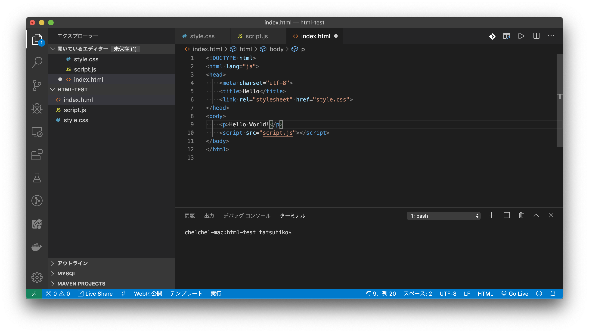
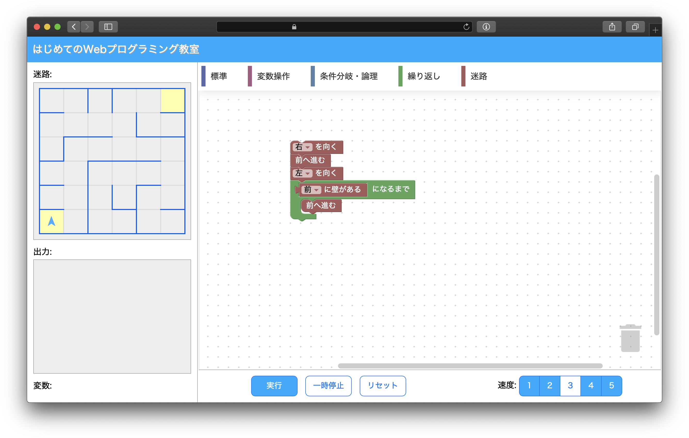

第 70 回駒場祭は、2019/11/22〜11/24 の３日間で開催されました。本年度の駒場祭は、初日が平日であったことに加え、雨天予報が出ていたため、来場者数の減少が危惧されていましたが、私たち ut.code();の企画「はじめての Web プログラミング教室」では、多くの方にお越しいただきました。本当にありがとうございました。

さて、本年度の駒場祭では、２つの企画を同時進行する形式をとりました。これは、ut.code();の実際の活動を体験していただくための企画に加え、親子連れの方々にもお楽しみいただける企画を用意したためです。以下、どのような活動が行われたのかをご報告させていただきます。

## はじめての Web プログラミング教室

駒場祭企画全体のタイトルにもなっている企画です。近年、ソフトウェア開発の主流が Web 関連の技術に移行しつつあることを踏まえ、Web 技術を用いて開発を行うメリットを感じていただくための企画として設計しました。HTML / CSS / JavaScript を一通り実際に書いてみて、最終的にインターネット上に公開するところまで実施しました。JavaScript に関してはプログラミング自体が未経験の方でも楽しんでいただけるよう、jQuery を導入しました。

### サンプルコードの自動展開

プログラミング学習を妨げる一つの要因に、タイピング速度の問題があります。特に書籍の形式の参考書の場合、サンプルコードが長くなってくると、入力が面倒であることが学習意欲を減退させる原因になることもあります。Web 開発の場合、プログラムを書き始める前にある程度定型句となる部分があるため、この問題が顕在化しやすいです。この企画では、学習者の負担を最大限軽減するため、ボタン一つでサンプルコードをプロジェクトディレクトリに展開する機能を用意しました。

実装の方法は至って単純です。Visual Studio Code の拡張機能を利用しました。Visual Studio Code の拡張機能開発では Node.js の全機能を利用できるため、npm の豊富なライブラリ群を、依存関係を意識することなく気軽に導入することができます。また、デフォルトで用意されているテンプレートが優秀で、TypeScript 連携や強力なデバッガまで標準で用意されています。さすが人気エディタですね。

### ホスティングサービスへの自動デプロイ

Web 開発を行う上での最大のメリットは、やはり製品を即座に全世界に向けて公開することができる点ですね。せっかく Web 開発を体験するのなら、ここまでやらないと意味がない。そのような思いのもと、ホスティングサービス（Netlify を利用しました）への自動デプロイも、ワンクリックで実施できるようにしました。こちらも公開されている API を Node.js で叩くだけの簡単な作業ですが、自動的に QR コードを生成し、駒場祭にお越しいただいたお客様のスマートフォンでも表示できるようにするなど、はじめての「感動」を重視した体験作りを心がけました。

## ビジュアルプログラミング

前項の「はじめての Web プログラミング教室」は、Web 以外のプラットフォームでプログラミングを学習したことがあるものの、つまらないと感じていた方に向けた企画でした。小さなお子様や、コンピューターをあまり使用しない方にもプログラミング的思考を体験していただくために用意した企画がこちらです。

### 自然言語からプログラミング言語へ

ビジュアルプログラミング言語として有名なものに、米マサチューセッツ工科大学の開発したビジュアルプログラミング言語 Scratch があります。過去の Scratch は Flash ベースの独自エンジンでしたが、2019 年 11 月現在の最新版の Scratch は、Google 社の OSS である[Blockly](https://developers.google.com/blockly)がベースとなっています。Blockly は SVG により描画を行なっているため、現在の Scratch はスマートフォンやタブレットなどの環境でも問題なく動作します。

Blockly は OSS として開発されているため、独自アプリケーションに組み込むことも比較的容易です。この企画で使用しているソフトウェアは、そんな Blockly をベースに開発しました。左のパネルに表示されている迷路を、「前に進む」「左/右を向く」といった動作ブロックと、「前/後/左/右に壁がある」といった条件分岐ブロックのみを用い、**ランダムに生成される迷路**を普遍的に解くことができるアルゴリズムを構築することが目標です。迷路の必勝法といえば片手を片方の壁に付けながら迷路を進む「右手法（左手法）」が有名ですが、この「片手を壁につけながら」という曖昧なルールを、限られた命令のみが使用できるプログラミングの環境においてどのように表現できるかを考え出すことは、プログラミング経験者でなければかなり難しいです。

### 未来のエンジニアたち

企画を通して非常に印象的だったのが、熱心に課題に取り組んでくださった親子連れの方々の姿でした。用意した企画は２つともかなり難しめだったにも関わらず、楽しんでいただけた方々が多かったようです。

また、すでにプログラミング学習を始めていらっしゃるというお子様や、これからお子様にプログラミングを教えたいという保護者の方々も多くいらっしゃいました。この企画が、少しでもそういった方々の力になれたならば幸いです。
