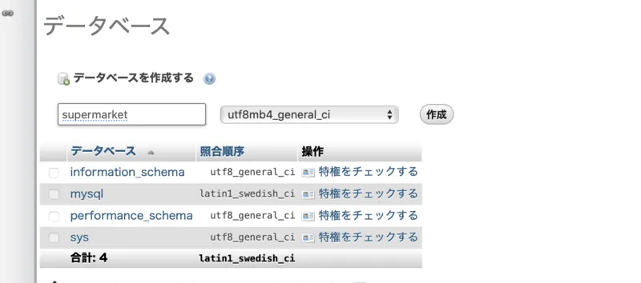
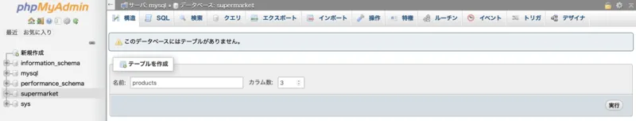
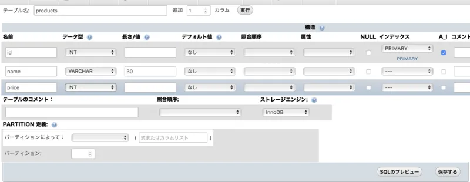
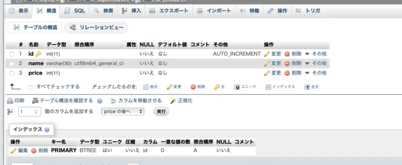
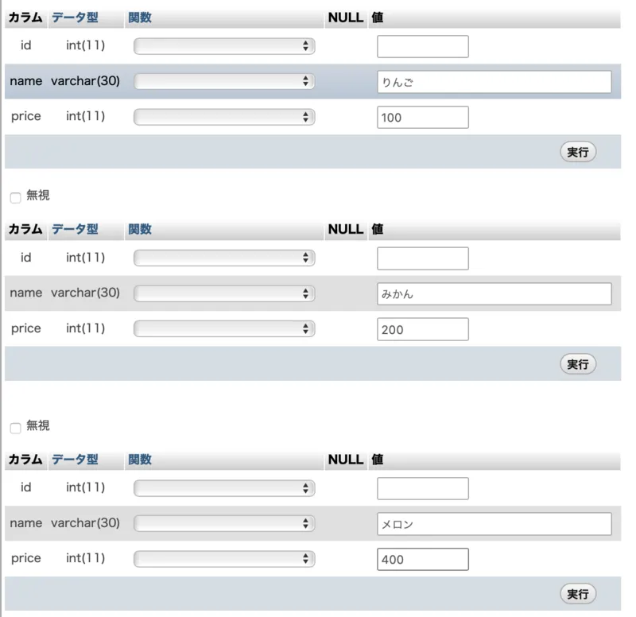

辛い回が続きます・・・もう少しの辛抱です！

## 環境構築

今回のカリキュラムは、前回の続きで Vultr の VPS 上で

```
curl -fsSL https://raw.githubusercontent.com/chelproc/utcode-lectures-setup/master/lamp-on-docker/init.sh | sh
```

が実行されていることを前提としています。すでに実施済みの方は再度実行する必要はありません。

## データベース

前回の課題で実装した商品検索システムは大分本格的なものになっては来ましたが、せっかくデータの検索ができても、データの追加や編集、削除ができなければ実用性は皆無ですね。では、ユーザーが自由にデータを編集できるようにするために、何が必要でしょうか。まず考え得るのは、編集されたデータをどのように保存しておくかという点です。もっとも単純な方法は、データを JSON 形式等にしてファイルに保存しておく点です。この方法であれば、複雑な操作は必要ありませんし、JSON ですので非常に複雑なデータ構造でも簡単に処理できます。

しかしながら、このような実装とした場合、複数人で同時に編集操作が行われると、困ったことが起こります。あとから編集するユーザーが、先に編集していたユーザーのデータを上書きしてしまう可能性があるということですね。

検索機能を追加したいという要望が出てきたらどうでしょうか。一般に、n 件のデータを全て検索するためには、O(n)の計算時間がかかります。データが数万件、数十万件と増えてきたら大変ですね。そこで一般的には、データをあらかじめ小さい順に並べておき、計算量を O(log n)に抑えるといった手法がとられます。

これらを全て自らの手で実装しようとすれば、膨大な工数がかかってしまうのが目に見えていますね。そこで利用するのが、**データベース**です。

## RDBMS

現代のデータベースは、大きく分けて二種類に分類することができます。**RDBMS**と**NoSQL**です。前者の RDBMS は、**リレーショナルデータベース**（関係データベース）とも呼ばれ、Excel のように行（＝**レコード**）と列（＝**カラム**）の形式でデータを管理します。今回扱う**MySQL**は、オープンソースで開発されている RDBMS の代表的な製品です。

### データベースを作成する

一般的なデータベースは、データベースサーバーの形式で使用します。RDB を操作するための言語を SQL と呼び、SQL を用いることでデータベースに関する全ての操作を行うことができます。今回は説明の簡略化のため、SQL を直接扱わず、phpMyAdmin と呼ばれる Web アプリケーションを用いて操作していきます。

phpMyAdmin は、その名の通り PHP 上で動作する MySQL クライアントです。冒頭のスクリプトにより自動的にインストールされているはずなので、追加でインストールする必要はありません。55556 番ポートで接続を受ける設定になっているので、このポートにアクセスしてみてください。


MySQL において、最も大きなまとまりを「データベース」と呼びます。データベースの中には、複数の「テーブル」と呼ばれるデータ構造が存在し、「テーブル」は同じ種類のデータの集まりです。

MySQL において、現在存在している全てのデータベースの一覧を取得するためには、以下の SQL を実行します。phpMyAdmin はこの SQL を自動的に発行してデータベースの一覧を取得しています。

```
SHOW DATABASES
```

初期状態で表示されている４つのデータベースは内部処理用に使用されるものですので、直接操作することは避けた方が無難です。

それでは、「新規作成」ボタンを押下し、新しいデータベースを作成しましょう。



今回は、データベース名を「superamarket」に設定しました。隣のセレクトボックスは照合順序です。検索をかける際に影響が出るので、上の図のように設定しておくのが良いでしょう。入力が終わったら、「作成」ボタンを押してください。この操作によって発行される SQL は、おおよそ以下のようになります。

```
CREATE DATABASE supermarket
```

### テーブルを設計する

続いて、データベース「supermarket」に対してテーブルを作成しましょう。



３つのカラム（＝列）を持つテーブル「products」を作成しましょう。



RDBMS は、テーブルの単位でデータを管理するため、使用する前にテーブルの設計が必要不可欠です。今回は、商品リストを管理するためのテーブルを作成します。テーブルの設計とは、そのテーブルでどのような種類のデータが使用されるかを定義することです。今回は商品リストを管理するため、識別用 ID、商品名、消費価格を設定してみました。

右側の「インデックス」を使用すると、インデックスを指定したカラムでの検索を高速化することができます。便利なオプションですが、乱用しすぎるとストレージを圧迫するため、ほどほどにするようにしましょう。A_I は AUTO_INCREMENT の略で、指定しておくとレコードの追加の際に自動的に連番を割り当ててくれます。

以上の設定を施して実行すると、以下のような SQL が発行されます。

```
CREATE TABLE `supermarket`.`products` (
    `id`    INT NOT NULL auto_increment,
    `name`  VARCHAR(30) NOT NULL,
    `price` INT NOT NULL,
    PRIMARY KEY (`id`)
)
```

### レコードを追加する



テーブルが作成されると、以上のような画面になります。「挿入」ボタンから、早速新しいレコードを追加してみましょう。



新しいレコードの追加

id カラムには AUTO_INCREMENT が指定されているので、ここで指定する必要はありません。これを実行すると、以下のような SQL が発行されます。

```
INSERT INTO `products` (`id`, `name`, `price`) VALUES (NULL, 'りんご', '100'), (NULL, 'みかん', '200'), (NULL, 'メロン', '400')
```

## PHP から MySQL にアクセスする

PHP から MySQL にアクセスするための方法はいくつかありますが、最も単純なものとして、[mysqli クラス](https://www.php.net/manual/ja/class.mysqli.php)を使用する方法があります。mysqli クラスを利用して、データベースからデータを取得してみましょう。

```
<?php
$mysqli = new mysqli('mysql', 'root', 'utcode2019', 'supermarket');
$mysqli->set_charset('utf8');
$result = $mysqli->query('SELECT * FROM products');
?>
<!DOCTYPE html>
<html lang="ja">
<head>
    <meta charset="utf-8">
    <title>データベース</title>
</head>
<body>
    <table>
        <tr><td>ID</td><td>商品名</td><td>価格</td></tr>
        <?php foreach ($result as $row): ?>
            <tr>
                <td><?= $row['id'] ?></td>
                <td><?= $row['name'] ?></td>
                <td><?= $row['price'] ?>円</td>
            </tr>
        <?php endforeach; ?>
    </table>
</body>
</html>
```

2 行目では、mysqli クラスのインスタンスを生成しています。コンストラクタの引数は順にホスト名、ユーザー名、パスワード、データベース名です。set_charset メソッドで文字コードを指定したうえで、query メソッドを実行します。query メソッドに指定した SQL が成功すると、[mysql_result オブジェクト](https://www.php.net/manual/ja/class.mysqli-result.php)が得られます。このオブジェクトは[列挙可能（＝イテラブル）](https://www.php.net/manual/ja/language.oop5.iterations.php)であるため、foreach 文を用いて各行を取得することができます。

なお、コード中央の

```
<?= $row['id'] ?>
```

は、[式の値をそのまま出力するための書き方](https://www.php.net/manual/ja/function.echo.php)です。

### SQL インジェクション

INSERT 文を用いてユーザーが入力したデータをデータベースに追加することを考えます。しかしながら、次のコードは**重大な脆弱性**を含んでいます。何が問題なのか考えてみましょう。

```
<?php
$mysqli = new mysqli('mysql', 'root', 'utcode2019', 'supermarket');
$mysqli->set_charset('utf8');

$name = $_POST['name'];
$price = $_POST['price'];
$result = $mysqli->query("INSERT INTO products (name, price) VALUES ('$name', '$price')");
```

上記のサンプルプログラムの問題点は、SQL の中にユーザーの入力を直接埋め込んでいることです。この例の場合、もしユーザーがシングルクォートを含む文字列を入力したとしたら、どうなるでしょうか。SQL の文法が乱され、予期しないクエリが発行されてしまう可能性がありますね。この脆弱性のことを**SQL インジェクション**と呼びます。非常に有名な脆弱性なので、必ず頭の中に入れておきましょう。

#### 対策 1: エスケープ関数を使用する

mysqli クラスの real_escape_string メソッドを使用すると、ユーザーが入力した文字列を安全な形式にエスケープすることができます。このメソッドを使用した例が以下になります。

```
$name = $mysqli->real_escape_string($_POST['name']);
```

これにより、$name 変数は SQL として安全な文字列になります。しかしながら、この方法ではプログラマのミスが生まれやすいため、あまり積極的に利用することはお勧めしません。

#### 対策 2: プリペアードステートメントを利用する

プリペアードステートメントを利用すると、より安全に SQL を構築することができます。

```
$stmt = $mysqli->prepare('INSERT INTO products (name, price) VALUES (?, ?)');
$stmt->bind_param('si', $name, $price);
$stmt->execute();
```

mysqli クラスの[prepare メソッド](https://www.php.net/manual/ja/mysqli.prepare.php)を使用すると、事前に SQL のテンプレートを用意しておくことができます。この際、ユーザー入力を扱う部分をクエスチョンマークにしておきます。クォーテーションは勝手にやってくれるので必要ありません。

prepare メソッドの戻り値は[mysqli_stmt オブジェクト](https://www.php.net/manual/ja/class.mysqli-stmt.php)です。[bind_param メソッド](https://www.php.net/manual/ja/mysqli-stmt.bind-param.php)を使用して先ほどの空白部分に割り当てる値を指定します。この際、第一引数はデータ形式を指定してください。今回は文字列型、整数型の順番なので si と指定しています。最後に[execute メソッド](https://www.php.net/manual/ja/mysqli-stmt.execute.php)を実行して SQL を実行してください。SQL の結果が必要な場合は[get_result メソッド](https://www.php.net/manual/ja/mysqli-stmt.get-result.php)により取得できます。

#### 対策 3: ライブラリを使用する

データベースをより安全に扱うためのライブラリが多数存在します。今回は扱いません。

## 課題

前回の課題で作成した商品検索システムを改変し、名前が入力されたらデータベースから対応する商品を探し出してその価格を表示するシステムを構築してください。
