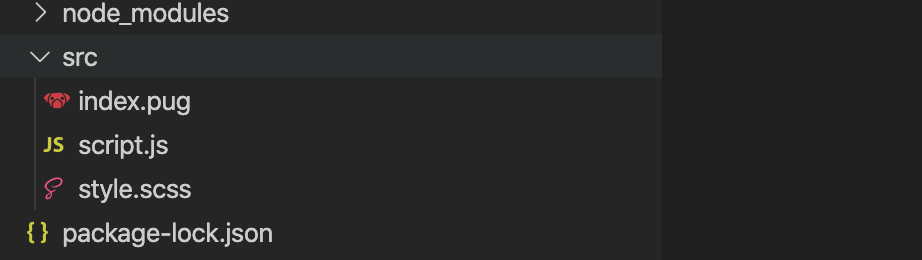

今回はフロントエンドに戻ります。ここからは比較的新しい開発手法を取り入れていきます。

## ブラウザ外で動作する JavaScript

これまで私たちが書いてきた JavaScript は、ブラウザ上で動作することを前提としていました。しかしながら、JavaScript は、ブラウザを介さず、Python のように直接実行されることを想定した実装があります。現在の標準は**Node.js**です。高速に動作することで有名な Google Chrome の V8 と呼ばれる JavaScript エンジンを搭載しているため、その高速さは折り紙付きです。

適当なディレクトリ に適当な JavaScript ファイルを配置し、以下のように記述してください。

```
console.log("Hello World!");
```

このファイルが index.js という名前で作成されているとして、以下のコマンドを実行してください。

```
node index.js
```

node コマンドは、Node.js を起動させるためのコマンドです。引数としてファイル名を与えることで、そのファイルを JavaScript と解釈して実行します。


おめでとうございます！Hello World と表示できました！

## JavaScript でモジュール分割

Node.js では exports というオブジェクトが常に使用できます。この exports オブジェクトのプロパティに対し適当な値を代入することで、JavaScript を複数ファイルで使用することができます。

```
const lib = require("./lib");
lib.writeHello();
```

```
exports.writeHello = () => {
    console.log("Hello!");
};
```

lib.js では、exports オブジェクトの writeHello メソッドを定義しています。lib.js の exports オブジェクトは index.js から require("./lib");の形で取り出すことができ、内部で定義されていたメソッドが実行できるようになります。

## npm: Node.js のパッケージマネージャー

Node.js では、npm と呼ばれるパッケージマネージャーが使用できます。npm を用いると、世界中の開発者によって開発されている膨大な数のパッケージを、コマンド一つで簡単に導入することができるようになります。まずはプロジェクトディレクトリで以下のコマンドを実行してみましょう。

```
npm init -y
```

npm を使用するためには、まず npm の管理下に置くディレクトリの直下で npm init コマンドを実行する必要があります。このコマンドを実行すると、そのディレクトリに package.json が生成され、対象となるプロジェクトに関する詳細情報が記録できるようになります。package.json は他にもインストールされたパッケージの一覧を保存しておく役割もある重要なファイルです。

```
npm install mathjs
```

npm install コマンドを実行すると、パッケージをインターネットから自動的に取得してインストールします。npm install コマンドは（特殊なオプションを使用しない限り）package.json が配置されているディレクトリより外側には一切の影響を及ぼしません。上記コマンドを実行すると、package.json と同じディレクトリに node_modules ディレクトリが生成され、その中に mathjs パッケージと mathjs が依存している（＝内部的に使用している）パッケージがインストールされます。また、同時に生成される package-lock.json には、依存先のパッケージを含めて全てのパッケージのバージョンが記録されます。

この時点で、package.json の中身は以下のようになりました。

```
{
  "name": "development",
  "version": "1.0.0",
  "description": "",
  "main": "index.js",
  "scripts": {
    "test": "echo \"Error: no test specified\" && exit 1"
  },
  "keywords": [],
  "author": "",
  "license": "ISC"
}
```

それでは早速 mathjs パッケージを使用してみましょう。前の例と同じように、パッケージは require 関数を用いることでインポートできます。

```
const mathjs = require("mathjs");
console.log(mathjs.evaluate("3 + sqrt(4 * 9)"));
```

npm によってインストールされたパッケージはパスを指定せずとも使用することができます。上記コードにより、コンソールに数値 9 が表示されます。

## 余談: Ubuntu 標準のパッケージマネージャー apt

Linux には、標準でパッケージマネージャーが付属している場合が多いです。パッケージマネージャーを使用すると、必要なソフトウェアを素早く、かつ安全にインストールすることができます。Ubuntu では、標準のパッケージマネージャーに apt を採用しています。Ubuntu の VPS を使用している場合は以下のコマンドを実行してみましょう。

```
apt install sl
```

sl コマンドは Linux の有名なジョークプログラムで、ls（ディレクトリの中身を一覧表示する）コマンドを打ち間違えた限界エンジニアの心を癒すためのものです。

## npm パッケージをコマンドとして実行する

npm パッケージの中には、コマンドとして実行できるものも存在します。代表的なものが[rimraf](https://www.npmjs.com/package/rimraf)です。Linux ではディレクトリをその子孫まで含めて強制的に削除するために rm -rf コマンドを使用しますが、残念なことに rm コマンドは Windows では使用できません（忌々しき Windows め！）。rimraf は、Windows と Linux の差異を吸収するためのパッケージです。

```
npm i -D rimraf
npx rimraf [作業したいディレクトリ名]
```

npm i は npm install の省略形になります。-D オプションを付与することで、package.json に記録される際、対象パッケージが開発時のみに使用されるものであることを明示することができます。先ほど mathjs をインストールした際の package.json と比較してみてください。

npx コマンドは、npm によってインストールされたパッケージをコマンドとして実行するためのコマンドです。パッケージが既にインストールされている場合はインストールされたパッケージを実行し、インストールされていない場合はパッケージを一時的にインストールして実行します。

## モジュールバンドラ

ブラウザから JavaScript を読み込む為には、通常 script タグを HTML に記述します。複数の JavaScript ファイルを実行させたい場合、ファイルの数だけ script タグを記述する必要があります。script タグを忘れてしまえば、必要なファイルが読み込まれていないことが原因で、別のスクリプトの実行が失敗してしまうでしょう。一方、Node.js では require 関数により JavaScript から直接別の JavaScript ファイルを参照できます。この方法は、スクリプトがそのソースコード内に必要とするファイルを明示しているという点で、より優れた構成であるということができるでしょう。

**モジュールバンドラ**を使用すると、モジュール単位で分割された JavaScript ファイルを一つにまとめる（**バンドル**）ことができます。これにより、ブラウザでもモジュール化された JavaScript を（あくまで最終的に出力されるファイルは単一ファイルですが）実行できるようになります。また、npm によりインストールされたパッケージもバンドルすることができるため、開発の幅が広がります。

スクリプト A・B が存在し、 A は B で定義されている機能を呼び出していたとします。このとき、スクリプト A はスクリプト B に**依存**していると言います。スクリプト A・B・C が存在し、A は B と C に、C は B に依存しているとします。このとき、スクリプトは B→C→A の順で読み込まれる必要があります。このような処理を**依存関係の解決**といいます。モジュールバンドラの主な役割は依存関係の解決です。

JavaScript のモジュールバンドラとして近年のスタンダードは[webpack](https://webpack.js.org/)です。

## トランスパイラ

プログラムを機械が実行できる形式に変換する作業のことをコンパイル、またそれを実行するためのソフトウェアをコンパイラと呼ぶことは有名です。Web の世界では、あるソースコードを HTML/CSS/JavaScript の形式に変換するという作業が発生する場合があります。このような作業を**トランスパイル**と呼び、そのためのソフトウェアを**トランスパイラ**と呼びます。

### Pug: HTML にトランスパイルされる言語

[Pug](https://pugjs.org/)は、HTML をシンプルに記述することのできるマークアップ言語です。HTML は比較的シンプルな言語ですが、開始タグと終了タグでタグ名を２回記述する必要がある点をはじめとして、いくつかの欠陥が指摘されます。Pug を利用すると、

```
<main class="contents">
  <header>Hello World</header>
  <p>Lorem ipsum.</p>
</main>
```

を、

```
main.contents
  header Hello World
  p Lorem ipsum.
```

のように記述できます。本カリキュラムではあまり使用しません。

### Sass: CSS を超絶便利にする言語

[Sass](https://sass-lang.com/)を使用すると、複雑な CSS をシンプルに記述することができます。[公式ガイド](https://sass-lang.com/guide)にできることが簡潔に纏まっているので詳しい説明は省略しますが、CSS に変数やループ、条件分岐、ネストなどの高度な抽象化概念を導入することができるようになります。本カリキュラムでも積極的に採用します。

### JavaScript のトランスパイラ

JavaScript のトランスパイラとして最も有名なものは[Babel](https://babeljs.io/)です。Babel は、JavaScript を JavaScript にトランスパイルします。どういうことでしょうか？

JavaScript はブラウザで実行される言語です。そして、最も速く進化しているプログラミング言語の一つでもあります。JavaScript は、[Ecma International](https://www.ecma-international.org/)と呼ばれる組織により、ECMAScript という名前で標準化されています。最新の ECMAScript で使用できる機能が、ブラウザではまだ実装されていないという場合が頻繁に訪れます。最新の JavaScript を、古いブラウザでも読み込める形式に変換するためのソフトウェアが、Babel になります。本カリキュラムでも、これ以降ブラウザ向けの JavaScript は Babel によりトランスパイルされているものとします。

もう一つ、JavaScript にトランスパイルされる言語として、[TypeScript](https://www.typescriptlang.org/)も重要です。TypeScript は、比較的ルーズな言語仕様を持つ JavaScript に非常に強力で厳格な型システムを導入するための言語です。Ajax の台頭以降加速度的に複雑さを増す JavaScript において、開発効率を大きく上昇させることができます。このカリキュラムでも今後扱う予定です。

Babel と TypeScript は併用される場合が多いです。この場合、TypeScript→Babel の順でトランスパイルを実行することになります。

## Parcel の利用

[Parcel](https://parceljs.org)は、Babel、TypeScript、Sass、Pug など有名どころのトランスパイラ全てと、モジュールバンドラ、そしてホットリロード（ソースコードの変更を検知して自動的にブラウザで表示される内容を更新すること）に対応するプレビューサーバーを全て内包する非常に強力なソフトウェアです。設定不要で動作することを売りにしており、実際に小規模なプロジェクトの場合ほとんど Parcel のデフォルト設定で事足ります。学習用にも最適です。

```
npm i -D parcel-bundler
```

パッケージ[parcel-bundler](https://www.npmjs.com/package/parcel-bundler)を-D オプションをつけてインストールしましょう。続いて、ソースコードを記述します。

```
doctype html
html(lang="ja")
  head
    meta(charset="utf-8")
    title Hello Parcel
    link(rel="stylesheet", href="style.scss")
  body
    h1 計算機
    input#expression(type="text")
    button#calculate 計算
    div#result
    script(src="script.js")
```

```
#expression {
    font-size: 2em;

    &:focus {
        border-color: red;
    }
}
```

```
const mathjs = require("mathjs");
document.getElementById("calculate").onclick = () => {
    document.getElementById("result").textContent = mathjs.evaluate(
        document.getElementById("expression").value
    );
};
```

トランスパイルやモジュールバンドル伴うプロジェクトの場合、ソースファイルとトランスパイル後のファイルが共存することになります。この時、プロジェクトのルートディレクトリにソースファイルを配置してしまうと、最終的に出力されたファイルを置く場所がなくなってしまいます。そのため、適当なディレクトリを作成し、その中でコードを書き進めると良いです。今回は src ディレクトリ（よく使われる source の略語です）を使用しました。



Parcel コマンドは引数にエントリポイントをとります。src/index.pug を指定して、Parcel を実行しましょう。

```
npx parcel src/index.html
```


Parcel は、index.html の中に記載された script タグや link タグを自動的に認識し、それらの参照先ファイルがトランスパイルの対象であれば、自動的にトランスパイルし、バンドリングします。出力されたファイルはプロジェクトディレクトリ直下に自動的に生成される dist ディレクトリ（この挙動は変更可能です）に生成され、ブラウザから表示させることが可能です。また、Parcel にはホットリロード可能な開発用サーバーを起動する機能も標準で用意されているため、そのためのリンクが表示されます。

## 課題

- [japanese-holidays パッケージ](https://www.npmjs.com/package/japanese-holidays)を使用すると、日本の祝日を取得することができます。ページを表示した年の全ての祝日を表示するシステムを作成してください。
- Sass を用いて簡単なスタイリングを施してみてください。
- Parcel が dist ディレクトリに出力した HTML/CSS/JavaScript を読んでみましょう。

### 注意

サンプルコード中で変数宣言に var が使用されています。最新の JavaScript では let または const を使用するので注意してください（2019 年 12 月現在）。
