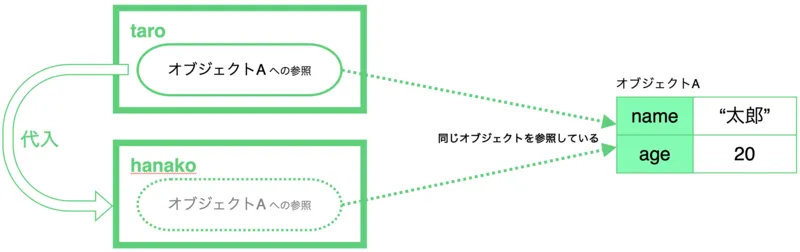
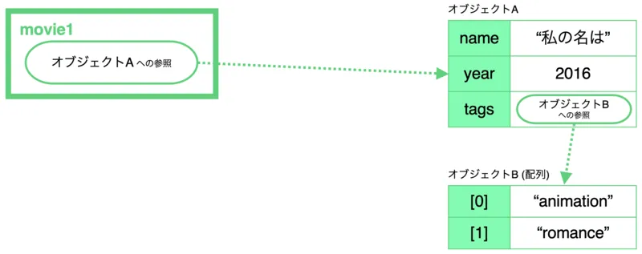

前回、JavaScript が ECMAScript（ES と略されることが多いです）をベースとしていることを学習しました。ECMAScript は、バージョンが 5 から 6 に上がると同時に、大幅な機能追加が行われました。現代の JavaScript は巨大化・複雑化の一途を辿っていますが、この理由の一端は、ES6 以降に実装された文法機能が劇的に開発効率を上げたことにもあります。この回では、昨今の JavaScript では必須の考え方である不変性（イミュータビリティ）の考え方について学びます。

## イミュータビリティ

### 参照とオブジェクト

注: この項目は非常に重要で、かつ正確に説明されている資料が少ないです。丁寧に読み進めてください。

突然ですが問題です。太郎さんと花子さんは同じ年齢ですが、（当たり前ですが）名前は違います。この性質を利用して、太郎さんと花子さんのプロフィールを表すオブジェクトを以下のように作成しました。

```
const taro = {
    name: "太郎",
    age: 20
};

const hanako = taro;
hanako.name = "花子";
```

このとき、

```
taro.name
```

は何になるでしょうか？

「太郎」だと思いましたか？残念、答えは「花子」です。どうしてでしょうか。これは、オブジェクトリテラルが、そのオブジェクト自身ではなく、その**参照**を生成するからです。C 言語の経験がある方はポインタと言って差し支えないでしょう。

もう少し具体的に説明していきます。１〜３行目の右辺、オブジェクトリテラル

```
{
    name: "太郎",
    age: 20
}
```

が実行されると、メモリ上にリテラルが示すオブジェクトが展開されるわけですが、式の生成する値自体は、実際のオブジェクトへの参照になります。6 行目では hanako に taro を代入していますが、実際に代入されているのは変数 taro に格納されている、先ほど生成されたオブジェクトへの参照が代入されているに過ぎません。つまり、taro と hanako は同じオブジェクトを参照していることになってしまっているのです。このため、hanako.name を書き換えれば、taro.name も自動的に書き変わってしまいます。



JavaScript では、様々な値を使用することができますが、ほとんどの値は参照として使用されます。参照として扱われない値、具体的には変数から変数へコピーしたときにその値自体がコピーされる値は、**数値、文字列、真偽値、（null、undefined、シンボル）**のみです。JavaScript において、このような値を**プリミティブ**といい、プリミティブが持つ性質、つまり一度生成された値がメモリ上で書き換えられることがないという性質を指して、プリミティブは**イミュータブル**であると言います（[MDN の記事](https://developer.mozilla.org/ja/docs/Glossary/Primitive)を参照）。

JavaScript では、非プリミティブな値は参照によりやりとりされます。参照のみのコピーのことを**シャローコピー**、参照先のオブジェクトを含めてメモリ上の値を完全に複製するコピーのことを**ディープコピー**と呼びます。JavaScript の標準ライブラリでは、ディープコピーのための関数等は用意されていません。ディープコピーが必要な場合は自作するか、npm のライブラリを探してみましょう。

この問題が顕著に起こるのが、関数を呼び出した場合です。以下の例を見てください。

```
function evilized(person) {
    person.age *= 2;
    return person;
}

const taro = {
    name: "太郎",
    age: 20
};
const evilTaro = evilized(taro);
```

evilized 関数は、age フィールドを２倍したオブジェクトを返すことを期待されています。しかしながら、

```
evilized(taro)
```

とした際、関数に渡されるのはオブジェクトそのものではなく、その参照なのでした。このため、関数の中で参照先のオブジェクトを書き換えてしまえば、呼び出し元から見えるオブジェクトも変わってしまいます。この場合では、taro も evilTaro も同じオブジェクトを参照しているからです。

以上のように、ある関数が、その関数外に対し戻り値以外の方法で影響を及ぼし得るとき、その関数は**副作用を持つ**ということがあります。副作用を持つ関数は、その挙動の予測が困難であるため、可能な限り作成しないようにしましょう。

### イミュータビリティを破壊する操作

以下に示すような操作は、非プリミティブな値のイミュータビリティを破壊する操作になります。

#### フィールド・配列の要素への再代入

先ほどの例でも扱いました。

```
const taro = {
    name: "太郎",
    age: 20
};
taro.age = 25;
```

上記の例では、taro が持つ参照先のオブジェクトに対し変更が加えられています。

変数への再代入は、イミュータビリティを壊しません。

```
let taro = {
    name: "太郎",
    age: 20
};
taro = {
    name: "太郎",
    age: 25
};
```

この例では、1〜3 行目で生成されるオブジェクトと 4〜6 行目で生成されるオブジェクトが完全に異なっており、当然のことながら参照先も異なっています。このため、メモリ上のオブジェクトが後から変更されることはありません。

#### 破壊的メソッドの使用

メソッドの内部でフィールドの変更が行われている場合、そのメソッドを**破壊的**であると言います。メソッドが破壊的であるかどうか知る方法は、ソースコードかリファレンスを読むことしかありません。代表的なメソッドが破壊的か非破壊的なのかは、ある程度記憶しておくようにしましょう。Ruby など、破壊的メソッドに対し特殊な命名規則を適用することが一般的となっている言語もあります。

JavaScript では、破壊的であることに気付きにくいメソッドとして、[Array#sort メソッド](https://developer.mozilla.org/ja/docs/Web/JavaScript/Reference/Global_Objects/Array/sort)が存在します。このメソッドは、配列をソートしてソート後の配列を返しますが、ソートは元のインスタンス上で直接行われます。下のコードを見てください。

```
const array1 = [3, 1, 5, 2, 4];
const array2 = array1.sort();
```

このとき、array2 は当然 \[1, 2, 3, 4, 5\] ですが、実際には array1 も \[1, 2, 3, 4, 5\] になっています。

### スプレッド構文

スプレッド構文は、「...（ドット３つ）」で表される構文で、配列やオブジェクトなどの構造を他の場所に展開するために用いられます。

#### 配列の展開

配列中でスプレッド構文を用いると、その場所に別の配列等を展開することができます。

```
const array1 = [1, 2, 3];
const array2 = [0, ...array1, 4];
```

array2 は \[0, 1, 2, 3, 4\] となります。

また、この記法を用いることで、配列のコピーを手軽に行うことができます。

```
const array1 = [4, 2, 5, 1, 3];
const array2 = [...array1].sort();
```

\[...array1\] と記述することで array1 がコピーされるので、sort メソッドを安全に実行できます。

#### オブジェクトの展開

オブジェクトリテラル中でスプレッド構文を用いると、別のオブジェクトのキーと値を組み込むことができます。重複するキーが存在した場合、最後に記述されたキーが優先されます。以下の例を見てください。

```
const taro1 = { name: "太郎", age: 20 };
const taro2 = { age: 25, language: "Japanese" };
const taro3 = { ...taro1, age: 30 };
const taro4 = { ...taro1, ...taro2 };
```

taro3 では、taro1 に language キーが追加された形のオブジェクトになります。taro4 は、taro1 と taro2 で age キーが重複していますが、最後に存在する taro2 が優先されます。

この記法を用いることで、オブジェクト中の特定のフィールドの値だけを変えたオブジェクトを簡単に生成することができます。

```
const taro1 = { name: "太郎", age: 20, language: "Japanese" };
const taro2 = { ...taro1, age: 25 };
```

上記のような記法は非常によく利用します。

なお、スプレッド構文はその他にも様々な用法があります。詳細は[MDN の記事](https://developer.mozilla.org/ja/docs/Web/JavaScript/Reference/Operators/Spread_syntax)を確認してください。

### ネストされた配列やオブジェクトの取り扱い

配列やオブジェクトがネストされていると、より取り扱いが難しくなります。以下に示す構造のオブジェクトを考えてみましょう。

```
const movie1 = {
    name: "私の名は",
    year: 2016,
    tags: ["animation", "romance"]
};
```

movie1.tags に、新しく「supernatural」を加えたオブジェクトを、イミュータビリティを保ったまま生成することを考えます。次の２つのコードは、いずれも間違いです。

```
movie1.tags.push("supernatural");
movie1.tags = [...movie1.tags, "supernatural"];
```

movie1 のデータ構造を、図によって考察してみましょう。



1 行目のコードでは、movie1.tags（=オブジェクト B）に対して破壊的メソッド（Array#push）を実行しているため、オブジェクト B のイミュータビリティが保たれていません。また、2 行目のコードでは、オブジェクト A の tags フィールドに対して再代入が行われているため、オブジェクト A のイミュータビリティが保たれていないことになります。正しいコードは、以下の通りです。

```
const movie2 = {
    ...movie1,
    tags: [...movie1.tags, "supernatural"]
};
```

## 演習

以下のコードにおいて、ichiro は、一郎のプロフィールを表すオブジェクトです。このオブジェクト全体のイミュータビリティを保ったまま、以下に示す変更を加えたオブジェクトを、それぞれ新しく生成してください。

```
const ichiro = {
    name: "一郎",
    age: 20,
    hobbies: ["tennis", "piano", "cycling"],
    examResults: [
        {subject: "science", score: 80},
        {subject: "math", score: 70}
    ]
};
```

- age フィールドを 25 にする
- hobbies フィールドを辞書順に整列する
- examResult フィールドに `{subject: "english", score: 90}` を追加する
