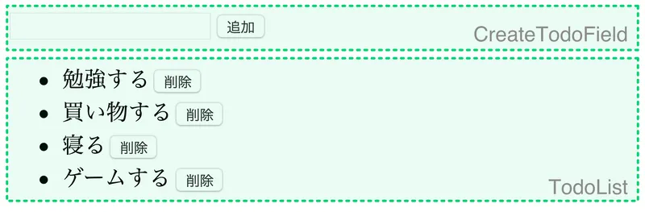

今回は、昨今のフロントエンド開発の人気ライブラリ React を用いて開発する手法を学びます。

## UI 開発のブレイクスルー

ヒトが操作することを想定した UI を開発することには、昔から大きな苦労が付き纏いました。ユーザーはどのような操作を行うか予測できないため、複雑な状態管理が必要だからです。単純なカウンターアプリを作ることを考えてみましょう。

```
<div id="counter">0</div>
<button id="minus">−</button>
<button id="reset">リセット</button>
<button id="plus">＋</button>
<script src="script.js"></script>
```

```
let count = 0;

const counter = document.getElementById("counter");
document.getElementById("minus").onclick = () => {
    count -= 1;
    counter.textContent = count;
};
document.getElementById("reset").onclick = () => {
    count = 0;
    counter.textContent = count;
};
document.getElementById("plus").onclick = () => {
    count += 1;
    counter.textContent = count;
};
```

このコードの問題点は、ボタンのイベントリスナーの中で表示部分の更新を行っていることです。6 行目、10 行目、14 行目で表示部分の更新が行われており、コードの見栄えが悪いですね。また、表示部分が増えたとき、変更の漏れが生じてバグの原因が増えそうです。

そこで、状態変数を用意し、それだけを見て表示部分を更新する関数を作るという手法がよくとられます。

```
let count = 0;
const counter = document.getElementById("counter");
function update() {
    counter.textContent = count;
}

document.getElementById("minus").onclick = () => {
    count -= 1;
    update();
};
document.getElementById("reset").onclick = () => {
    count = 0;
    update();
};
document.getElementById("plus").onclick = () => {
    count += 1;
    update();
};
```

このようなコードにしておくことにより、「状態変数（この場合は count）を更新したら update 関数を呼び出す」とだけ記憶しておけば、表示の更新し忘れを防止することができます。

UI の更新部分を抽象化することで、コードの見通しが良くなることは間違いありません。しかしながら、状態変数に合わせて UI を更新するコードは、実装方法によっては様々な問題を引き起こします。そのうちの一つが、パフォーマンスに関する問題です。例えば、配列型の状態変数があり、その一つ一つが&lt;li&gt;要素にマッピングされる場合を考えてみましょう。

```
const todos = [];
const container = document.querySelector("ul.todolist");

function update() {
    container.innerHTML = "";
    for (const todo of todos) {
        const item = document.createElement("li");
        item.textContent = todo;
        container.appendChild(item);
    }
}

function addTodo(todo) {
    todos.push(todo);
    update();
}
function sortTodo() {
    todos.sort();
    update();
}
```

状態変数は todos、状態変数の反映のための関数が update です。addTodo や sortTodo は UI から呼び出されることを想定しています。document.createElement は新しい HTML 要素を生成するためのメソッドです。

一見シンプルで良さそうなのですが、update 関数に致命的な問題があります。それは、update 関数は実行されるたびに DOM を完全に置き換えてしまう点です。例えば addTodo 関数により、100 件の登録された既存の Todo に対し、１件追加するだけで、それまでの DOM 構造を再構築してしまうといった問題が起こるでしょう。理想を言えば、新しく追加した１件だけをレンダリングして欲しいところですね。

## React の導入

React は、Facebook 社が開発したライブラリで、複雑化しがちな UI の更新処理を自動で、かつ高速に処理することに特化しています。以前の Web 開発では考えられなかった新たな概念を大量に導入することにより、大規模な UI 開発を効率的に行えるようにしました。

React を利用するには、まずプロジェクトに npm で react、react-dom パッケージを導入します。Parcel も利用するので導入しておきましょう。

```
<div id="main"></div>
<script src="script.jsx"></script>
```

```
const React = require("react");
const ReactDOM = require("react-dom");

ReactDOM.render(
    <div>Hello React</div>,
    document.getElementById("main")
);
```

React を使用するプロジェクトの JavaScript ファイルは、通常拡張子が js ではなく jsx となります。その理由は script.jsx の 5 行目を見ると分かります。JavaScript ファイルの中なのにも関わらず謎の HTML タグが出現していますね。この記法を**JSX**と呼びます。

React では、DOM 構造を**仮想 DOM**と呼ばれる JavaScript オブジェクトにより管理します。JavaScript の DOM インターフェース（getElementById、createElement など）は、ブラウザでの描画を伴うため非常にコストの高い処理となります。そこで React では、DOM 構造を一旦プレーンな JavaScript オブジェクトとして管理することにより、まず DOM 構造の差分を仮想 DOM の状態で高速に計算した上で、実際にブラウザに描画しています。

6 行目の

```
<div>Hello React</div>
```

は、トランスパイラの中で

```
React.createElement("div", null, "Hello React")
```

に変換されます。このコードは、React に仮想 DOM の生成を指示するためのコードとなっており、ReactDOM.render メソッドにより実際の DOM に反映させることができます。ReactDOM.render メソッドの第二引数は仮想 DOM をレンダリングするコンテナとなる HTML 要素を指定します。

## カスタムコンポーネントを生成する

React では、React.Component クラスを継承したクラスをカスタムコンポーネントとして利用することができます。render メソッドで、そのコンポーネントの内容を定義することができます。

```
class MyComponent extends React.Component {
    render() {
        return <div>Hello React components</div>;
    }
}

ReactDOM.render(
    <MyComponent />,
    document.getElementById("main")
);
```

1〜4 行目で、React.Component クラスを定義しています。render メソッドを実装し、適切な仮想 DOM を返却するようにしておくと、そのクラス名をあたかもタグのように扱うことができます。8 行目では、最初に定義した MyComponent クラスを早速 HTML タグとして使用しています。なお、HTML では、`<Tag />` と記述することで、中身のないタグの開始タグと終了タグを同時に記述することができます。HTML では input タグなど、終了タグを必要としないタグがありましたが、JSX では全てのタグは終了タグを持つ必要があります。このため、`<Tag />` などの省略記法がよく使われます。

## カスタムコンポーネントへのデータの埋め込み

JSX 記法は一見奇妙な記法ではあるのですが、結局のところトランスパイラにより適当なメソッド（React であれば React.createElement）の呼び出しへと変換されます。トランスパイラが出力したコードを一度眺めてみると良いでしょう。したがって、JSX の中には全ての JavaScript として有効な式を記述することができます。JSX の中に式を記述するためには、波かっこを使用します。

```
<div>{1 + 2}</div>
<input
    type="text"
    placeholder={
        navigator.language.includes("ja") ?
            "ここに入力してください。" :
            "Please input here."
    }
/>
```

1 行目の例は比較的分かりやすい例で、div タグの中身を波かっこにすることで、JavaScript の計算式が計算できるようになっています。2 行目以降の例は HTML 要素の属性を JavaScript 式にする例です。通常、HTML 要素の属性にはダブルクォーテーションを利用しますが、式を指定する場合は波かっこを使用します。今回カッコ内で使用されているのは[三項演算子](https://developer.mozilla.org/ja/docs/Web/JavaScript/Reference/Operators/Conditional_Operator)と呼ばれる演算子で、JSX で頻繁に登場します。

カスタムコンポーネントに属性を適用すると、props フィールドにその値が連想配列（オブジェクト）形式で格納されます。

```
class SelfIntroduction extends React.Component {
    render() {
        return <div>こんにちは、私は{this.props.name}です。</div>;
    }
}

ReactDOM.render(
    <SelfIntroduction name="田中" />,
    document.getElementById("main")
);
```

この場合、render メソッドはあくまで SelfIntroduction クラスのインスタンスメソッドであるため、this キーワードを通して props フィールドにアクセスできます。

## ループの処理

JSX の中で扱えるのは JavaScript 式なのでした。JavaScript「式」というのがポイントです。埋め込めるのはあくまで式なので、for 文や if 文などの制御構文は使用することができません。if 文に関しては前項でチラリと説明したように三項演算子で代用できる場合が多いです。それでは for 文、繰り返しはどう表現したら良いのでしょうか？

答えは、Array#map メソッドです。JSX では、子要素が配列の形式で扱われます。したがって、配列を流し込むことで、任意の数の要素を動的に表示できます。例を見てみましょう。

```
<ul>
    {[1, 2, 3, 4, 5].map(value =>
        <li key={value}>{value}</li>
    )}
</ul>
```

上記の JSX は、1〜5 の整数をリストとして出力するための JSX です。アロー関数の戻り値として li タグが指定されている点に注目してください。また、React で Array を動的に生成して要素のリストとして利用する場合、key 属性の値を設定する必要があります。これは、React が仮想 DOM の変化を正確にトラッキングする為に必要な操作です。同じデータを表現するための JSX 要素は常に同じ key が指定されていることが期待されます。

## イベントハンドラ

onClick 等の属性に対し関数を指定することで、要素に対してイベントハンドラを指定することができます。乱用しすぎると複雑度が上がってしまうので、適宜メソッドに切り出すなどして JSX 部分を可能な限りシンプルに保つよう心がけましょう。

```
<button onClick={() => { alert("Clicked!"); }}>ボタン1</button>
```

ラムダ式はあくまで JavaScript として有効な式ですので、onClick 属性には波かっこを使用しなければなりません。

## state の利用

コンポーネントは、state（状態）を持つことができます。コンポーネントの state を変化させるためには、React.Component#setState メソッドを使用します。

```
class StatefulComponent extends React.Component {
    state = {
        count: 0
    };
    updateCounter(diff) {
        this.setState({
            count: this.state.count + diff
        });
    }
    render() {
        return <div>
            <p>{this.state.count}</p>
            <button onClick={() => { this.updateCounter(-1); }}>減らす</button>
            <button onClick={() => { this.updateCounter(1); }}>増やす</button>
        </div>;
    }
}
```

setState を呼び出すと、必ず render メソッドが実行され、変更後の state に基づいて DOM に変更が加えられます。render メソッド内部で直接 setState を呼び出すと、無限ループとなってしまいます。注意しましょう。

## 双方向データバインディング

テキストフィールドの入力内容を、state として保存しておくことができます。この場合、

1. value 属性に state の値をバインドする
2. onChange イベントで setState を実行する

といった２つの操作が必要です。例を見てみましょう。

```
class TwoWayDataBinding extends React.Component {
    state = {
        inputData: ""
    };
    render() {
        return <div>
            <input
                value={this.state.inputData}
                onChange={e => { this.setState({inputData: e.target.value}); }}
            />
            <p>あなたは{this.state.inputData}と入力しました。</p>
        </div>;
    }
}
```

イベントハンドラの第一引数は、Event クラスのオブジェクトとなっており、target プロパティはイベントが発生した要素を表します。上記のように記述することで、state 内の inputData と、テキストボックスに入力されている値が一致していることを保証することができます。

## 子から親への通知

親から子への情報伝達は、props を介して行うことができました。これとは逆に、子から親へ情報伝達を行う必要がある場合は、親のイベントハンドラを子に渡すという形式をとります。具体的な例を見てみましょう。

```
class Controller extends React.Component {
    render() {
        return <div>
            <button onClick={() => { this.props.onValueChanged(-1); }}>減らす</button>
            <button onClick={() => { this.props.onValueChanged(1); }}>増やす</button>
        </div>;
    }
}
class App extends React.Component {
    state = {
        counter: 0
    };
    render() {
        return <div>
            <Controller onValueChanged={diff => {
                this.setState({counter: this.state.counter + diff});
            }} />
            <p>{this.state.counter}</p>
        </div>
    }
}
```

以上の例では、App コンポーネントから Controller コンポーネントに対し props を経由してラムダ式を与えることにより、Controller 内の button がクリックされた際、その親コンポーネントである App の state が更新されるようになっています。

## React を使用する上で押さえておきたい文法知識

### スプレッド構文

JSX 内でオブジェクトに対してスプレッド構文を適用することで、key-value 型の構造を属性名-値の形にマッピングすることができます。下の例を見てください。

```
const inputProps = {
    type: "text",
    value: "Hello World!"
};
class App extends React.Component {
    render() {
        return <input {...inputProps} />
    }
}
```

render メソッド内部の JSX は

```
<input type="text" value="Hello World!" />
```

と等価です。

### React.Fragment

React.Fragment コンポーネントを使用すると、コンポーネントをグループ化することができます。HTML 構造には影響を与えません。

```
class ReactFragment extends React.Component {
    render() {
        return <React.Fragment>
            <p>吾輩は猫である。</p>
            <p>名前はまだない。</p>
        </React.Fragment>;
    }
};
```

return 文では通常、単一のコンポーネントしか返却することができません。div タグを使うことでもグループ化できますが、意味のない HTML 構造が増えてしまうことは望ましくありません。React.Fragment コンポーネントを使用することで、複数のコンポーネントをグループとして扱うことができるようになります。なお、

```
<React.Fragment>〜</React.Fragment>
```

は、

```
<>〜</>
```

のようにタグ名を省略して記述することができます。j

## 課題

React のチュートリアルは、大抵 ToDo アプリを作ることを目標としています。以下に列挙する条件を満たす React アプリを作成してください。

- 以下に示す３つのコンポーネントを作成してください。
  - CreateTodoField: 新しい ToDo の入力欄
  - TodoList: 現在存在している ToDo を表示
  - App: 上記二つのコンポーネントを内包する
- props や state のイミュータビリティを保ってください。



### ヒント

- アプリケーションがどのような状態を持つのかを考えてみましょう。今回の場合は、現在の ToDo のリストと CreateTodoField のテキストボックス内の文字列の２つです。前者はアプリケーション全体に関わる状態なので、App コンポーネントに持たせましょう。逆に、後者は CreateTodoField 内の状態とするのが良いでしょう。
- 配列から要素を削除するためには、通常[Array#splice メソッド](https://developer.mozilla.org/ja/docs/Web/JavaScript/Reference/Global_Objects/Array/splice)を使用しますが、このメソッドは残念ながら破壊的なメソッドです。イミュータビリティを保つには、[Array#filter メソッド](https://developer.mozilla.org/ja/docs/Web/JavaScript/Reference/Global_Objects/Array/filter)を使うと良いです。このメソッドや、[Array#map メソッド](https://developer.mozilla.org/ja/docs/Web/JavaScript/Reference/Global_Objects/Array/map)のコールバック関数の第２引数から、処理対象の要素のインデックスを取得することができます。TodoList の削除ボタンが押されたら、削除対象となる ToDo のインデックスを取得し、App コンポーネントに通知しましょう。
