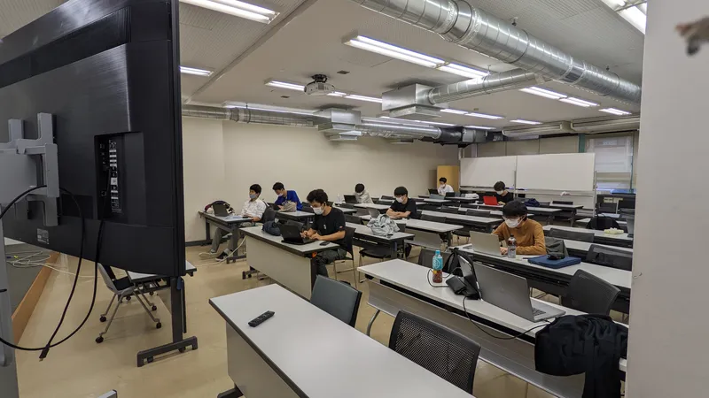
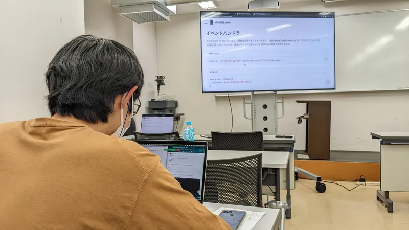

10/15(土) にオンライン形式で 丁友会 × ut.code(); プログラミング講習会を開催しました。

今回のイベントでは新歓体験会にあたる内容( HTML, CSS, JavaScript の基礎 )を扱い、3 時間という限られた時間の中で多くの参加者が実際におみくじアプリを作成することができました。途中の演習では、丁友会の方々を含めスタッフと参加者がブレイクアウトルームに分かれることで活発に質問が行われていました。

ut.code(); の次のイベントは駒場祭となり、たくさん体験型プログラムを用意しているので是非事前の入構予約の上ご参加ください！
