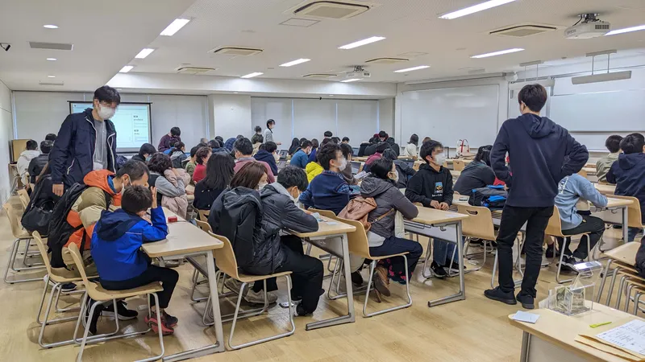

ut.code(); では、2022年11月18日（金）〜20日（日）に行われた駒場祭において、「あなたのためのプログラミング」という企画名で参加しました。

キャンパスでも、オンラインでも、多くの来場者の方にご来場いただきました。ご来場いただいた皆さま、ほんとうにありがとうございました。

そして、皆さまの投票の結果、「駒場グランプリ」を受賞することができました。

当日、特に土日の午後に関しましては大変ご盛況となりました。お待たせすることになってしまった方、ご案内できなかった方は、大変申し訳ございませんでした。

駒場祭のコンテンツは以下より見ることができます。少なくとも1ヶ月以上は公開を継続する予定です。

[https://kf73.utcode.net/](https://kf73.utcode.net/)

改めましてご来場ありがとうございました。来年の五月祭や駒場祭にも参加予定ですので、よければご来場ください。
