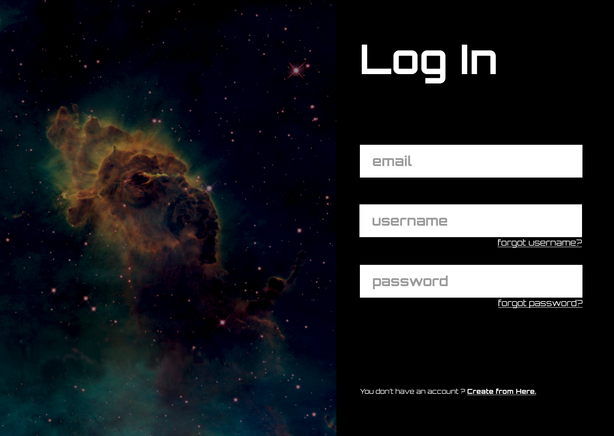

「デザインをそれっぽく見せる方法」というタイトルで、WebアプリのUIデザインを学ぶ講習会を開催しました！

当講習会では、デザイン4原則を確認しながらデザインの基本的な作り方を学ぶだけでなく、参加者の皆さんに実際にログイン画面のデザインを作っていただきました。

皆さん積極的に手を動かしたり、参加者同士でレビューをし合っていたりと活発にデザインをされていてとても嬉しかったです！

参加していただいた皆さん、ありがとうございました！