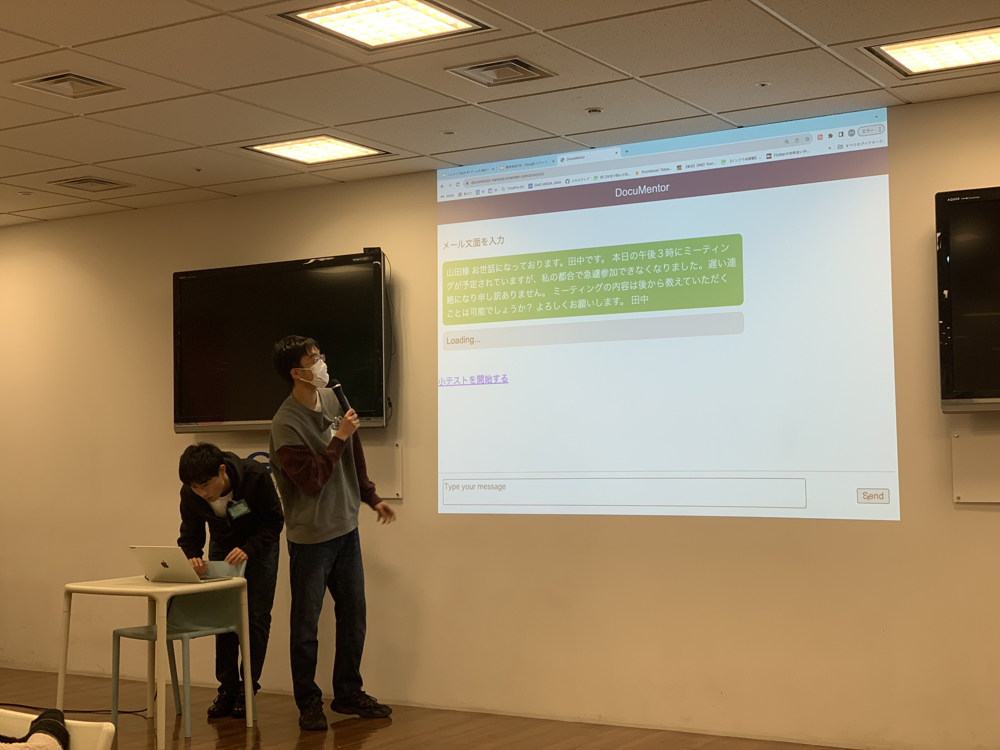
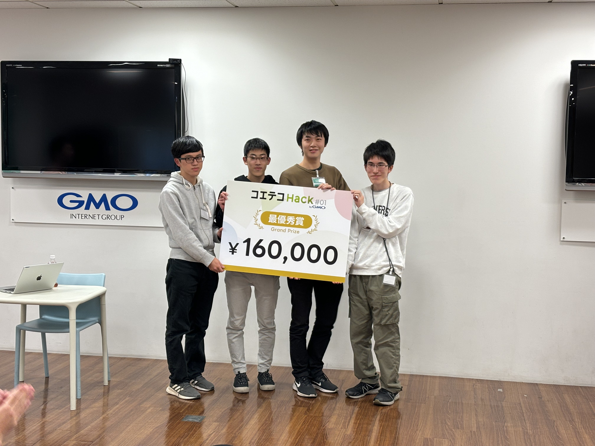

ut.code(); は、2023 年 12 月 10 日（日）にコエテコ Hack #1 の 2 日目を開催しました。

[コエテコ Hack #1](https://utcode.net/events/coeteco-hack-1/) は、GMO メディア株式会社が運営するプログラミング教育ポータルサイト「[コエテコ byGMO](https://coeteco.jp/)」と ut.code(); が共催するハッカソンイベントです。

「AI × 教育」をテーマとして、総額 28 万円の賞金も用意されています。

2 日目は、それぞれのチームでプロダクトを開発し、最後に最終発表を行いました。

最終発表では、各チームが開発したプロダクトを発表しました。どのチームも素晴らしいプロダクトを開発していました。

## チーム A EchoNote

チーム A は、特に耳が不自由な学生を対象に、授業中の音声を自動でテキストに変換しさらに授業の内容を自動で要約するアプリケーション「EchoNote」を開発しました。

## チーム B FlipFlow-Enhancer

チーム B は小学校低学年の生徒の前転を改善するアプリケーション「FlipFlow-Enhancer」を開発しました。模範の動画と生徒の動画をアップロードし教科書に記載されているコツやポイントを入力することで、模範と生徒の画像を比較して表示し改善点を指摘してくれます。

## チーム C DocuMentor

チーム C は、個人の特性、背景に合わせたソフトスキル向上の提案の補助を行うアプリケーション「DocuMentor」を開発しました。管理者がプロンプトを設定することや小テストを自動で作成することができます。

## チーム D まねりて

チーム D は、お手伝いによって小学校低・中学年の子どもの金銭感覚を育成するアプリケーション「まねりて」を開発しました。親が報酬を設定すると AI がお手伝いプランを提示し、お手伝いプランをクリアすることでポイントを獲得し、目標管理能力を向上させることができます。

## チーム E ワクワク発見！

チーム E は、小学校 3〜6 年生の好奇心旺盛な小学生に向けて、疑問に対して気になる項目をクリックするだけで AI がわかりやすく教えてくれるアプリケーションを作りました。気になる分野を選択していくだけで簡単に身近な疑問を解決することができます。

## チーム F 教科書の画像から問題を生成する

教科書の画像をアップロードするとそれを読み込んで独自の 4 択問題を生成するアプリケーションを開発しました。問題を生成してくれるだけでなく、解答解説まで自動で生成してくれます。

最終発表の後は、審査員の方々による審査が行われ、最優秀賞、優秀賞、審査員特別賞が決定しました。

## 最優秀賞 チーム F 教科書の画像から問題を生成する

最優秀賞は、チーム F の「教科書の画像から問題を生成する」に決定しました！

## 優秀賞 チーム C DocuMentor

優秀賞は、チーム C の「DocuMentor」に決定しました！

## 審査員特別賞 チーム B FlipFlow-Enhancer

審査員特別賞は、チーム B の「FlipFlow-Enhancer」に決定しました！

