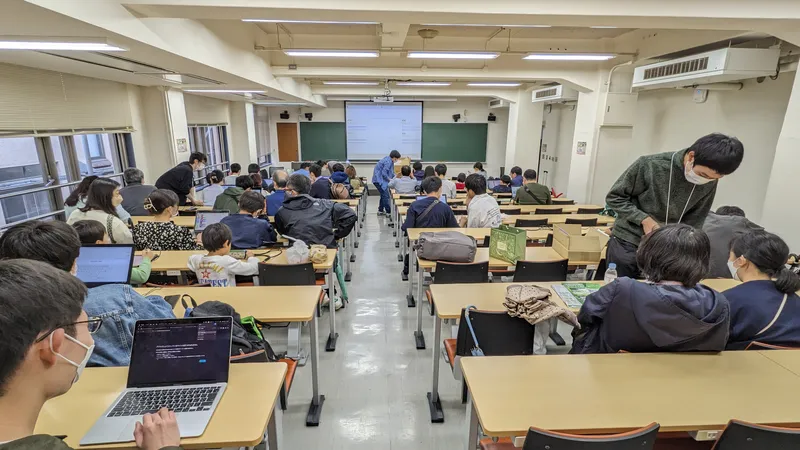

ut.code();は、5 月 13 日 (土) 、5 月 14 日 (日) に行われた第 96 回五月祭に「あなたのためのプログラミング」を出展しました。

今回は実に 4 年ぶりの入構制限なしの開催となり、雨天であったにもかかわらず多くの方にご来場いただきました。お待たせしてしまった方、ご案内できなかった方は、申し訳ございませんでした。

本企画は「[五月祭総選挙](https://gogatsusai.jp/96/visitor/awards/)」の参加型部門にて第 2 位を受賞しました。たくさんの投票をいただきありがとうございました。

また、カンパにつきましては総額が 20,161 円となりました。こちらは ノート PC のレンタル費用、ビラ・ポスターの印刷費用に充てさせていただきます。ご協力いただいた皆様、ありがとうございました。

本企画のコンテンツは下のリンクより見ることができます。

[https://mf96.utcode.net/](https://mf96.utcode.net/)

改めまして、ご来場ありがとうございました。よろしければ、2023 年 11 月 24 日（金）〜26 日（日）に開催予定の第 74 回駒場祭でまたお会いしましょう。
