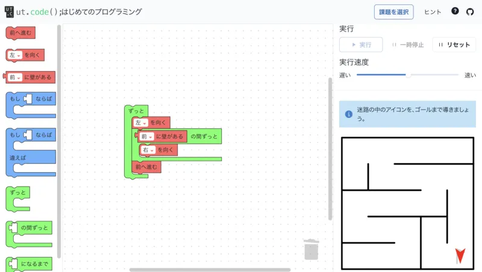

ut.code();は 8 月 20 日に[コエテコジュニアプログラミングフェス 2023](https://expo.coeteco.jp/junior-programming-fes-2023)に出展しました。

コエテコジュニアプログラミングフェスとは、小学生向けの体験型プログラミングイベントです。
小学生の子どもたちにプログラミングを体験してもらうことで、プログラミングに興味を持ってもらうことを目的としています。

ut.code();は、今までの学園祭でも出展していた[「はじめてのプログラミング教室」](https://first-programming.utcode.net/)を展示しました。
多くの子どもたちにブロックを使ったプログラミングを体験してもらうことができました。

非常に楽しく有意義なイベントでした。来ていただいた皆様、ご担当者様、ありがとうございました。
