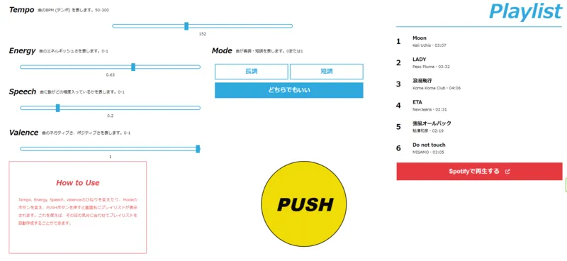
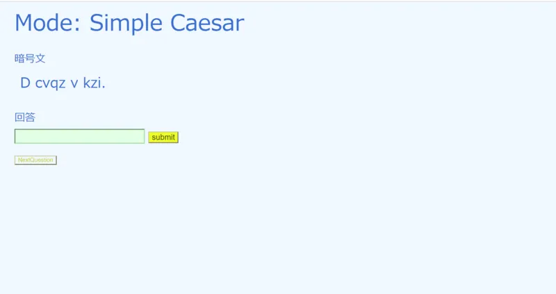
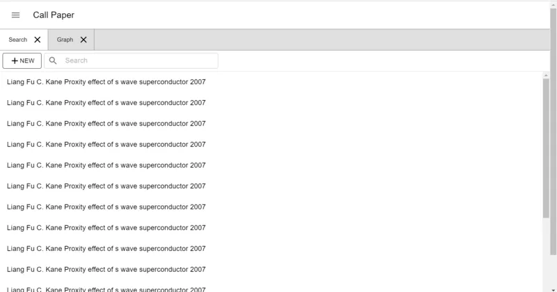
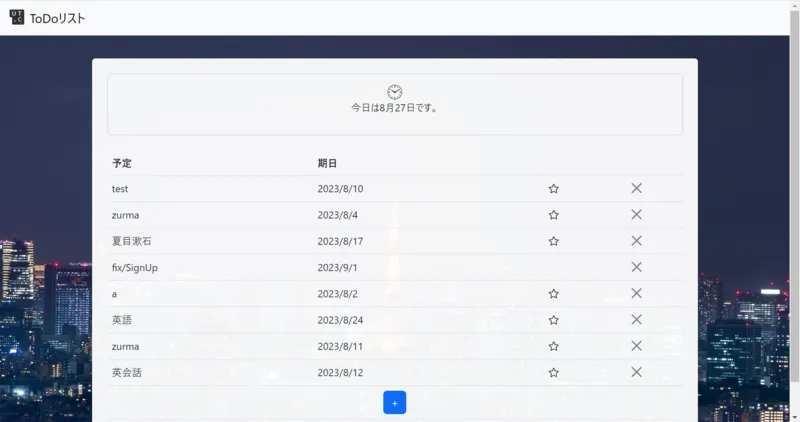

ut.code(); では、8 月 17 日〜19 日に、ハッカソンイベントを開催しました。16 名の参加者が 4 チームに分かれてそれぞれプロダクト開発を行いました。完成したプロジェクトのソースコードは GitHub で公開しています。

春休みにも開催いたしますのでまたの機会にぜひご参加ください！

## ミュージックアプリ

- 作品名: music-app
- 作品説明: その日の気分にあった作業用BGMを生成してくれるアプリ
- URL: [https://ut-code.github.io/music-app/](https://ut-code.github.io/music-app/)
- GitHub: [https://github.com/ut-code/music-app](https://github.com/ut-code/music-app)

## 暗号解読ゲーム

- 作品名: denigma
- 作品説明: 暗号解読ゲーム。シーザー暗号やRSA暗号など、基本的な暗号に触れてみよう！
- URL: [https://utcode-denigma.onrender.com/](https://utcode-denigma.onrender.com/)
- GitHub: [https://github.com/ut-code/denigma](https://github.com/ut-code/denigma)

## 論文用アプリ

- 作品名: Call Paper
- 作品説明: 論文の引用関係を可視化できるアプリ
- URL: [https://call-paper.pages.dev/](https://call-paper.pages.dev/)
- GitHub: [https://github.com/ut-code/call-paper](https://github.com/ut-code/call-paper)

## ToDoアプリ

- 作品名: todoアプリ
- 作品説明: ToDoを管理できる Web アプリ
- GitHub: [https://github.com/ut-code/todo-2023-hackathon](https://github.com/ut-code/todo-2023-hackathon)

