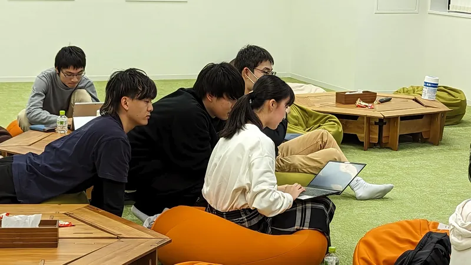
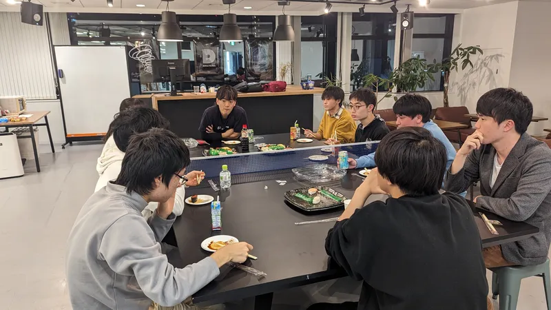
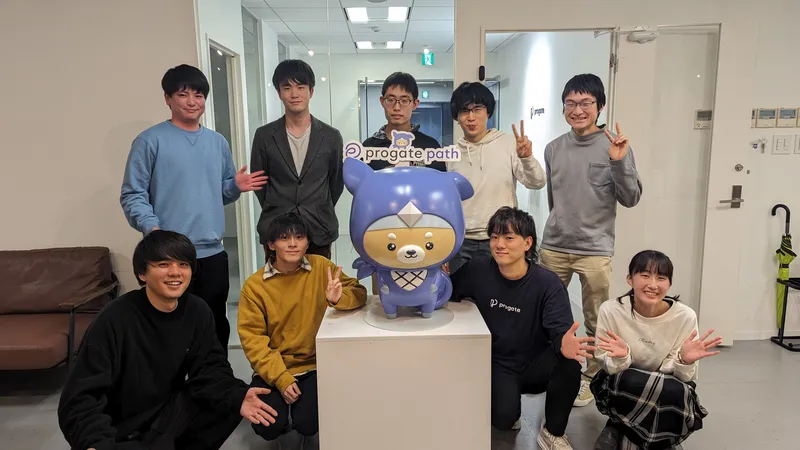

ut.code(); は、2023 年 11 月 17 日（金）に[株式会社 Progate](https://prog-8.com/) とハンズオン勉強会を行いました。

「プロジェクトに最速で馴染むためのコードリーディング入門」というテーマで、どのようにコードリーディングやデバッグをしていくのかについて Progate のエンジニアの方にお話をしていただきました。

また、[Progate Path](https://path.progate.com/) の「ピッタリ賞の画像が出力されないバグの修正」というタスクを解きながら、コードリーディングやデバッグのコツを学びました。

勉強会の後には懇親会も行い、様々なお話をすることができました。

とても有意義な勉強会となりました。これからも勉強会を開催していきますので、ぜひご参加ください！

