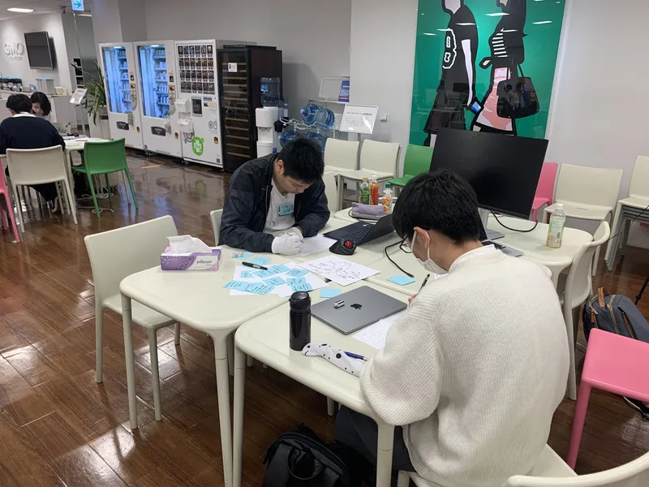
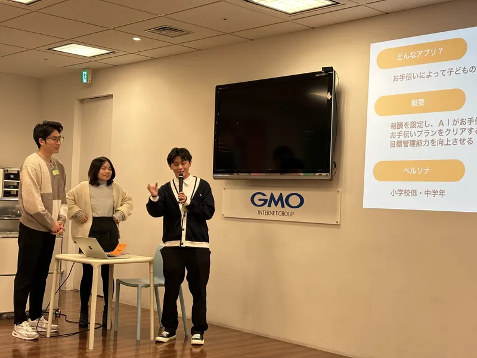
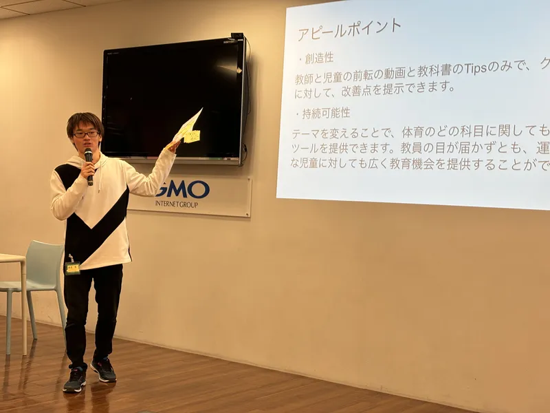

ut.code(); は、2023 年 12 月 9 日（土）にコエテコ Hack #1 の 1 日目を開催しました。

[コエテコ Hack #1](https://utcode.net/events/coeteco-hack-1/) は、GMO メディア株式会社が運営するプログラミング教育ポータルサイト「[コエテコ byGMO](https://coeteco.jp/)」と ut.code(); が共催するハッカソンイベントです。

「AI × 教育」をテーマとして、総額 28 万円の賞金も用意されています。

1 日目は、チームを組んで、アイディアを出し合いました。どのチームも、熱心に議論を重ねていました。

最後には、中間発表を行いました。どのチームも、素晴らしいアイディアを発表しており、たいへんハイレベルな中間発表となりました。明日の最終発表が楽しみです。

