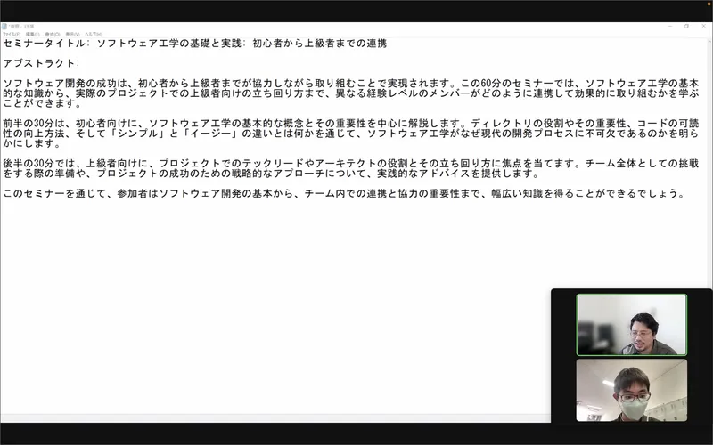

ut.code(); は、2023 年 12 月 16 日（土）に[GMO インターネットグループ株式会社](https://www.gmo.jp/) と「ソフトウェア工学の基礎と実践: 初心者から上級者までの連携」というテーマで勉強会を行いました。今回も[成瀬さん](https://nrslib.com/)がお話をしてくださいました。

ソフトウェア工学の基本的な知識から、プロジェクトでのアーキテクトやテックリードの役割とその立ち回り方まで、異なる経験レベルのメンバーがどのように連携して効果的に取り組むかを学ぶことができる勉強会でした。

参加者の皆さんからは、以下のような感想をいただきました。

- 「普段サークル内で様々な人と共同で開発することが多く、その際にどのように立ち回るかに迷うことが多かったので、今回の勉強会はとても参考になりました。」
- 「エンジニアのそれぞれの役職がどのような役割を期待されているかということがよく理解できました。クラスがなぜ必要なのかという説明が非常に興味深かったです。」
- 「オブジェクト指向の基本理念がわかりやすく説明されていて良かったです。」

