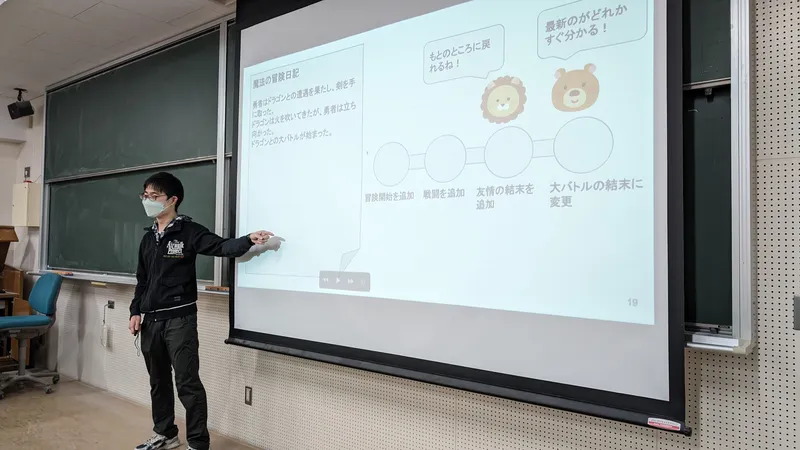

ut.code(); は、2023 年 12 月 21 日（木）に全学自由研究ゼミナール（現代の Web アプリケーションの構築方法の学習と実践）の第 11 回を開講しました。

この全学自由研究ゼミナールは、初心者でもプログラミングをじっくり学びながら単位もとることができる授業となっています。

第 11 回の授業内容は Git と GitHub でした。[ut.code(); Learn](https://learn.utcode.net/) の Git と GitHub の章を学びました。今回の授業に合わせて Git と GitHub の章はすべて改訂しており、以前よりもたいへんわかりやすい内容になっています。

今回も多くの質問が出ており、みなさん活発に取り組んでいました。

次回の授業は、2024 年 1 月 4 日（木）に開講します。次回からは、今まで学習した内容を使ってチームでアプリを開発していただきます。チームでの開発には、Git と GitHub が必須となるので、今回の授業で学んだ内容をよく復習しておいてください。

次は年明けになりますが、引き続きよろしくお願いします。

授業スライドは[こちら](https://drive.google.com/file/d/1UVP8M4ZLMlHrAB6wxl7umPJ3MF6XMgtv/view?usp=sharing)からご覧ください。
