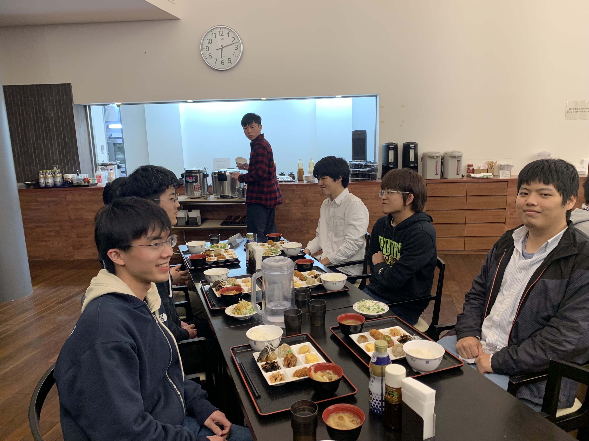
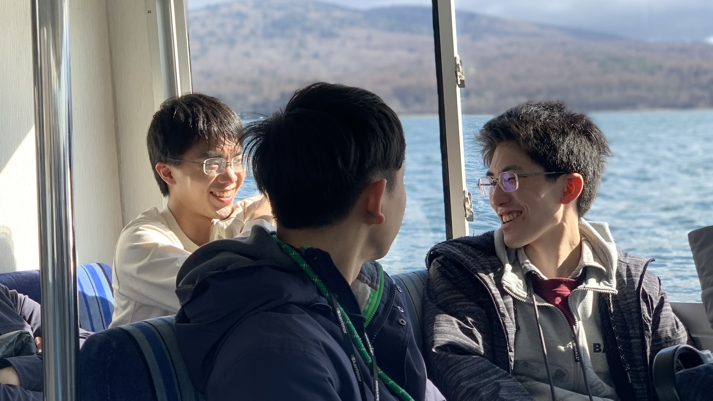
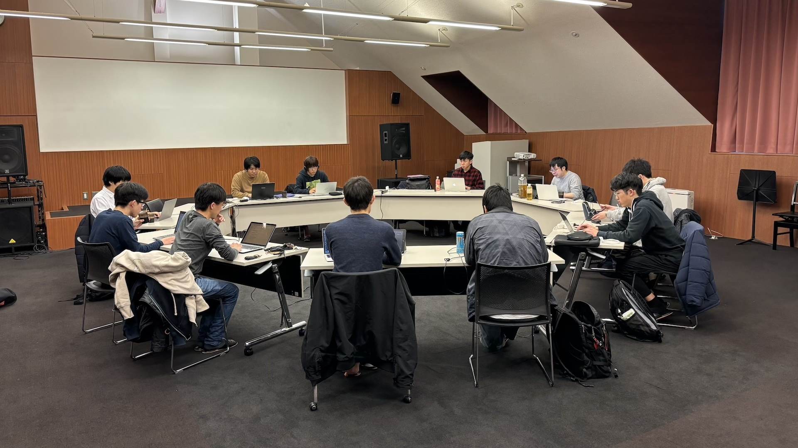

## 今回の春合宿の概要

3 月 26 日から 28 日にかけて、春合宿を開催しました！

会場は東京大学山中寮内藤セミナーハウスで、山間の静かな環境の中で 3 日間、集中して開発を行いました。

宿泊施設も素晴らしく、美味しい食事やゆったりとしたお風呂を満喫し、携わっているプロジェクトを進めました。

ut.code(); では、プロジェクトごとに 5 名ほどが集まって、開発を行なっています。

プロジェクト内で普段メンバーが集まるのは、週 1 度の Zoom ミーティングですが、合宿ではメンバー内で意見を頻繁に共有し、開発を進めました。

今年始まったプロジェクトには、以下のようなものがあります。

- Journical (カレンダーアプリとジャーナルアプリを組み合わせたアプリ)

- Transit (駅構内に特化した道案内アプリ)

- CourseMate (学内で友達が欲しい人同士をマッチングするアプリ)

- Mathdown (数学の定義が何かわからなくなるのを解消するアプリ)

## 合宿中のイベント

### 1 日目

山中寮に集合後、名物ほうとう鍋がいただける「ドライブイン きくや」で昼食をとりました。

その後、合宿所に戻り、開発を進めました。

以下の写真は、夕飯を食べている様子です。

### 2 日目

引き続き、開発を進めました。途中で、データベースの構造などについて、ホワイトボードを用いたりしながら、議論を行ったりしました。

昼頃には、山中湖遊覧船に乗船し、湖畔の景色を楽しみながらリフレッシュしました。

### 3 日目

午前中は、更に開発を進め、解散しました。

次回は 8 ~ 9 月の開催となりますので、お楽しみに！
