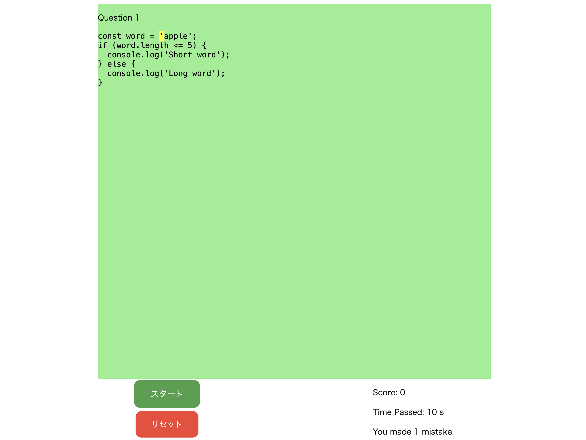

ut.code(); は 6 月 8 日（土）、9 日（日）に春新歓の総まとめとしてハッカソンを開催しました。

16 名の参加者が 3 チームに分かれてそれぞれアプリ開発を行いました。参加者が積極的に取り組んだおかげで、一週間前の 6 月 1 日（土）から開始したブレストでは、多くのアイデアが提供されました。また、たった 2 日間のハッカソンでしたが、作品の完成度はどれも高いものとなりました。

完成したプロジェクトのソースコードは GitHub で公開しています。

## ボウリングゲーム

- 作品名: 壁よけボウリング
- 作品説明: 障害物を避けてピンを倒そう！ どこか懐かしくてどこか新感覚のボウリングゲームをお楽しみあれ！
- URL: [https://ut-code.github.io/bowling-app/](https://ut-code.github.io/bowling-app/)
- GitHub: [https://github.com/ut-code/bowling-app](https://github.com/ut-code/bowling-app)

## シフト調整アプリ

- 作品名: ShiftSyncer
- 作品説明: 複数人から登録されたシフトの希望を基に、最適なシフトを作成するアプリです。シフトの希望を出す際に、シフトに入れるか否かだけではなく、積極的に入りたいのか、それとも人が居なかったら入っても良い程度なのかといった事情も勘案できるようになっています。
- GitHub: [https://github.com/ut-code/ShiftSyncer](https://github.com/ut-code/ShiftSyncer)

## タイピングゲーム

- 作品名: TypingScript
- 作品説明: ソースコードに特化したタイピング練習サイトです。
- URL: [https://ut-code.github.io/TypingScript/](https://ut-code.github.io/TypingScript/)
- GitHub: [https://github.com/ut-code/TypingScript](https://github.com/ut-code/TypingScript)

