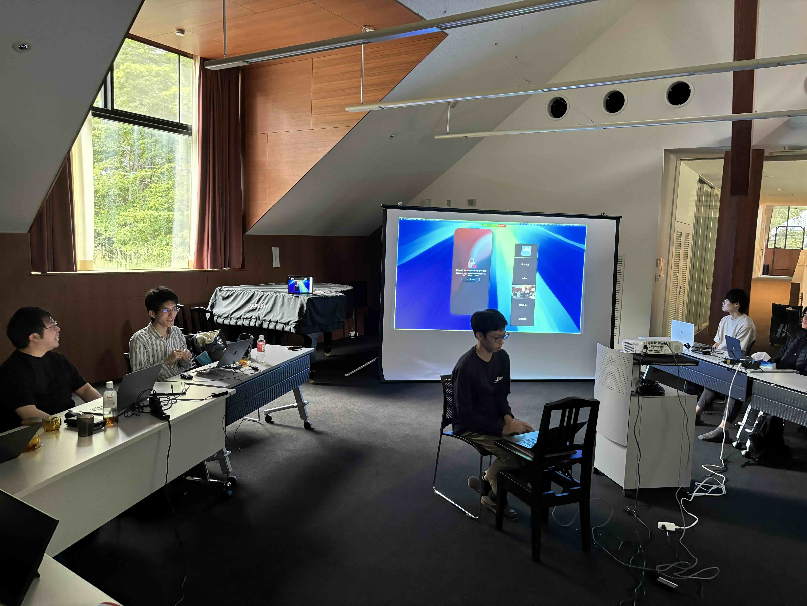

ut.code(); では 9 月 23 日から 25 日にかけて、東京大学山中寮内藤セミナーハウスにて合宿を行いました。本記事ではその様子を皆さんにお伝えします。

## 1 日目の様子

現地に到着したら、まずは山梨県の郷土料理「ほうとう」をいただきました。

山中湖の景色を眺めながらいただく地元の料理で、さっそく合宿気分を満喫しました。

会場の東京大学山中寮内藤セミナーハウスに到着したら、簡単な自己紹介ののち、さっそくプログラミング活動を開始しました。

今回の合宿では、

- ブロックを組み合わせて Web ページを構築できる駒場祭企画「Blosite (仮称)」
- 競馬の動画から画像認識によって予測を行う駒場祭企画「競馬 AI (仮称)」
- パズルとして麻雀を学べる駒場祭企画「一人麻雀 (仮称)」
- 同じ講義を取っている友達を探せるアプリ「CourseMate」
- ジャーナルとカレンダーを統合したアプリ「JourniCal」

などの開発のほか、A セメスターに開講する自主ゼミ「[モダン Web システム開発入門](/articles/2024-a-seminar-announcement/)」の準備も行われました。

## 2 日目の様子

2 日目には、ゆる LT (Lightning Talk) 会と題して技術的なトピックに関するプレゼン大会を行いました。

「今日から使える Vim」「Nix のすすめ」「自宅サーバーのすゝめ」「ブックマークレットを使ってスマートフォンで開発者ツールを使用する」など多様なテーマのプレゼンを聞くことができました。

また、夜には卒業生の牧村さんによる講演が行われました。「地理情報で遊んでみよう」というタイトルで、ユーモアを交えて語っていただきました。

## 3 日目の様子

最終日の 3 日目まで時間の許す限り開発を続けました。合宿中に個人プロジェクトをリリースするメンバーや、最後の最後まで粘ってアルファ版のリリースにこぎつけるチームが見られました。

美味しい食事や綺麗な施設のおかげで、リラックスしつつ開発を進めることができました。山中寮のスタッフの皆様、ありがとうございました。

## おわりに

今回の合宿にはたくさんのメンバーが参加し、楽しく充実した時間を過ごすことができました。

これからも定期的にこうした合宿やイベントを開催していく予定ですので、次回もぜひ参加していただければと思います。皆さんのご参加をお待ちしています。
