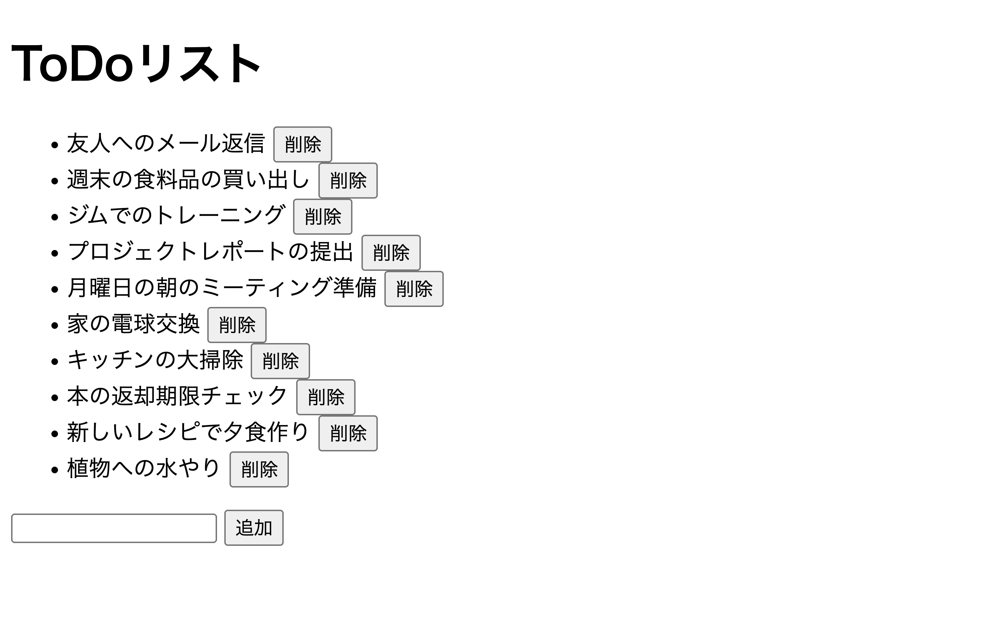

あけましておめでとうございます。

ut.code(); は、2024 年 1 月 4 日（木）に全学自由研究ゼミナール（現代の Web アプリケーションの構築方法の学習と実践）の第 12 回を開講しました。

この全学自由研究ゼミナールは、初心者でもプログラミングをじっくり学びながら単位もとることができる授業となっています。

第 12 回はグループに分かれて実際に Web アプリケーションを作成しました。すでに用意されている簡単な [ToDo アプリ](https://github.com/utokyo-web-dev-2023a/template-todo)と[チャットアプリ](https://github.com/utokyo-web-dev-2023a/template-chat)、[単語帳アプリ](https://github.com/utokyo-web-dev-2023a/template-flashcard)の 3 つからグループで 1 つを選び、グループでそれに新たな機能を追加していくという課題でした。

助け合って環境構築を進めているチームも見られました。これから、どのようなアプリケーションができるのか楽しみです。

次回の授業は、2024 年 1 月 11 日（木）に開講します。次回も今回に引き続き、グループに分かれて実際に Web アプリケーションを作成していきます。

