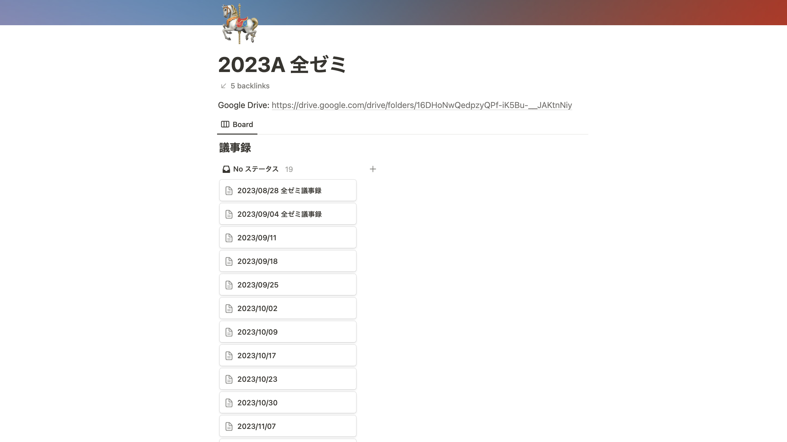

ut.code(); は、2023 年度の A セメスターに全学自由研究ゼミナール（現代の Web アプリケーションの構築方法の学習と実践）を開講しました。

この全学自由研究ゼミナールは、初心者でも基礎からプログラミングを学びながら単位もとることができる講義となっていました。

1 月 11 日の最後の講義ですべての講義が終わりましたが、この記事では今回の全学自由研究ゼミナール全体の振り返りを書いていきたいと思います。

## 今回の全学自由研究ゼミナールの概要

全学自由研究ゼミナールは、東京大学の教養学部前期課程の全科類の学生が最低でも 2 単位を取得しなければならない主題科目の 1 つとなっています。

今回の全学自由研究ゼミナールは、「現代の Web アプリケーションの構築方法の学習と実践」というテーマで開講し、基礎的な内容から高度な内容まで Web アプリケーションについて学び、実際に開発をすることができる講義となっていました。

## 今回の全学自由研究ゼミナールの講義内容

ut.code(); が独自に作成している教材である [ut.code(); Learn](https://learn.utcode.net/) を使用して、次のような内容を学びました。

- 第 1 回講義
  - ガイダンス、Visual Studio Code のインストール
- 第 2 回講義
  - HTML、JavaScript ことはじめ、値と式と演算子、変数、論理値と論理演算子、条件分岐
- 第 3 回講義
  - 繰り返し、関数、配列
- 第 4 回講義
  - オブジェクト、CSS
- 第 5 回講義
  - DOM、イベント、おみくじアプリケーションの作成
- 第 6 回講義
  - ブラウザの開発者ツール、オブジェクトの参照、クラス
- 第 7 回講義
  - 無名関数、ToDo アプリケーションの作成
- 第 8 回講義
  - WSL、はじめての Node.js、モジュールと npm、Express
- 第 9 回講義
  - フォーム、GET リクエストと POST リクエスト
- 第 10 回講義
  - データベース
- 第 11 回講義
  - Git と GitHub
- 第 12 回講義
  - グループごとでの Web アプリケーションの開発
- 第 13 回講義
  - グループごとでの Web アプリケーションの開発

## 今回の全学自由研究ゼミナールで改善した点

ut.code(); は、S セメスターに「モダン Web システム開発入門」というテーマで自主ゼミを開講していました。今回の全学自由研究ゼミナールでは、その自主ゼミでの反省点を踏まえて、より学生が理解しやすいように大幅に改善しました。

### 講義形式の改善

S セメスターの自主ゼミでは、講義形式での学習が中心となっていました。しかし、それでは学生が実際に手を動かして学ぶ時間があまりとれず定着が難しくなっているという問題点がありました。

そのため、今回の全学自由研究ゼミナールでは、講義では要点のみに絞って簡単に説明し、詳しいことは各自で教材を見ながら学んで、演習問題を解くことで定着を図るようにしました。また、演習の時間には運営メンバーが常にサポートを行うことで、もし学生がわからないことがあってもすぐに質問することができるようにしました。演習問題については、課題として Google フォームでの提出を行うこととして、授業中に解き終わらなかった場合でも学習内容を定着させられるようにしました。

また、最後の 2 回の講義では、グループで Web アプリケーションを開発する時間を設けることで、学習した内容を実際に活かすことやチーム開発の経験を積むことができるようにしました。

### 講義の発表練習の改善

S セメスターの自主ゼミでは、講義の発表練習を十分できておらず、あまりわかりやすい説明をすることができていなかったという問題点がありました。

今回の全学自由研究ゼミナールでは、運営メンバー全員で集まり発表練習をそれぞれ 3 周行い、発表に対してその都度多くのフィードバックを行うことで、発表者がわかりやすく説明できるようになり、また正確な説明をすることができるようになりました。

また、プレゼン資料も掲載前に入念なチェックを行い、正確でわかりやすい資料の作成に努めました。これにより、学生にとってより理解しやすい講義を行うことができるようになりました。

### 教材および学習内容の改善

S セメスターの自主ゼミでは、学習内容が多すぎたり、教材にわかりにくいところがあったり、演習が少なかったりといった問題点がありました。

今回の全学自由研究ゼミナールでは、学習内容の大幅な見直しを行いました。全体的に教材の順序の見直しをして、「CSS による配置」、「Fetch API」、「トランスパイラとモジュールバンドラ」、「TypeScript」、「React」などの高度な内容を発展扱いとして講義の内容から削除し、より基礎的な内容のみに絞りました。また、「http 標準モジュール」や「EJS」、「CommonJS モジュール」などの現在では学ぶ必要性が低いと思われる内容を削除し、内容を絞りました。

また、教材の説明も全体的に修正し、特に「データベース」や「Git と GitHub」の章は全面的に書き直しを行い、わかりやすくなるようにしました。

さらに、今までの教材では演習問題が少なく、難しい演習問題も多かったため、各章の最後により簡単な演習問題を追加することで、学習内容の定着を図るようにしました。

## 今回の全学自由研究ゼミナールの振り返り

全体的に講義はスムーズに進行しており、学生が理解しやすい講義を行うことができていたと思います。また、学生が実際に手を動かして学ぶ時間を確保することができたため、学習内容がかなり定着しているように感じました。実際に、最後のグループでの開発では、学生が自分たちで考えたアイデアを実現することができており、Git や GitHub を用いたチーム開発もうまく行うことができていました。

一方で、環境構築がうまくできず時間がかかってしまう学生がいたり、一部の演習問題が難しくなかなか解けないといった問題点もありました。これらの点については、次の全学自由研究ゼミナールでは改善していきたいと思います。

## 次回の全学自由研究ゼミナールに向けて

ut.code(); は、来年度の S セメスターでも同様に全学自由研究ゼミナールを開講する予定です。

来年度の全学自由研究ゼミナールでは、今回の全学自由研究ゼミナールでの反省点を踏まえて、より学生が理解しやすい講義を行うことができるように改善していきたいと思います。

今回参加できなかった方はぜひ来年度の全学自由研究ゼミナールに参加してみてください。また、この全学自由研究ゼミナールをよりよいものにしたいという運営メンバーを募集しています。今週中に ut.code(); の Slack の `000_general` チャンネルで運営メンバーの募集を開始する予定ですので、少しでも興味のある方はぜひ参加してください。
