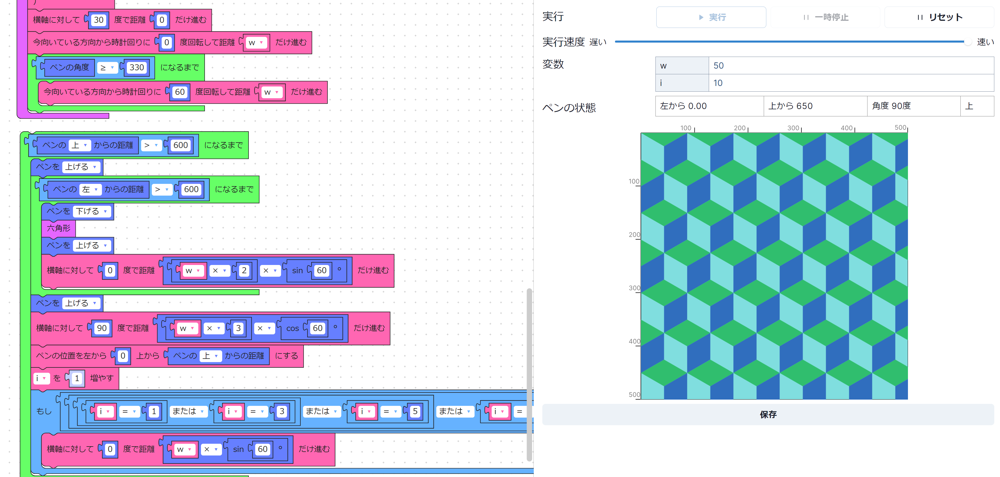
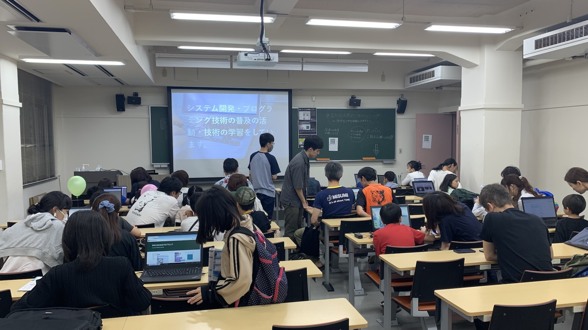

ut.code(); は、5 月 18 日 (土)、19 日 (日) に開催された第 97 回五月祭に参加しました。

ut.code(); は、「あなたのためのプログラミング」という誰でもプログラミングを楽しめる企画を行いました。プログラミングに触れるのが初めての方も、プログラミングが大好きな方も新しい面白さを発見できる企画です。

## 企画内容

「あなたのためのプログラミング」では、特設サイト上に用意した企画を来場者にお楽しみいただきました。特設サイトは[こちら](https://mf97.utcode.net/)からご覧いただけます。

毎年ご好評をいただいている[「はじめてのプログラミング」](https://first-programming.utcode.net/)の他にも今年の五月祭のために 3 つほどの新しい企画をご用意させていただきました。

### [QR コードを体験してみよう！](https://ut-code.github.io/qrcode/)

QR コードは、今では生活のあらゆる場面で見かけるものとなっています。

この企画では、その仕組みを学びながら自分の手で QR コードを作成してみることができます。また、合わせてバーコードの仕組みについても学ぶことができます。

※QR コードは株式会社デンソーウェーブの登録商標です。

### [CodeYourArt](https://utcode-draw.onrender.com/)

この企画では、ブロックプログラミングであなただけのアート作品をプログラムすることができます。アート作品を作りながら、直感的にプログラムの基本構造を学ぶことができます。作った作品は保存して家から見ることもできます。

### [u/place](https://u-place.onrender.com/)

この企画では、みんなで大きなキャンバスに絵を描きます。セルを塗るだけで簡単に絵を描くことができます。

## 当日の様子

両日とも多くの来場者にお越しいただきました。小学生の方から大人の方まで幅広い年代の方にお楽しみいただきました。

## 今後に向けて

11 月に開催される駒場祭にも参加する予定ですので、興味のある方はぜひお越しください。
