ut.code();が2024年度のSセメスターに開講していた全学自由研究ゼミナール (モダンWebシステム開発入門) は、7月9日 (火) の第13回講義をもってすべて終了しました。

## 全学自由研究ゼミナール (モダンWebシステム開発入門) について

全学自由研究ゼミナール (全ゼミ) は、東京大学の全科類の学生が最低でも2単位を取得しなければならない主題科目の1つとなっている講義です。

この全学自由研究ゼミナール (モダンWebシステム開発入門) は、Webプログラミングを基礎から学び、Web開発に必要な技術を一通り学ぶことができる講義となっています。ut.code();が独自に開発した教材である[ut.code(); Learn](https://learn.utcode.net/)を使用して、Webプログラミングで必須となるHTMLやCSS、JavaScriptを基礎から学び、最後にはサーバーやデータベースといった高度な内容まで扱います。

講義情報の詳細については、[こちら](/articles/2024-s-specialized-seminar-announcement/)からご確認ください。

また、第4回講義までの様子は、[こちら](/articles/2024-s-specialized-seminar-report-1/)でご紹介しています。

## 第5回講義

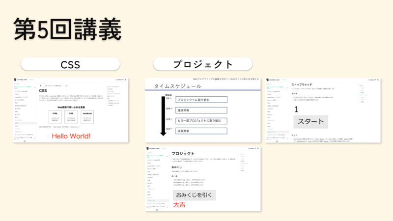

5月14日 (火) の5限に第5回講義を行いました。

第5回講義では、ut.code(); Learnの「Webプログラミングの基礎を学ぼう」の「CSS」と「プロジェクト」を扱いました。

講義の前半でCSSを学んだ後に、講義の後半では実際に今まで扱った内容をもとにしておみくじアプリやストップウォッチアプリといった簡単なWebアプリケーションを作成しました。講義の後半ではグループ学習を取り入れたため、各自がおみくじアプリやストップウォッチアプリを作成していく中でわからないことがあればお互いに相談でき、さらに作成したWebアプリケーションをグループ内で発表することでグループ内の他の人からフィードバックを受けることができました。

今まではHTMLとJavaScriptを学んできましたが、講義の前半で今回新たにCSSを学んだことにより実際のWebアプリケーションを作成するイメージが湧いた人が多かったようです。また、講義の後半では今まで学んだ内容をもとにして実際にWebアプリケーションを作成したため、今までの学習内容がつながったと感じた人もいました。おみくじアプリの作成は今までに学んだ内容を多く使うため難しかったようですが、最終的にはほとんどの人が完成させることができていました。おみくじアプリを作成する課題では、おみくじの結果がそれぞれ何回出たかを表示するように改良するなどそれぞれが工夫を凝らしたWebアプリケーションを作成していました。

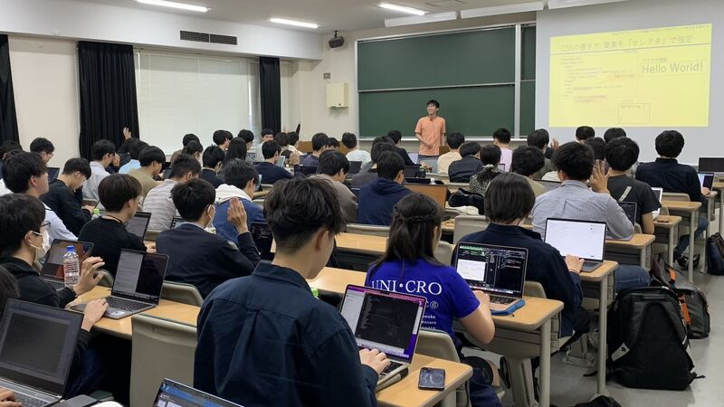

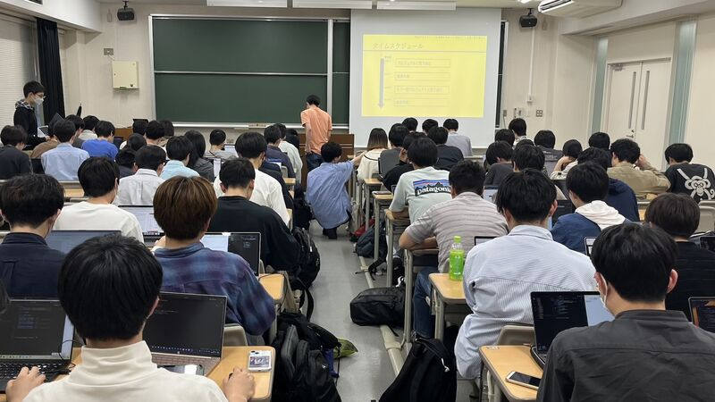

## 第6回講義

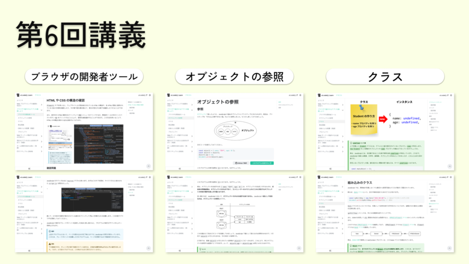

5月21日 (火) の5限に第6回講義を行いました。

第6回講義からは、ut.code(); Learnの「ブラウザで動作するアプリを構築しよう」に入り、「ブラウザの開発者ツール」「オブジェクトの参照」「クラス」を扱いました。

「ブラウザの開発者ツール」では、HTMLやCSSの構造を確認する方法やデバッガの使い方を学びました。「オブジェクトの参照」では、JavaScriptにおいてオブジェクトがどのように扱われているのかについて学びました。「クラス」では、クラスの基本的な概念やその使い方について学びました。

ブラウザの開発者ツールを用いてHTMLやCSSの構造を確認する方法を学び、便利に感じた人が多かったようです。クラスについては、その有用性がわかりにくく、また、概念を理解することが難しい単元であることから、理解するのに時間がかかるという声もありました。

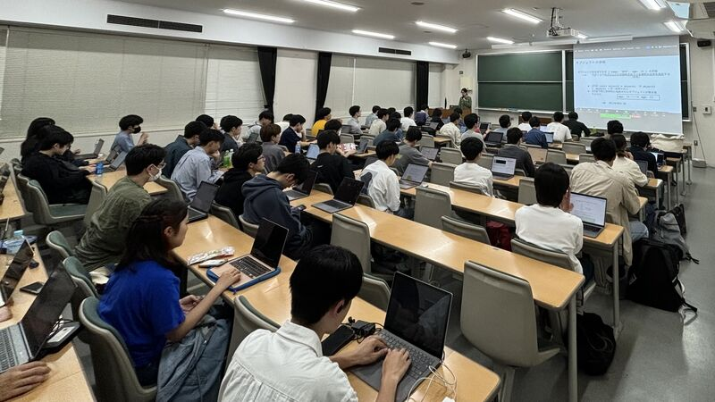

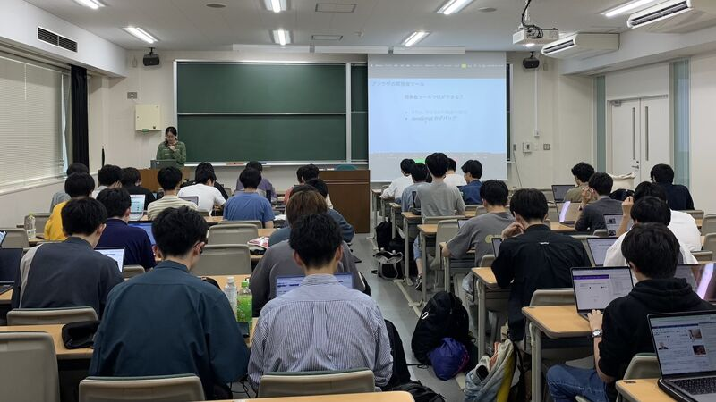

## 第7回講義

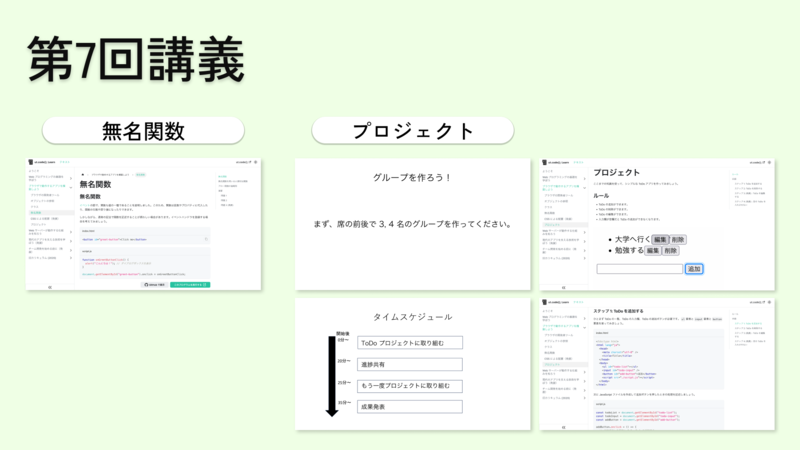

5月28日 (火) の5限に第7回講義を行いました。

第7回講義では、ut.code(); Learnの「ブラウザで動作するアプリを構築しよう」の「無名関数」「プロジェクト」を扱いました。

講義の前半で無名関数を学んだ後に、講義の後半では今まで扱った内容をもとにしてToDoアプリを作成しました。講義の後半では第5回講義の時と同様にグループ学習を取り入れたため、グループ内でお互いに相談でき、また、作成したWebアプリケーションをグループ内で発表することでフィードバックを受けることができました。

無名関数は、その有用性がわかりにくく、理解が難しい単元ですが、今回の講義では多くの人が最終的には理解することができていたようです。一方で、ToDoアプリを作成するという課題は第4回講義で扱ったDOMなどを多く扱うため今までに扱ってきた内容が十分に理解できていないと解くことが難しく、また、書くコードが多いこともあり苦戦した人が多かったです。ToDoアプリを作成する課題では、第5回講義で扱ったCSSを使ってToDoアプリの見た目を整えたり、ToDoアプリに新しい機能を追加したりしている人もいました。

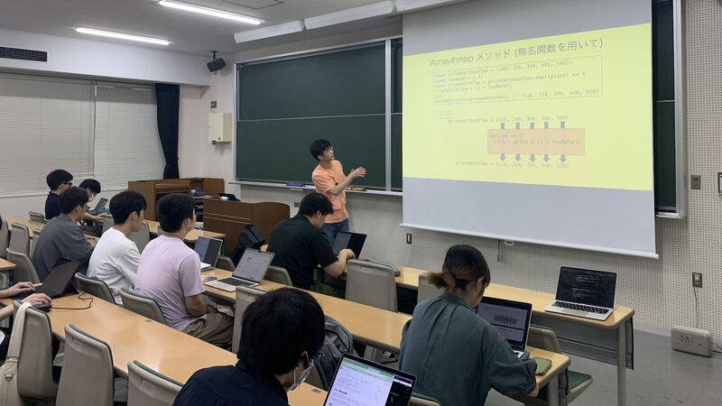

## 第8回講義

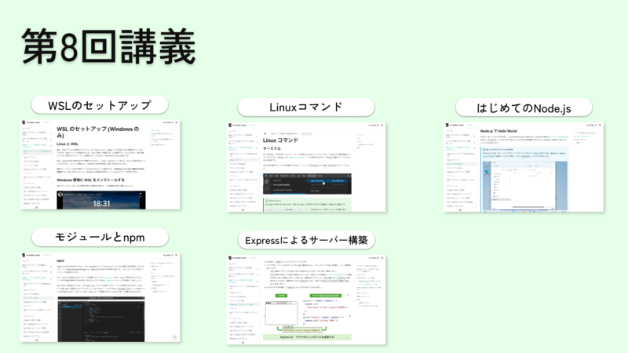

6月4日 (火) の5限に第8回講義を行いました。

第8回講義からは、ut.code(); Learnの「Webサーバーが動作する仕組みを知ろう」に入り、「WSLのセットアップ」「Linuxコマンド」「はじめてのNode.js」「モジュールとnpm」「Expressによるサーバー構築」を扱いました。

WSLやNode.jsのセットアップをしてから、簡単なLinuxコマンドの使い方を学び、Node.jsやnpmの使い方についても学びました。また、講義の最後ではExpressを使って簡単なWebサーバーを構築する方法を学びました。

WSLやNode.jsのセットアップについては、それぞれの人のコンピューターの環境によってはうまくセットアップができないこともあるため、例年鬼門となっていました。しかし、過去の講義での知見がスタッフに溜まってきたこともあり今回の講義では例年よりもスムーズに進めることができました。今回の講義での経験を活かして、今後の講義でもよりスムーズに進めることができるように改善していきたいと考えています。npm上にあるパッケージの使い方について学んだため、他の人が作成した便利なパッケージを使うことの便利さを実感した人が多かったようです。また、今回の課題では自分でパッケージの使い方を調べる必要があったのですが、うまくパッケージの使い方を調べて使うことができている人が多い印象でした。

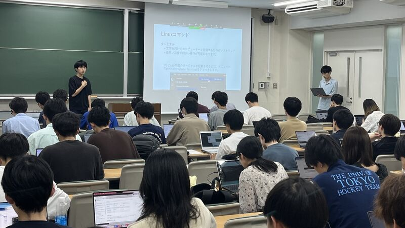

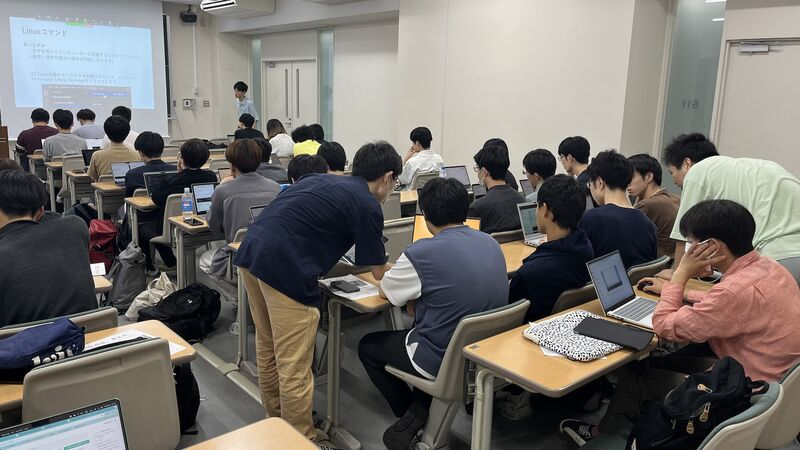

## 第9回講義

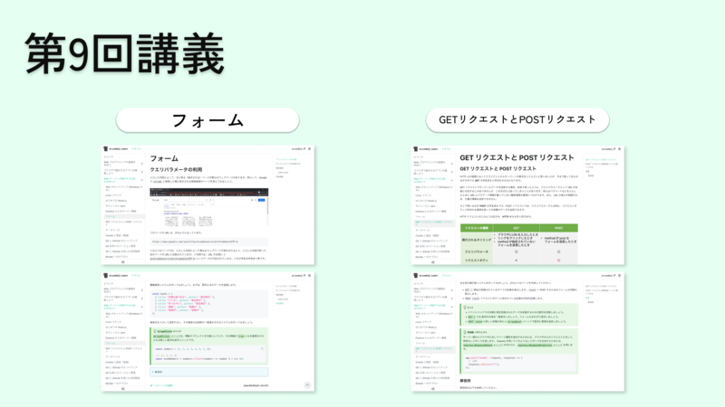

6月11日 (火) の5限に第9回講義を行いました。

第9回講義では、ut.code(); Learnの「Webサーバーが動作する仕組みを知ろう」の「フォーム」「GETリクエストとPOSTリクエスト」を扱いました。

ユーザーの入力に応じたページを表示するようなアプリケーションの作成方法を学びました。最後の課題では、書籍検索システムや掲示板システムを作成しました。

書籍検索システムや掲示板システムは今回の全ゼミの中でも最も難易度が高い課題であり、また、今までの講義で学んだ内容を多く使うため難しかったようです。一方で、この課題を解くことで今までの講義で学んだ内容がつながったと感じたり、今までの講義で十分理解ができていなかった部分が理解できたと感じたりする人もいました。

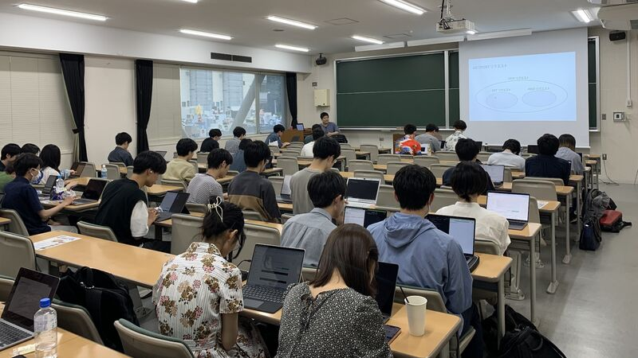

## 第10回講義

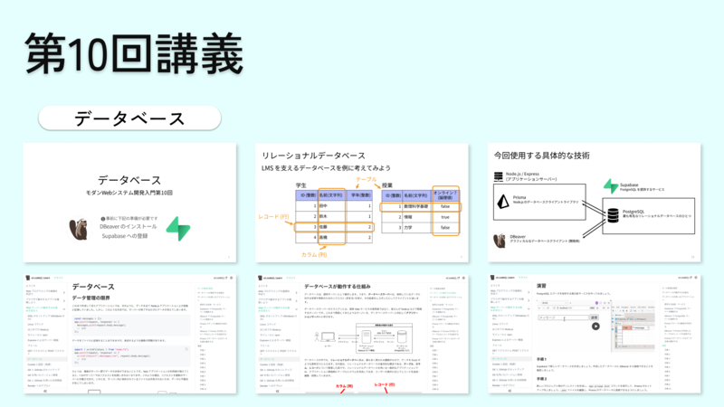

6月18日 (火) の5限に第10回講義を行いました。

第10回講義では、ut.code(); Learnの「Webサーバーが動作する仕組みを知ろう」の「データベース」を扱いました。

ユーザーのデータをデータベースサーバーに保存する方法を学びました。最後の課題では、第9回講義で作成した掲示板システムにデータベースを導入しました。

今回の講義ではデータベースを導入するため手順が少し複雑で、どのような操作をしているのか理解が難しかったようです。しかし、最後の課題が手順に従って再びデータベースを構築するような課題だったため、それを通じて最終的には理解することができたようでした。

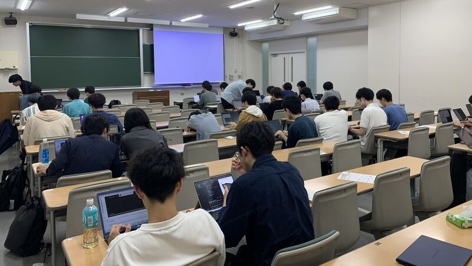

## 第11回講義

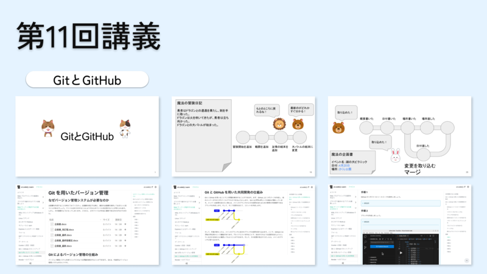

6月25日 (火) の5限に第11回講義を行いました。

第11回講義では、ut.code(); Learnの「Webサーバーが動作する仕組みを知ろう」の「GitとGitHubのセットアップ」「Gitを用いたバージョン管理」「GitとGitHubを用いた共同開発」「Renderへのデプロイ」を扱いました。

Gitを用いてソースコードなどのバージョンを管理する方法や、GitとGitHubを用いて複数人での共同開発を行う方法を学びました。また、講義の最後では作成したWebアプリケーションを公開する方法についても触れました。

GitとGitHubのセットアップについては、それぞれの人のコンピューターの環境によってはうまくセットアップができないことがあるため例年鬼門となっていたのですが、今回の講義では過去の講義での知見をもとにセットアップの方法を改善していたこともあり、スムーズに進めることができました。また、GitとGitHubは、今までの講義で扱った内容の理解をあまり前提としていない単元であることもあり、今までの内容が十分に理解できていない人も理解することができていたようです。GitとGitHubの概念を理解するのは難しいようでしたが、GitとGitHubの操作については直感的に行うことができることもあり理解がしやすいようでした。

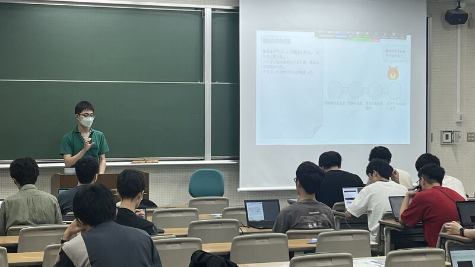

## 第12回講義

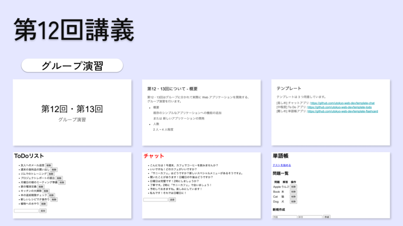

7月2日 (火) の5限に第12回講義を行いました。

第12回講義では、第11回講義まででut.code(); Learnで扱う内容はすべて終了したため、今まで扱った内容を活かして実際に複数人で1つのWebアプリケーションを作成しました。

まず、2から4人で1つのチームを作りました。その後、こちらで用意したToDoアプリとチャットアプリ、単語帳アプリの3つの簡単なWebアプリケーションのテンプレートからチームで1つを選んでもらい、それをもとに機能を追加していく形でWebアプリケーションを作成しました。チームで開発をする際には、第11回講義で学んだGitとGitHubを使いました。

今回の講義では、こちらで用意したテンプレートを実際に自分のコンピューター上でも動かすという手順がどのチームもすぐに終わったためスムーズに開発に入ることができていました。

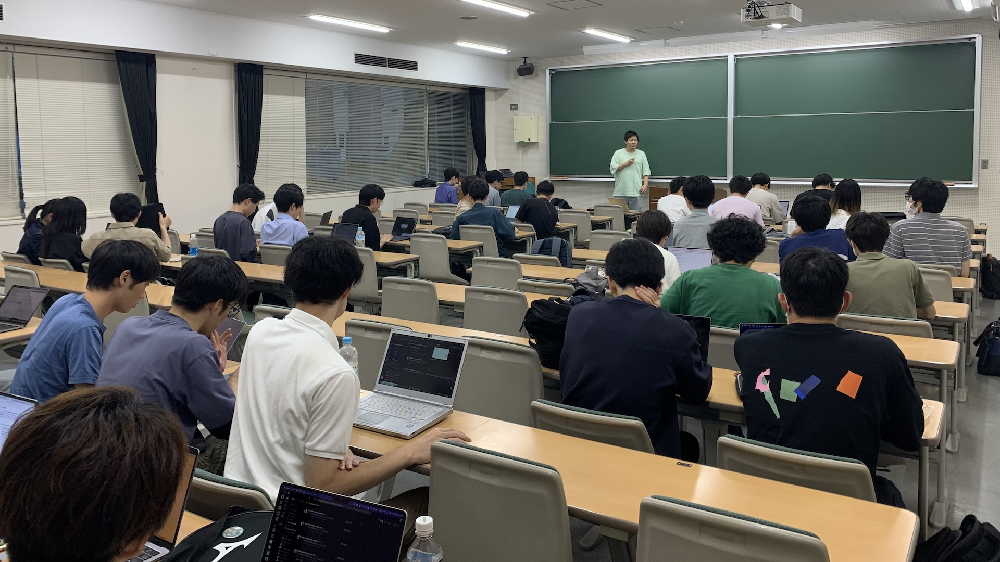

## 第13回講義

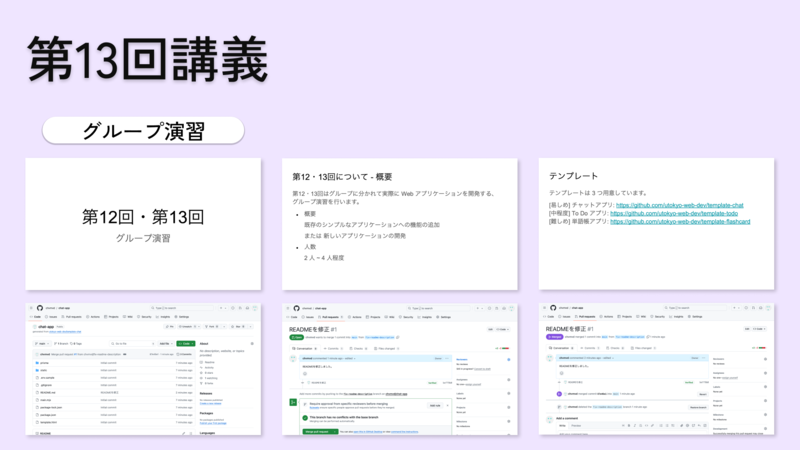

7月9日 (火) の5限に第13回講義を行いました。

第13回講義では、第12回講義に引き続きチームでのWebアプリケーションの開発を行いました。

文字の色やボタンの形などをCSSを用いて変更したり、メッセージが未入力の時に送信ボタンを押せないようにする機能を追加したり、スマートフォンでも美しいデザインが表示されるようにしたり、ToDoアプリへの完了ボタンの機能を追加したりするなど、それぞれのチームで様々なアイディアを出しながらWebアプリケーションを作成していました。

## 次回のゼミに向けて

今学期の全学自由研究ゼミナール (モダンWebシステム開発入門) は、これですべて終了となります。最後まで参加していただいた皆さん、お疲れさまでした。

次の学期である2024年度のAセメスターには、今回と同じ内容で自主ゼミを開講する予定となっております。次の学期が始まる前にお知らせを流しますので、今回参加できなかった方はぜひそちらにご参加ください。

また、今回の全ゼミでの経験を踏まえて、次の学期の自主ゼミではより理解しやすい講義を行えるように改善していきたいと考えています。そのため、次の学期の自主ゼミの運営メンバーを募集しています。運営メンバーの募集は、近日中にut.code();のSlackの`0-0_general`チャンネルで流しますので、運営メンバーとして参加してみたい方は[こちら](/join)からut.code();のSlackに参加し、募集が流れましたらぜひご気軽にご参加ください。
