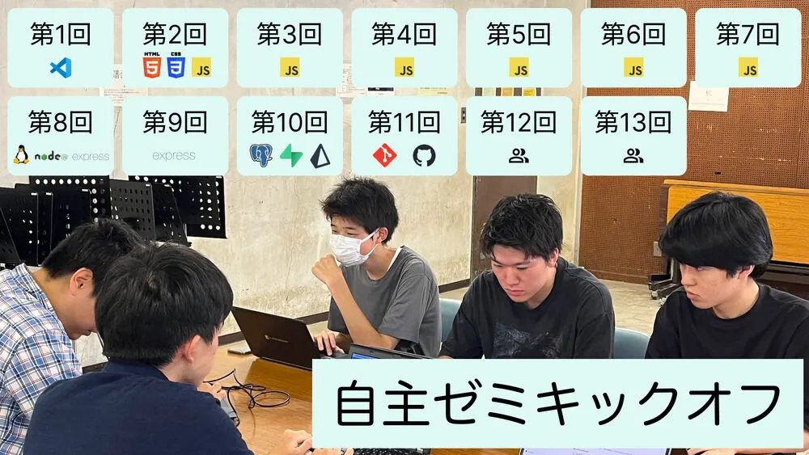
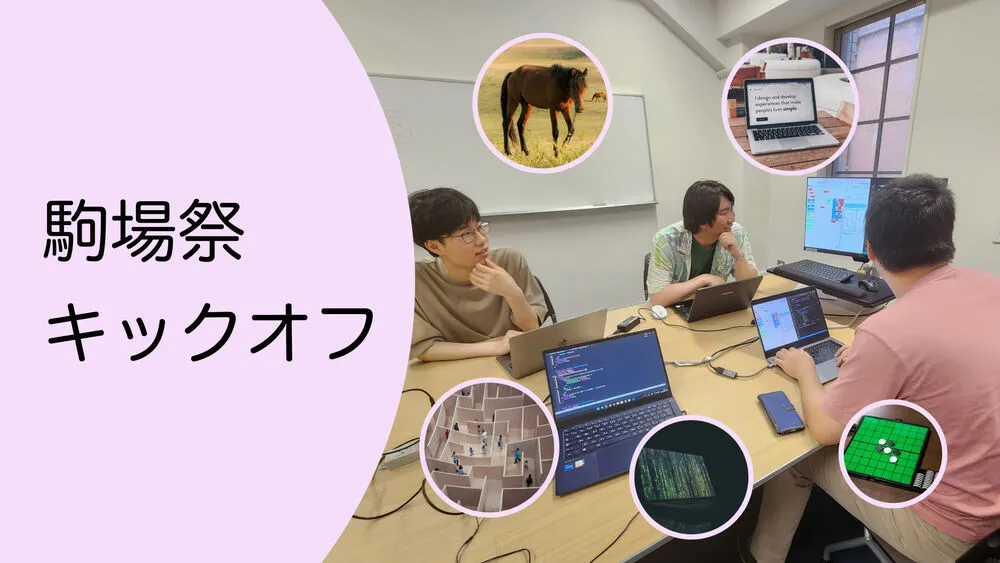

ut.code();では、8月4日に、2024年度のAセメスターに開講する自主ゼミの運営のキックオフミーティングと第75回駒場祭で出展する企画のキックオフミーティングを行いました。

## 自主ゼミのキックオフミーティング

13時30分から15時に自主ゼミのキックオフミーティングを行いました。

2024年度のAセメスターに開講する予定の自主ゼミは、2024年度のSセメスターに開講した全ゼミと同様に、Webプログラミングを基礎から学び、Webプログラミングに必要な技術を一通り学ぶことができる講義となっています。

ut.code();が独自に開発した教材である[ut.code(); Learn](https://learn.utcode.net/)を使用して、Webプログラミングを行う際には必須となるHTMLやCSS、JavaScriptを基礎から学び、サーバーやデータベースといった高度なものの使い方を学び、最終的には独力でWebアプリケーションを開発できるようになることを目指します。

キックオフミーティングでは、今回の自主ゼミを運営していくことになるメンバー同士の顔合わせを行い、自主ゼミをどのように運営していくのか、誰がどの回の講義を担当するのか、今後の予定はどうするのかについて話し合いました。

今後は、それぞれの担当する回の講義の準備をし、全員で授業練習を行い、より良い講義になるように検討を重ねていきます。次回は、8月19日に第1回の授業練習を行う予定です。

自主ゼミをより良いものにしたいというアツい気持ちを持つメンバーをまだまだ募集しています。授業練習などをしっかりと行っており、上級生のサポートもあるので、経験のない人でも大歓迎です。少しでも興味のある方は、[こちら](/join)からut.code();のSlackに参加し、[`#5-20241001_自主ゼミ24a`チャンネル](https://utcode.slack.com/archives/C076ZJTTJ2D)で、その旨をお知らせください。

## 駒場祭のキックオフミーティング

自主ゼミのキックオフミーティングが終わった後の15時から17時に第75回駒場祭のキックオフミーティングを行いました。

ut.code();では、毎年5月に東京大学の本郷キャンパスで行われる学園祭である五月祭と11月に東京大学の駒場キャンパスで行われる駒場祭で誰でもプログラミングを楽しめる企画を出展しています。ut.code();は、今年の11月に行われる第75回駒場祭にも企画を出展する予定となっています。

キックオフミーティングでは、駒場祭で出展する企画を開発することになるメンバー同士の顔合わせを行い、どのような企画を出展するのかのブレインストーミングを行い、出展する企画を決め、今後の日程について話し合いました。

ブレインストーミングでは、数多くの面白い案が出ましたが、最終的には次の5つの企画を出展する方向で進めることになりました。

- 競馬を予想するAI  
   今回の駒場祭のために一から開発する企画です。過去の競馬のデータを読み込ませることで、競馬の結果を予想することができるAIを作成します。これによって、AIの仕組みが理解できるようにします。主に今年に入った新入生のメンバーを中心にして開発をします。
- 「Blosite（仮）」  
   今回の駒場祭のために一から開発する企画です。ブロックを組み合わせるようにしてウェブサイトを作成することができるアプリを作成します。主に今年に入った新入生のメンバーを中心にして開発をします。
- 「はじめてのプログラミング」  
   今までの学園祭で出展しており、毎度好評をいただいている企画です。ブロックプログラミングで迷路を解くことができる企画となっています。既存のものは難易度が高くなかなか迷路を解くことが難しいため、今回の駒場祭に向けて大規模に改修し、ステップごとにチュートリアルを設けることでよりわかりやすいものにしようと考えています。主に開発経験のある上級生のメンバーを中心にして開発をします。
- 「ハッカーになろう」  
   第74回駒場祭で出展し、好評をいただいた企画です。SQLインジェクションやクロスサイトスクリプティングといった手法を用いて、こちらで用意してあるWebアプリケーションから重要な情報を盗み出したり、攻撃を仕掛けたりする方法を学べます。既存のものは少し説明が難しく体験することが難しかったため、さらにわかりやすいものに改善しようと考えています。主に開発経験のある上級生のメンバーを中心にして開発をします。
- 「AIと対戦しよう」  
   第73回駒場祭で出展し、好評をいただいた企画です。AIとオセロで対戦することができます。主に開発経験のある上級生のメンバーを中心にして開発をします。

今後は、毎週木曜日の21時からミーティングを行い、進捗確認や今後の方針の確認などを行っていきます。また、それぞれの企画のプロジェクト毎に週1回程度の作業会を行い、その時間を利用して企画の開発を進めていきます。

駒場祭で出展する企画を開発したいというメンバーをまだまだ募集しています。駒場祭は、春の講習会や全ゼミでWebプログラミングを学んだ新入生が実際にプロダクトを開発する経験を積むことができる場となっています。また、プログラミングが未経験の新入生が、実際にプロダクトを開発しながらWebプログラミングを学ぶ場ともなっています。少しでも興味のある方は、[こちら](/join)からut.code();のSlackに参加し、[`#4-2024_駒場祭_0_全体`チャンネル](https://utcode.slack.com/archives/C0778FJRJG3)で、その旨をお知らせください。
