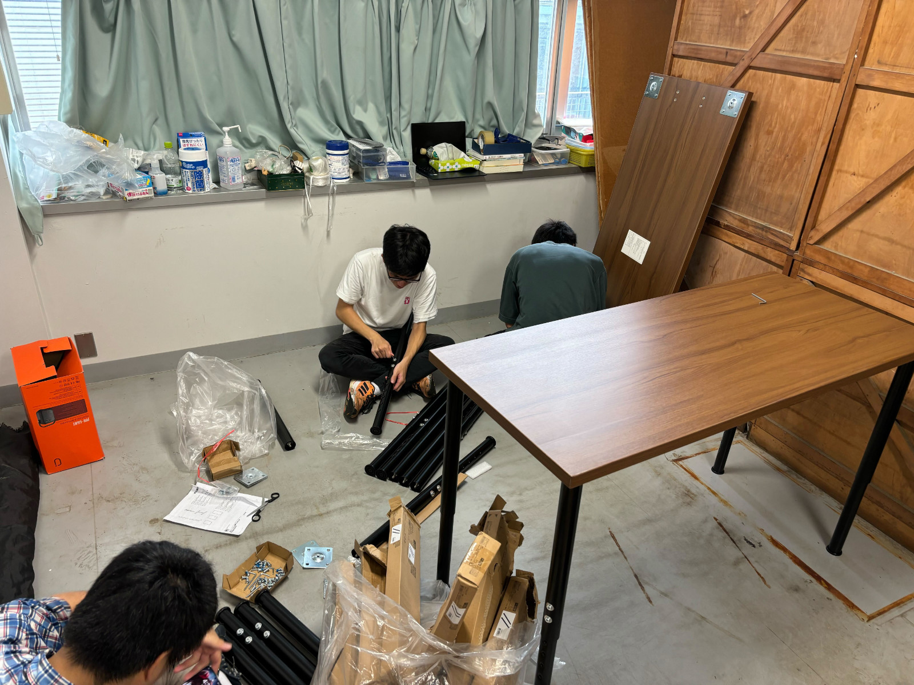

ut.code();では、学内での活動をより円滑に行うため、8月10日、駒場キャンパス内の部室のリノベーションを行いました。古い家具類を全て撤去し、新しい机や椅子を導入しました。また、部室内でのミーティングが捗る大画面ディスプレイも設置しました。

リノベーション前の部室は、古い家具が大量に置かれ、活動を行うのが困難な状態でした。

暑い中での作業でしたが、多くのメンバーの協力のもと、迅速に作業を進めることができました。

新しくなった部室は、ut.code();のメンバーのどなたでも自由に利用できます。また、部室内での定例ミーティングや、作業会などの企画も開催されています。ぜひ、快適な部室を活用して、活動の幅を広げてみてください。

