ut.code();は、11月2日（土）に、韓国にある大学であるKAISTの開発コミュニティであるSPARCSと共同で、SPARCS × ut.code(); 合同交流会2024をオンラインで開催しました。

## イベントの概要

SPARCSは、韓国にある大学であるKAISTの開発コミュニティで、1991年に設立されています。KAISTの学生の生活がより便利になるサービスを開発、運営しています。

SPARCS × ut.code(); 合同交流会2024は、日韓の大学生間で交流することで、新たなアイディアに出会ったり、新たな知見を得たりすることを主な目的として開催されました。

イベントのはじめには、それぞれの大学および団体の紹介を行い、その後それぞれの団体が作成しているプロダクトの紹介を行いました。それぞれの紹介の後には質疑応答の時間が設けられており、気になったことやもっと深く知りたいことについて質疑応答を行いました。

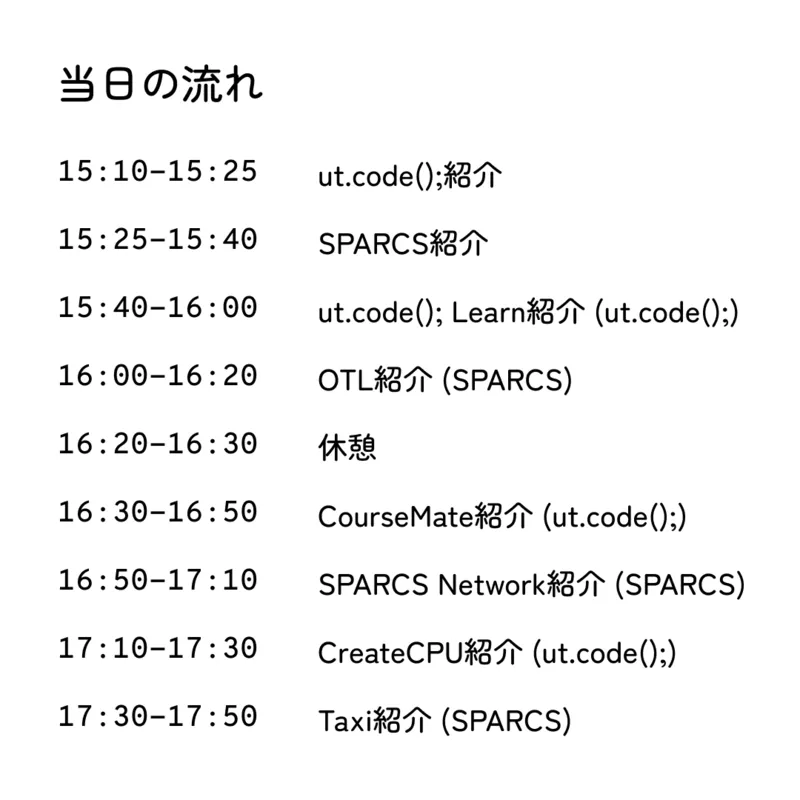

## 大学および団体の紹介の様子

はじめに、それぞれの大学および団体の紹介を行いました。SPARCSとのイベントは今回がはじめてであったため、それぞれの団体がどのようなものであるのかについてお互いに詳しく紹介を行いました。

### ut.code();の紹介の様子

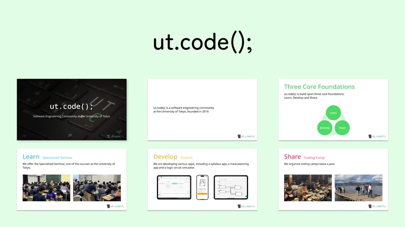

はじめに、ut.code();の紹介を行いました。ut.code();が普段どのような活動をしているのかについてやどのようなプロダクトを作成しているのかについての紹介を行いました。

### SPARCSの紹介の様子

次に、SPARCSの紹介を行いました。SPARCSがどのようなことを目指して活動を続けているのかについてやどのようなプロダクトを作成しているのかについての紹介を行いました。

## プロダクトの紹介の様子

それぞれの大学および団体の紹介が終わった後には、それぞれの団体が作成しているプロダクトの中から3つのプロダクトを紹介しました。

### ut.code(); Learnの紹介の様子

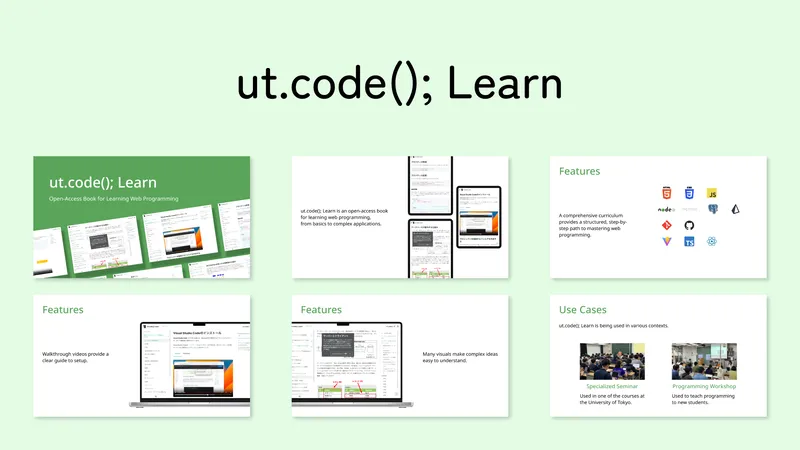

ut.code();のプロダクトの紹介の1つ目は、ut.code(); Learnでした。

ut.code(); Learnは、未経験の状態からでも自力でWebサービスの開発ができるようにするための、ut.code();公式の教材です。ut.code(); Learnが作成された目的や、ut.code(); Learnにある他の教材にはない特徴、実際の大学の授業や講習会での活用事例などが紹介されました。

### OTLの紹介の様子

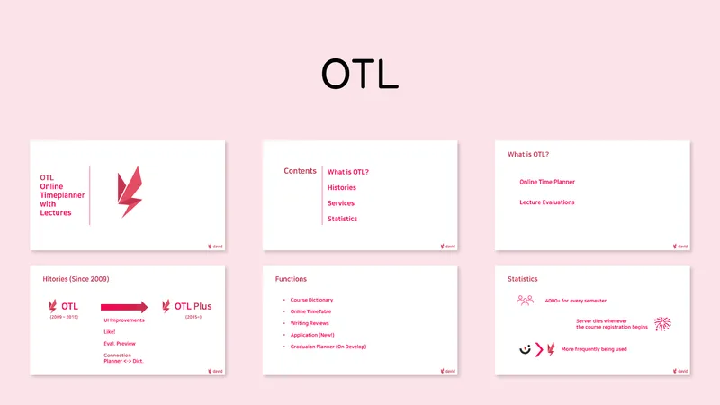

SPARCSのプロダクトの紹介の1つ目は、OTLでした。

OTLは、KAISTの学生が時間割の作成や講義の評価を効率的に行えるようにするためのサービスです。OTLにはどのような機能があり最近どのような機能が追加されたのかについてや、実際にどれぐらい使われているのかについてなどが紹介されました。

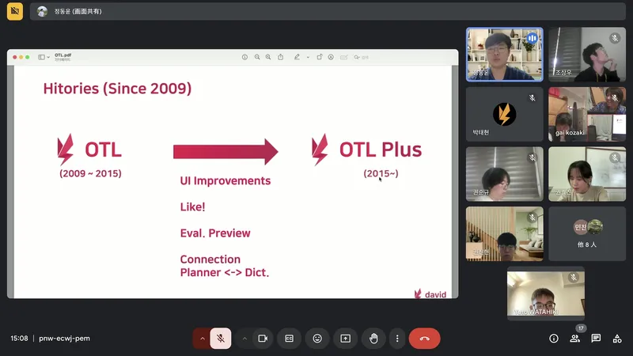

### CourseMateの紹介の様子

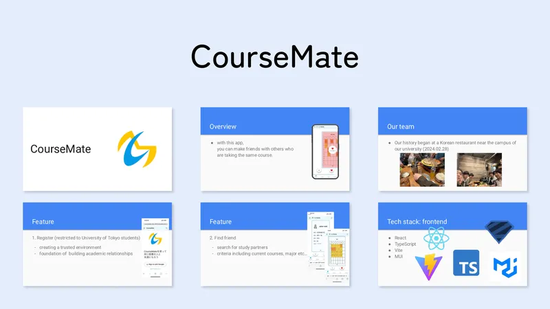

ut.code();のプロダクトの紹介の2つ目は、CourseMateでした。

CourseMateは、同じ授業を履修している友達を気軽に探すことができるサービスです。同じ授業を履修している友達を探すことができる機能やその友達とやり取りを行うことができる機能があること、使用している技術スタックなどが紹介されました。

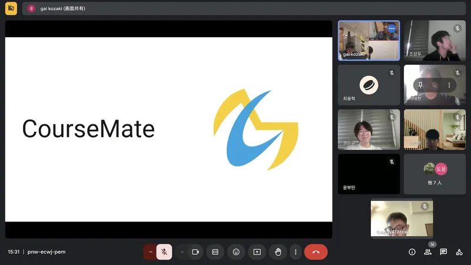

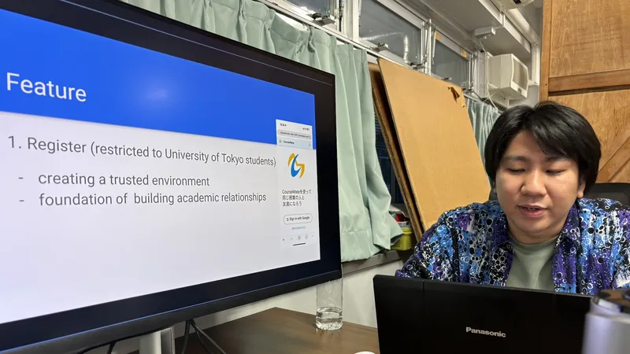

### SPARCS Networkの紹介の様子

SPARCSのプロダクトの紹介の2つ目は、SPARCS Networkでした。

KAIST内のITインフラの管理についてやSPARCSが運営しているミラーリングサービスについてが紹介されました。また、KAIST内でのネットワークをこれからどのように管理していこうとしているのかについても紹介されました。

### CreateCPUの紹介の様子

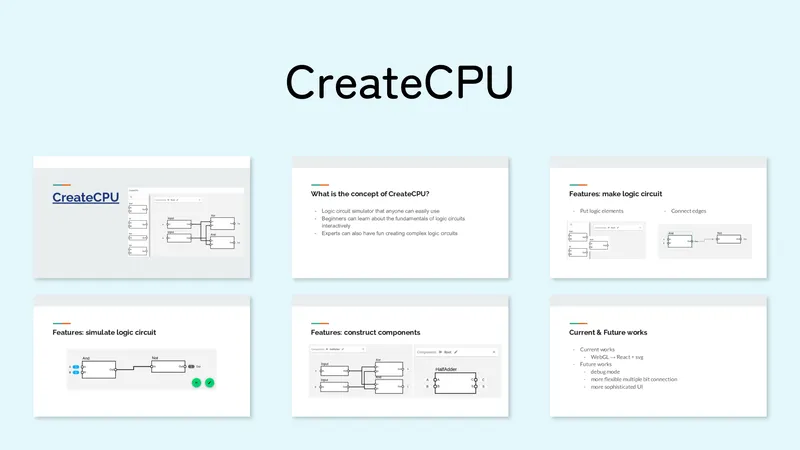

ut.code();のプロダクトの紹介の3つ目は、CreateCPUでした。

CreateCPUは、Webブラウザ上で論理回路を学ぶことができるサービスです。最も単純な回路素子をつなぎ合わせて自分だけのCPUを作り上げることができます。CreateCPUにある他の論理回路シミュレーターにはない特徴についてなどが実演を交えながら紹介されました。

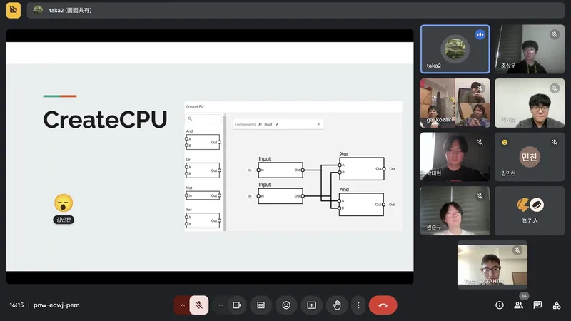

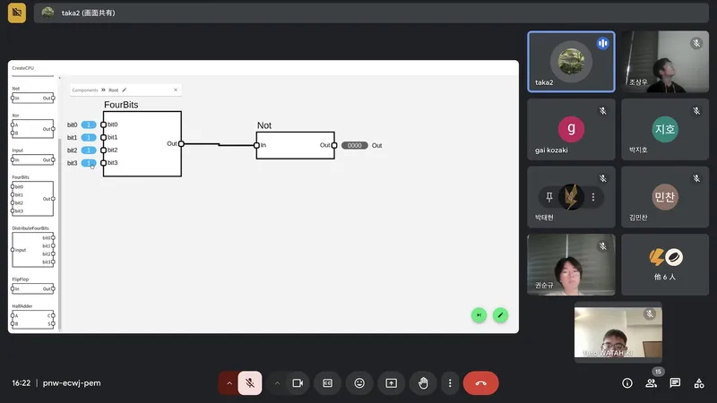

### Taxiの紹介の様子

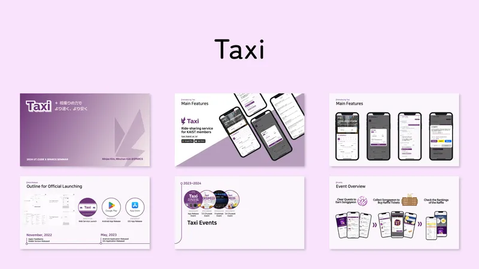

SPARCSのプロダクトの紹介の3つ目は、Taxiでした。

Taxiは、タクシーの同乗者を簡単に見つけることができるアプリで、これによりタクシーの料金を節約したり、同乗者との調整をスムーズに行うことができます。Taxiができる前にKAISTの学生にとってどのような問題があったのか、どのようにして多くの人に使ってもらえるように広報を行ったのかなどが紹介されました。

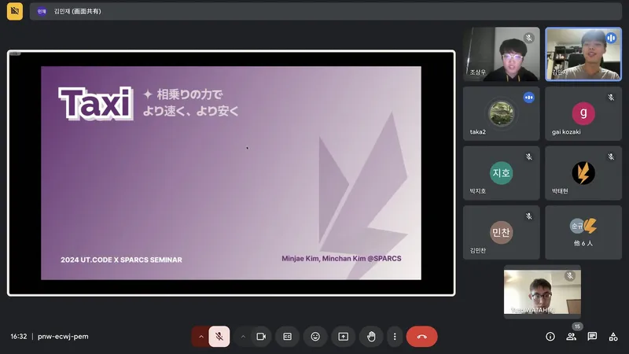

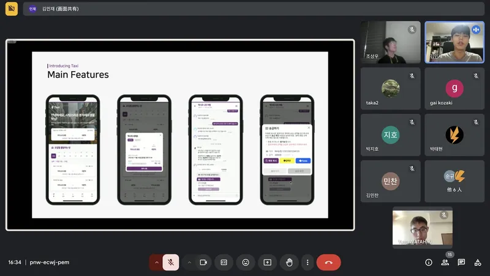

## 最後に

どのような問題を解決しようとしているのかや、実際に作ったプロダクトを使ってもらうためにどうしてきたのかなど、ut.code();のメンバーにとっても、SPARCSのメンバーにとっても、学びになることがたくさんあるイベントになりました。今後も、今回のようにお互いに情報交換ができるイベントやその他のイベントを行っていきたいと思っています。参加していただいたSPARCSのメンバーのみなさん、ut.code();のメンバーのみなさん、ありがとうございました。

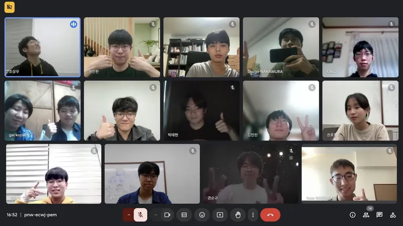
