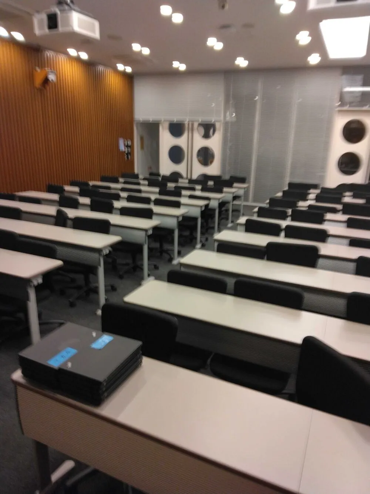

ut.code(); は、2024 年 12 月 23 日に行われた「 【2024】小中学生集まれ！エンジニアフェスティバルin東大」に「一人麻雀」を出展しました。来場してくださった皆様、ありがとうございました！

麻雀はハマると抜け出せなくなるくらい面白いにもかかわらず、ルールが複雑なせいで始めるハードルが上がってしまっているように思います。そこで、簡単なパズルとして遊べるようにしたのが「一人麻雀」です。

「一人麻雀」は、以下のリンクからご覧いただけます。ただ、サーバーがスリーブしていて、すぐには立ち上がらない可能性があります。ご了承ください。

[https://mahjong.utcode.net/](https://mahjong.utcode.net/)

また、来場者の方で「一人麻雀」をとても気に入ってくれた方がいました。将来Mリーガーになったら、是非「一人麻雀」の名前を出していただけると嬉しいです。

改めまして、ご来場ありがとうございました。よろしければ、来年の第 98 回五月祭でまたお会いしましょう。

