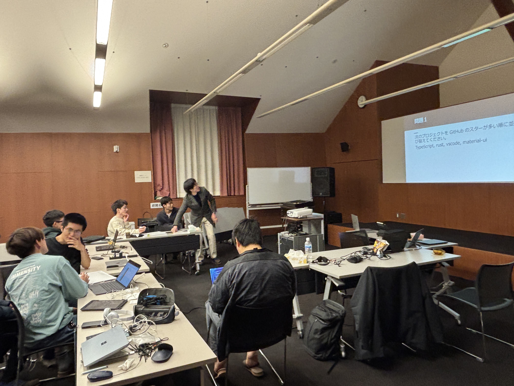

ut.code(); では 2 月 20 日から 22 日まで、東京大学山中寮内藤セミナーハウスにて春合宿を実施しました。

## 初日

到着したら、まずは山中湖に臨むカフェ「LA2CAFE Yamanakako」にて昼食をとりました。

寮に着いてからは、会議室でプログラミング活動を進めました。

今回の合宿は、昨年 12 月に行われたプロジェクト発足会で生まれたプロジェクトのメンバーが多く参加しており、ひとまずの完成を目指して頑張っていました。

## 二日目

引き続きプログラミングの開発を続けながら、イベントも楽しみました。

午前は有志の発表者によるLT会が開かれました。個人プロジェクトについて話してくださり、とても興味深かったです。

午後はチーム対抗ITクイズ大会を実施しました。早押し問題や頭を悩ませるような問題を協力して解いて盛り上がりました。

## 三日目

最終日にも昼間まで時間を惜しんでプログラミングを続けました。

そのなかで、一部のプロジェクトの実演も行われました。

自然に囲まれながら山中寮の美味しいご飯を食べて、心地よい時間を過ごすことができました。

今後も定期的な合宿やイベントを開催していきますので、ぜひ参加してください。
