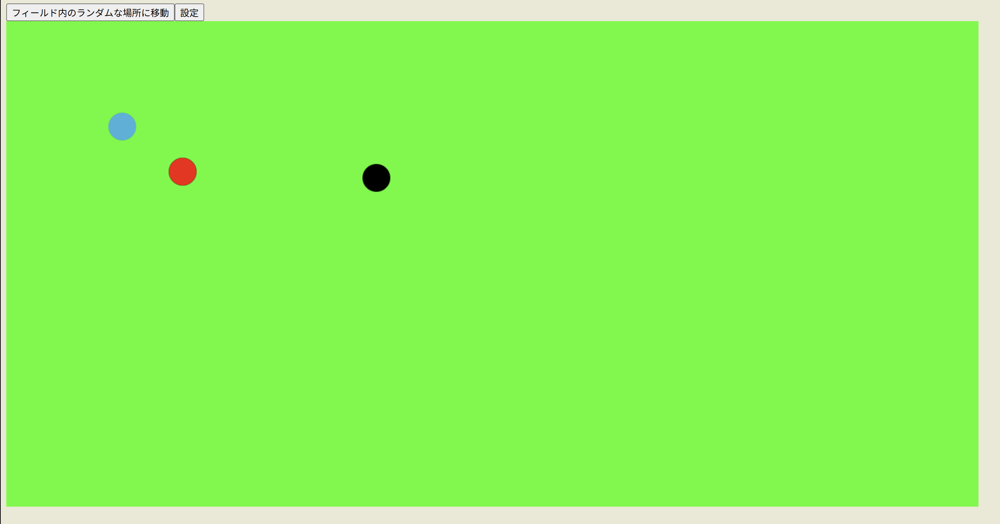
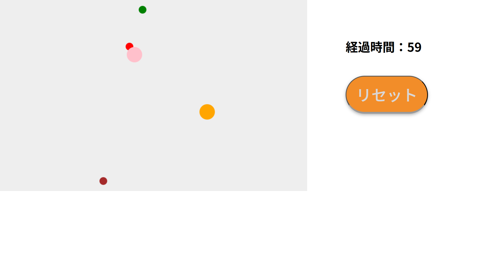
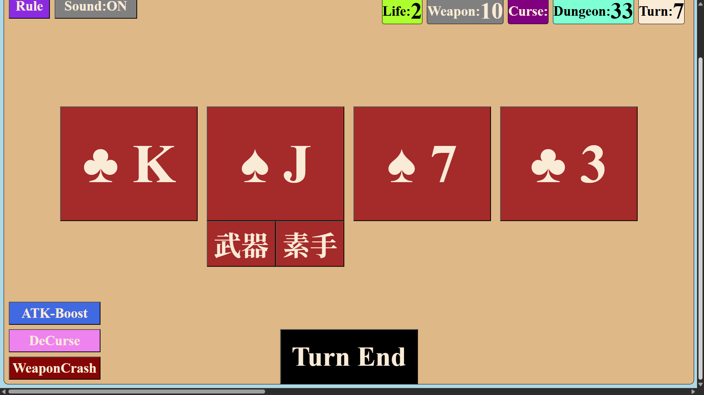
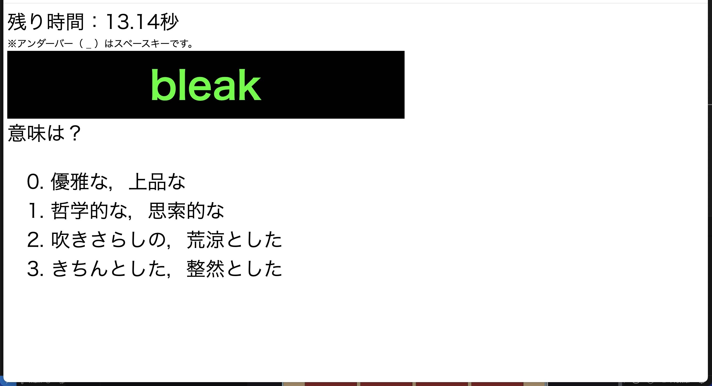
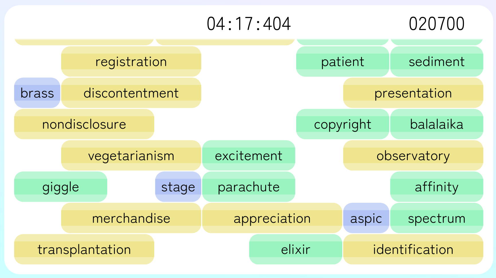
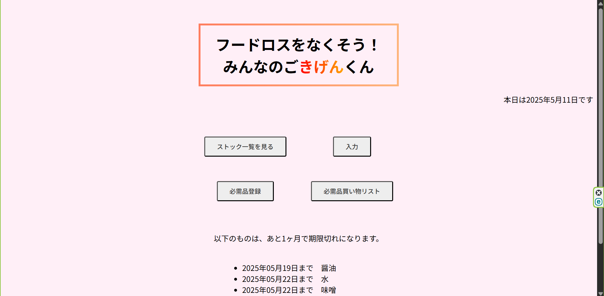
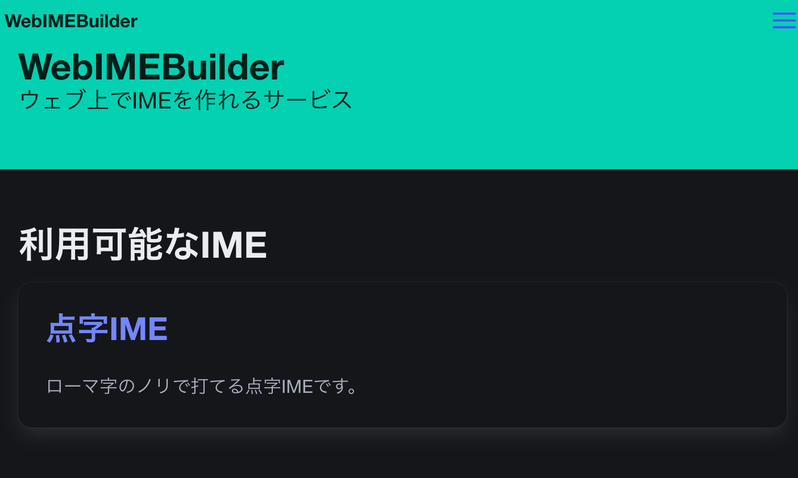
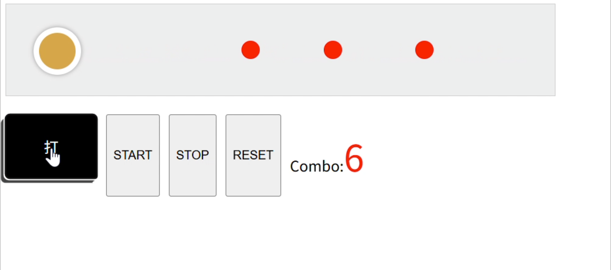
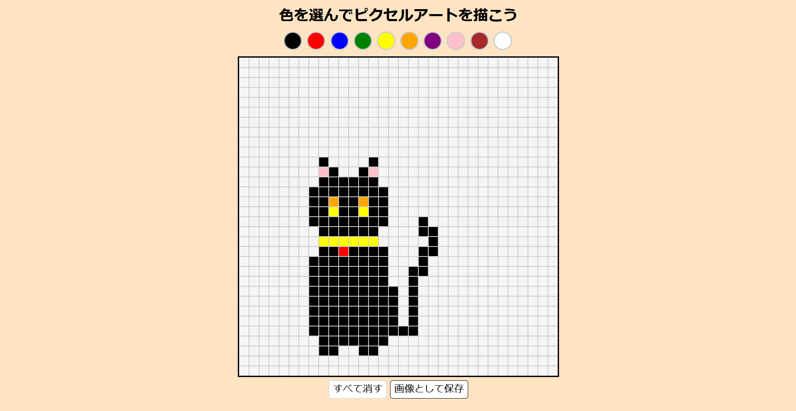

ut.code(); は、2024年5月10日（金）、5月11日（土）の二日間にわたり、新歓個人開発会を開催しました。

このイベントは、新入生の皆さんに開発の楽しさを体験してもらうことと、新入生の開発体験を積むことを主な目的として企画されました。新入生にとって、大学での新しい生活が始まり、プログラミングや開発に触れる良い機会となることを願っての開催です。

## イベントの様子

イベントは二日間にわたって開催されました。今回は試験的に設計の時間をとってみるなど、参加者の皆さんが開発に集中できるよう工夫を凝らしました。
イベント当日は、経験者、初心者問わず、多くの新入生の皆さんが集まり、それぞれのアイデアを形にするべく集中して開発に取り組んでいました。会場は、真剣な雰囲気と、新しい技術に触れるワクワク感が入り混じった、熱気あふれる空間となりました。

参加者の皆さんはそれぞれの開発テーマに取り組む中、途中経過の共有や質問を通じて交流を深めました。二日目も引き続き開発に集中し、締め切りに向けて熱心に取り組んでいました。開発中は、参加者同士で技術的な質問をしたり、成果を見せ合ったりと、積極的にコミュニケーションを取る姿も見られました。また、困った時には運営メンバーがサポートを行い、参加者の皆さんがスムーズに開発を進められるよう努めました。

二日間の開発期間を経て、参加者の皆さんからは素晴らしい作品が多数生まれました。Webアプリケーションやゲームなど、その内容は多岐にわたり、新入生とは思えないクオリティのものも多く見受けられました。

イベントの最後には成果発表会が行われ、完成した作品の発表が行われました。発表会では、それぞれの開発の背景や技術的な工夫について説明があり、参加者からは驚きや感心の声が上がっていました。

## 参加者の作品

### **Fieldchat**

登録すると謎の空間に送り込まれます。この空間にいる自分以外の●とチャットすることができます。WASDで移動、Enterで話しかけます。●の位置とメッセージは実はリアルタイムで更新されます。 

- 作品 URL: <https://fieldchat2.onrender.com/>
- GitHub: <https://github.com/Kanata844/fieldchat2>

### **玉避けゲーム**

球を避け続ける、ただそれだけのゲームです。
少しやってみたところ思っていたよりも難しく、40秒以内に終了してしまいます。
１分以上避け続けることができたら反射神経がきっとかなり良いです。

＊ちなみにマウスカーソルをキャンバス上から外すと無敵になるという基本的な欠陥に完成してから気づきました。

- 作品 URL: <https://hack-s3es.onrender.com/>

### **Scoundrel**

1人用トランプゲームのScoundrel(悪党)を再現しました．本来のルールですと非常に高難易度でしたのでオリジナルでスキル機能をつくりました．ルール説明も設けましたがルールは調べた方がわかりやすいと思います．

- 作品 URL: <https://scoundel.onrender.com/>

### **タイピングゲームと単語クイズを組み合わせたゲーム**

- 作品 URL: <https://hackerson1.onrender.com/>

タイピングゲームと英単語クイズを組み合わせたゲーム。

英検準一級の単語が表示されて、それをタイピングした後にその意味が選択肢で問われます。制限時間内にできるだけ多く解いきましょう。

### **タイピングゲームとブロック崩しを組み合わせたゲーム**

ブロック崩しとタイピングを織り交ぜました

ぜひ僕の記録を超えてください

- 作品 URL: <https://typing-3anr.onrender.com/>

### **ごきげんくん**

品目と賞味期限を入力し、賞味期限を管理するアプリです。データベースにつながっています。

- 作品 URL: <https://stockmanagement-ad9g.onrender.com/>

### **WebIMEBuilder**

IMEを簡単に自作できるツールになる予定のものです。

一応、ログイン/ログアウトとIMEの個別ページの表示まではいけました:

### **太鼓の達人っぽいゲーム**

### **ピクセルアート**

ピクセルアートが書けちゃうものです。

- 作品 URL: <https://pixelart-t3mu.onrender.com>

## まとめ

参加者からは、「たった2日間で満足のいくものが作れた」「ut.code(); Learn で学んだことを創作を通じて自分の中で体系化することができた」「他のメンバーの発想を味わえた」といったポジティブな感想が多く寄せられました。

とくに、参加者の皆様が生み出した成果物のレベルの高さには、運営一同感銘を受けました。

今回の新歓個人開発会が、新入生の皆さんの今後の開発活動のきっかけとなり、技術への探求心をさらに深める一助となれば幸いです。

ut.code(); では、今後も様々なイベントを通じて、メンバーの技術力向上と交流を促進していきます。今回の開発会に参加してくださった皆さん、そして運営に協力してくれたメンバーに心より感謝申し上げます。
