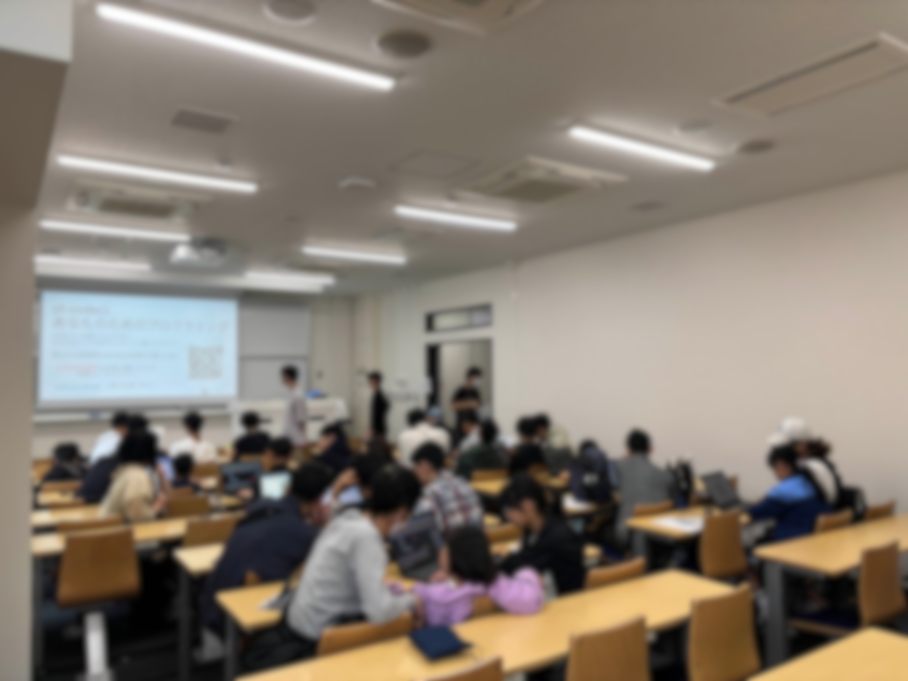

ut.code(); は、2025年5月24日（土）、5月25日（日）の二日間、五月祭に企画を出展しました。
お越しくださった皆様、ありがとうございました！

今回の企画では、「はじめてのプログラミング」といった定番の人気企画に加え、新入生によるハッカソンの成果物や、ショートカットキーをモチーフにしたパズルゲームなどを展示しました。

五月祭で展示した内容は、以下の特設サイトからご覧いただけます。

https://mf98.utcode.net/

今後も ut.code(); では五月祭・駒場祭にて様々な企画を展示していきます。

改めまして、ご来場ありがとうございました。次回11月の駒場祭もどうぞよろしくお願いいたします。

