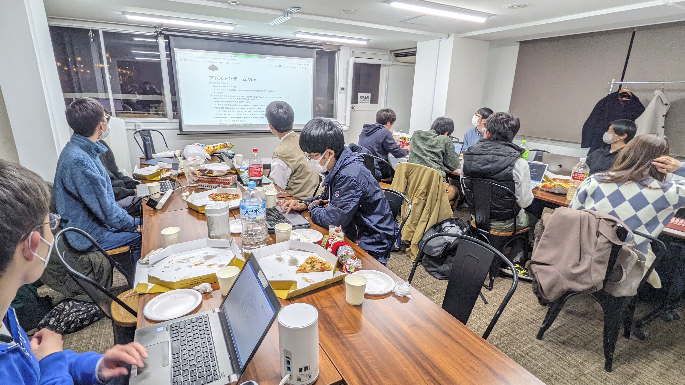

2022 年度もあっという間に過ぎ去り、いよいよ 2023 年度の新入生を迎えようとしています。
2022 年 11 月の駒場祭を終え、そこから今日までの約 4 か月間は、ut.code(); にとっては非常に慌ただしい日々になりました。

しばらくの間ウェブサイト上での報告が途切れていたため、まとめてこの記事にて報告させていていただければと思います。

## 大忘年会を開催しました

大忘年会は、年末に開催された ut.code(); 内部のイベントです。忘年会を名乗っているため部屋に集まって食事をしていますが（感染症対策は徹底しています！）、同時に ut.code(); の新しいプロジェクトを決めるブレインストーミング大会にすることにしました。

参加者にはひとり一案以上新プロジェクトのアイデアを持ち寄ってもらい、後日のアンケートで配属プロジェクトを決めます。結果、6 つのプロジェクトを始動させることになりました。

## プロジェクトが始動しました

ut.code(); にとっては、多くのプロジェクトが同時進行するのは初めての経験になります。確実にプロジェクトを成功させるため、初回のミーティングは各プロジェクトごとに集まり、元のアイデアをブラッシュアップしたり、役割分担を決めたりしました。

## 自主ゼミを開講します

昨年度 A セメスターから準備を進めてきた自主ゼミが、いよいよ開講目前となっています。このイベントは、前年度の「新歓体験会」の代わりになるイベントです。今年度は、より多くの人（ut.code(); のメンバーでない人も含め）にソフトウェア開発の魅力を伝えるため、学友会主催の自主ゼミという形式で実施することにしました。詳細は[こちら](/articles/seminar/)をご覧ください。

## 春合宿を実施しました

ut.code(); 初のイベントとして合宿を開催しました。会場は[東京大学山中寮内藤セミナーハウス](http://www.abreuvoir.co.jp/yamanaka/)で、2 泊 3 日の日程で行いました。こちらの会場には東京から施設のすぐ近くまで移動できる高速バスが通っているため、アクセスは良好です。

3 日間集中して開発を進めることができ、非常に有意義なイベントになりました。来年度の夏や春の長期休暇にも実施していければと考えています。

## ウェブサイトをリニューアルしました

ut.code(); 設立当初より 4 年間維持してきた元のウェブサイトを、この度刷新することにしました。動機は、複数のプロジェクトが動き始め、それらの情報を発信していくためにより高度で安定したウェブサイトが必要になったためです。

元のウェブサイトは [WordPress](https://wordpress.org/) で、[Lightning](https://lightning.vektor-inc.co.jp/) テーマを用いていました。今まで本当にお世話になりました。

新しいウェブサイトは [Gatsby](https://www.gatsbyjs.com/) で製作されています。
